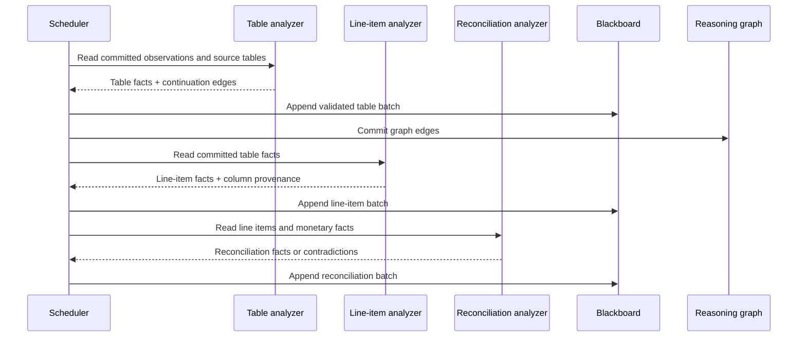
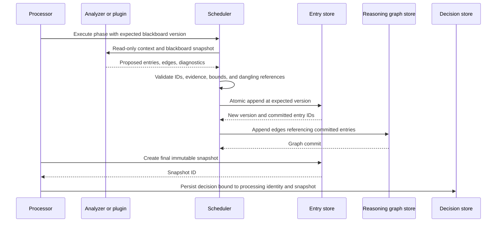

Below are the sections/subsections from **`edi-document-technical-design.md`** that directly define `ReasoningGraph`, produce its edges, consume it, constrain it, persist it, or test it. I’ve excluded sections where “graph” is incidental rather than part of the reasoning-graph design.

---

## 2. Goals — provenance requirement

The relevant goal is:

> Preserve the OCR words, geometry, corrections, facts, rules, and graph edges that support every extracted field and final decision. 

This is the high-level reason `ReasoningGraph` exists: it is part of the provenance chain for extracted values and the final transaction decision.

---

## 4.6 Plugins propose; the resolver decides

A transaction plugin may:

* propose one or more typed hypotheses;
* expand its own typed hypothesis;
* validate its own typed candidate; and
* emit evidence, findings, and reasoning edges.

A plugin may not declare its candidate globally accepted. Only the resolver and review policy produce a `TransactionDecision`. 

This establishes that plugins **produce graph material but do not own final reasoning authority**.

---

## 5. Terminology

The design defines the graph as:

> **Reasoning graph:** Directed graph explaining how blackboard entries support, contradict, derive, validate, invalidate, replace, require, or outrank one another.

It also defines an analyzer as a component that produces:

> additional entries, reasoning edges, and diagnostics. 

This establishes the distinction:

```text
Blackboard
    = semantic objects / assertions

ReasoningGraph
    = relationships explaining how those objects led to conclusions
```

---

# 6. High-Level Architecture

The graph is a first-class retained-evidence component alongside the blackboard:

```mermaid
flowchart LR
  source["VerifiedDocument<br/>repaired OCR pages"] --> context["DocumentContextFactory<br/>deterministic indexes"]
  context --> scheduler["Bounded blackboard scheduler<br/>fixed analysis phases"]
  scheduler --> board[("Append-only blackboard<br/>observations, facts, contradictions")]
  scheduler --> reasoningGraph[("Reasoning graph<br/>support and conflict edges")]
  board --> registry["Transaction plugin registry"]
  registry --> hypotheses["Competing typed hypotheses"]
  hypotheses --> topk["Top-k selection<br/>minimum preliminary score"]
  topk --> extraction["Typed candidate extraction"]
  extraction --> validation["Deterministic domain validation"]
  validation --> resolution["Candidate scoring<br/>conflict resolution + review policy"]
  reasoningGraph --> resolution
  board --> resolution
  resolution --> decision["TransactionDecision<br/>accepted | needs-review | rejected"]
  decision -.-> review["Human review or downstream adapter<br/>deployment integration"]

  classDef runtime fill:#e8f1ff,stroke:#315f9b,color:#10243e;
  classDef evidence fill:#f4f0ff,stroke:#7057a3,color:#2f2347;
  classDef proposal fill:#fff7d6,stroke:#8a6d1d,color:#2f2500;
  classDef success fill:#e8f7ec,stroke:#2f7d43,color:#153b20;
  classDef future fill:#f1f3f5,stroke:#6c757d,color:#343a40,stroke-dasharray:5 5;
  class source,context,scheduler,registry,topk,extraction,validation,resolution runtime;
  class board,reasoningGraph evidence;
  class hypotheses proposal;
  class decision success;
  class review future;
```



The graph and blackboard both feed final resolution. 

### 6.1 Module boundaries

The graph has its own module:

```text
blackboard/
├── blackboard.ts         # read-only and mutable blackboard interfaces
├── entry-store.ts        # atomic append, duplicate policy, snapshots
├── reasoning-graph.ts    # explanatory graph contracts
└── scheduler.ts          # bounded phases and analyzer execution
```

The dependency rule explicitly states:

> Resolution depends on candidates, findings, blackboard queries, and the reasoning graph.

The `domain` layer does not depend on graph implementation details, persistence, or service adapters. 

### 6.2 Authority boundaries

The relevant authority split is:

| Component            | May propose                               | May commit or decide      |
| -------------------- | ----------------------------------------- | ------------------------- |
| Analyzer             | Entries, edges, diagnostics               | No direct commit          |
| Scheduler            | Validated analyzer batch                  | Commits entries and edges |
| Transaction plugin   | Hypotheses, candidate, validation results | No global decision        |
| Transaction resolver | Selected candidate and decision reasons   | Produces final decision   |

This makes the **scheduler the write authority for reasoning edges**, while analyzers/plugins merely propose them. 

---

# 8.1 Tagged identifiers and constrained scalars

Reasoning edges receive their own nominal identifier:

```ts
type BlackboardEntryId = Tagged<string, "BlackboardEntryId">;
type AnalyzerId = Tagged<string, "AnalyzerId">;
type ProducerId = Tagged<string, "ProducerId">;
type SnapshotId = Tagged<string, "SnapshotId">;
type ReasoningEdgeId = Tagged<string, "ReasoningEdgeId">;
type TransactionDocumentId = Tagged<string, "TransactionDocumentId">;
type SourceDocumentId = Tagged<string, "SourceDocumentId">;
type RuleId = Tagged<string, "RuleId">;
```

The document states that runtime constructors validate canonical values before applying tags; casting alone is not validation. 

---

# 9.4 Relationships

This is important because it distinguishes **blackboard relationships** from **reasoning-graph edges**.

```ts
interface FactRelationship extends ProducedEntry {
  readonly kind: "fact-relationship";
  readonly fromEntryId: BlackboardEntryId;
  readonly toEntryId: BlackboardEntryId;
  readonly relationship:
    | "supports"
    | "contradicts"
    | "derived-from"
    | "aliases"
    | "belongs-to"
    | "continues"
    | "validates"
    | "invalidates";
  readonly strength: number;
}
```

The document then makes the distinction explicit:

> Relationships are blackboard entries because analyzers may query them as facts about the current interpretation. Reasoning graph edges provide graph traversal and score contribution metadata; the two representations may be generated from the same analyzer result but serve different access patterns. 

So they are **not duplicates conceptually**:

```text
FactRelationship
    └─ queryable semantic assertion

ReasoningEdge
    └─ explanation/traversal/scoring relationship
```

---

# 10.5 Transactions and snapshots

```ts
interface EntryStoreTransaction {
  readonly baseVersion: number;
  append(entries: readonly BlackboardEntry[]): void;
  commit(): Promise<AppendResult>;
  rollback(): Promise<void>;
}

interface BlackboardSnapshot {
  readonly id: SnapshotId;
  readonly version: number;
  readonly entries: readonly BlackboardEntry[];
  readonly createdAt: string;
}
```

> Snapshots are immutable decision boundaries. The final decision records the exact snapshot ID used during resolution. 

This matters to `ReasoningGraph` because graph edges must correspond to committed entries belonging to the reasoning state used for that decision.

---

# 11. Reasoning Graph

This is the primary section.

## 11.1 Edge contract

```ts
type ReasoningRelationship =
  | "supports"
  | "contradicts"
  | "derived-from"
  | "replaces"
  | "validates"
  | "invalidates"
  | "selected-over"
  | "requires";

interface ReasoningEdge {
  readonly id: ReasoningEdgeId;
  readonly fromEntryId: BlackboardEntryId;
  readonly toEntryId: BlackboardEntryId;
  readonly relationship: ReasoningRelationship;
  readonly contribution?: ScoreContribution;
  readonly ruleId?: RuleId;
  readonly explanation?: string;
}
```


There are three distinct kinds of metadata on the edge:

```text
relationship
    semantic relationship between entries

contribution
    scoring effect associated with the relationship

ruleId / explanation
    why the edge exists
```

## 11.2 Graph authority

> The graph is explanatory and analytical. It does not replace the blackboard entry store. An edge may refer only to committed entry IDs.

> The scheduler commits entries before or atomically with corresponding edges. A graph implementation must reject dangling references. 

This gives the fundamental graph invariant:

```text
∀ edge ∈ ReasoningGraph:

exists(edge.fromEntryId) &&
exists(edge.toEntryId)
```

There are no reasoning-only phantom nodes.

## 11.3 Queries

The graph supports:

* incoming and outgoing edge lookup;
* bounded traversal from one or more roots;
* relationship filtering;
* bounded path search; and
* extraction of a decision-specific reasoning subgraph. 

The final operation is especially important: the public explanation does not need the complete internal graph.

## 11.4 Explanation projection

> A deployment should expose a bounded explanation projection rather than the entire blackboard for every user interaction.

The intended chain is:

```text
selected candidate
    <- validates / supports
required fields and reconciliation facts
    <- derived-from
labels, tables, values, and geometry
    <- derived-from
source OCR words and corrections
```


That is effectively the canonical explanation traversal pattern.

---

# 12.1 Common analyzer contract

Analyzers do **not** mutate the graph directly.

```ts
interface BlackboardAnalyzer {
  readonly id: AnalyzerId;
  readonly producerId: ProducerId;
  readonly phase: AnalysisPhase;
  readonly consumes: readonly EntryKind[];
  readonly produces: readonly EntryKind[];
  readonly trigger: AnalyzerTrigger;

  analyze(
    context: AnalyzerExecutionContext,
    blackboard: ReadonlyBlackboard,
  ): Promise<AnalyzerResult>;
}
```

They return proposed graph edges as part of the result:

```ts
interface AnalyzerResult {
  readonly entries: readonly BlackboardEntry[];
  readonly edges: readonly ReasoningEdge[];
  readonly consumedEntryIds: readonly BlackboardEntryId[];
  readonly diagnostics: readonly AnalyzerDiagnostic[];
  readonly madeProgress: boolean;
}
```

The scheduler validates and commits the result; the analyzer receives neither a mutable blackboard nor a mutable graph. 

This implies the mutation flow:

```text
Analyzer
   │
   │ proposes
   ▼
AnalyzerResult
   ├── entries[]
   └── edges[]
          │
          ▼
      Scheduler
          │
          ├── validate entries
          ├── validate edge references
          └── commit
```

---

# 12.9 Table and line-item analysis

The table pipeline shows actual graph population:




The graph therefore captures things such as:

```text
OCR table
   ↓ derived-from
TableFact
   ↓ derived-from
LineItemFact
   ↓ validates/supports
TransactionCandidate
```

---

# 16.1 Domain validation result

Validators also generate reasoning edges:

```ts
interface DomainValidationResult {
  readonly ruleId: RuleId;
  readonly valid: boolean;
  readonly score: number;
  readonly finding?: ValidationFinding;
  readonly entryIds: readonly BlackboardEntryId[];
  readonly evidence: readonly EvidenceReference[];
  readonly edges: readonly ReasoningEdge[];
}
```

> Validation results contribute to domain consistency and produce graph edges. 

This is how relationships such as:

```text
ReconciliationFact
    ── validates ──► InvoiceCandidate
```

or:

```text
CurrencyConflict
    ── invalidates ──► CandidateField
```

enter the explanation structure.

---

# 18. End-to-End Processing Pipeline

The relevant pipeline stages are:

```text
VerifiedDocument
      ↓
Observations
      ↓
Fact extraction
      ↓
Fact linking + contradictions
      ↓
Hypotheses
      ↓
Top-k
      ↓
Candidate extraction
      ↓
Domain validation
      ↓
Scoring + conflict resolution
      ↓
Immutable snapshot
      ↓
Decision
```


## 18.2 Dependencies

`ReasoningGraph` is explicitly injected into the processor:

```ts
interface EdiDocumentProcessorDependencies {
  readonly contextFactory: DocumentContextFactory;

  readonly createBlackboard: (
    context: DocumentContext,
  ) => MutableBlackboard;

  readonly createReasoningGraph: () => ReasoningGraph;

  readonly scheduler: BlackboardScheduler;
  readonly stages: readonly AnalysisStage[];
  readonly registry: TransactionPluginRegistry;
  readonly resolver: TransactionResolver;
}
```


This makes it an independent runtime dependency rather than state hidden inside the blackboard implementation.

---

# 20.3 Suggested durable append protocol

The durable-store design preserves the same scheduler authority model:



The design then requires:

> A production database adapter should atomically commit entries and graph edges or use an outbox/reconciliation protocol that cannot expose accepted dangling edges. 

---

# 20.4 Crash consistency

Relevant durable-store requirements:

* an uncommitted analyzer batch is discarded;
* a committed entry batch without graph edges is recoverable from a durable edge outbox;
* a decision is not visible before its snapshot and reasoning projection are durable;
* duplicate worker completion is idempotent by batch fingerprint; and
* a worker must not commit against a stale expected blackboard version. 

The critical ordering requirement is therefore:

```text
entries + reasoning projection durable
                ↓
         decision visible
```

not:

```text
decision visible
      ↓
eventually construct explanation
```

---

# 21. Resource and Progress Control

The graph has explicit resource bounds:

```ts
interface EdiProcessingBudgets {
  readonly maxPages: number;
  readonly maxWords: number;
  readonly maxTables: number;
  readonly maxBlackboardEntries: number;

  readonly maxReasoningEdges: number;

  readonly maxEntriesPerAnalyzerResult: number;
  readonly maxEdgesPerAnalyzerResult: number;
  readonly maxAnalyzerIterationsPerStage: number;
  readonly maxHypotheses: number;
  readonly topKHypotheses: number;
  readonly maxFieldAlternatives: number;
  readonly maxCandidates: number;
  readonly maxDiagnostics: number;

  readonly maxReasoningDepth: number;

  readonly maxProcessingDurationMs: number;
}
```


So both graph **width** and **depth** are bounded.

## 21.1 Progress definition

> A stage makes progress only when it commits a nonduplicate entry or a new reasoning edge that changes a bounded downstream query. Re-emitting the same fingerprint does not count as progress. 

## 21.2 No-progress detection

The scheduler fingerprint includes:

* committed entry fingerprints;
* graph-edge fingerprints;
* hypothesis score vectors;
* candidate required-field coverage;
* validation findings; and other state relevant to progress. 

---

# 22. Security and Confidentiality

Reasoning-graph-specific controls include:

* bounded graph traversal behavior;
* deterministic validation before blackboard commit;
* evidence and source-entry containment checks;
* **no dangling graph edges**; and
* bounded diagnostic and explanation projections. 

This means arbitrary unbounded graph traversal is explicitly outside the design.

---

# 24. Proposed Observability

The proposed operational metrics include:

> blackboard entries and graph edges by kind

alongside fixed-point/no-progress rates and downstream candidate/validation metrics. 

The important privacy rule is that business/OCR values should not become normal metric dimensions.

---

# 25. Engineering Test Strategy

## Blackboard and graph tests

The graph-specific test requirements are:

* atomic expected-version append;
* duplicate strategies;
* transaction commit and rollback;
* immutable snapshot behavior;
* typed queries by kind;
* fingerprint stability;
* rejection of invalid evidence and source-entry IDs;
* **rejection of dangling graph edges**;
* **bounded graph traversal and path search**; and
* append-only replacement and invalidation semantics. 

## Plugin tests

Each transaction plugin must test:

> evidence and reasoning-edge completeness. 

## Resolver tests

The resolver must test:

* deterministic scoring/ranking;
* conflict handling;
* acceptance/review thresholds;
* unknown fallback; and
* **bounded decision explanation**. 

---

# 26. Delivery Phases

## Phase 2: In-memory runtime

The next implementation phase explicitly contains:

* document context factory;
* in-memory entry store and mutable blackboard;
* **in-memory reasoning graph**;
* bounded scheduler;
* generic analyzers; and
* deterministic fingerprints and snapshots. 

## Phase 4: Durable and human-review integration

The durable phase includes:

* **persistent entry and graph stores**;
* processing identity and deterministic replay;
* private API or queue adapter;
* **bounded explanation projections**;
* manual review revisions; and
* operational observability. 

---

# 27. Acceptance Criteria

The directly graph-related acceptance requirements are:

> **4.** Reject dangling evidence, source-entry references, and reasoning edges.

> **19.** Produce a bounded trace explaining the selected candidate and runner-up.

The broader acceptance requirements also require deterministic replay and binding the final decision to an immutable blackboard snapshot. 

---

# 28. Architectural Decisions

The decisions most directly governing `ReasoningGraph` are:

| Area            | Decision                                                                         |
| --------------- | -------------------------------------------------------------------------------- |
| Evidence        | Mandatory on every decision-bearing entry and extracted value                    |
| Provenance      | Stable producer IDs, source-entry ancestry, source word IDs, and reasoning edges |
| Final authority | Resolver and review policy, not plugins or analyzers                             |
| Scheduler       | Fixed phase topology with bounded iterations and fixed-point stopping            |
| Progress        | New semantic fingerprints, not analyzer invocation count                         |
| Snapshot        | Final decision bound to exact immutable blackboard snapshot                      |
| Persistence     | Optional adapter; core requires only versioned append and snapshots              |


---

## Consolidated `ReasoningGraph` model

Taken strictly from these sections, the intended contract is:

```text
                    ┌────────────────────┐
                    │ Blackboard entries │
                    └──────────┬─────────┘
                               │ committed IDs
                               ▼
                     ┌───────────────────┐
AnalyzerResult ─────►│  Scheduler        │
 entries[]           │  validates +      │
 edges[]             │  commits          │
                     └───────┬───────────┘
                             │
                 ┌───────────┴──────────┐
                 ▼                      ▼
        ┌────────────────┐      ┌─────────────────┐
        │ Entry Store    │      │ ReasoningGraph  │
        │ semantic state │◄────►│ explanatory     │
        └────────────────┘      │ relationships   │
                                └────────┬────────┘
                                         │ bounded traversal
                                         ▼
                                ┌─────────────────┐
                                │ Resolver        │
                                │ scoring +       │
                                │ explanation     │
                                └────────┬────────┘
                                         ▼
                              decision-specific
                              reasoning subgraph
```

The key distinction in the design is that **the blackboard is the authoritative store of semantic assertions, while `ReasoningGraph` is the bounded explanatory/analytical projection connecting those committed assertions**. It carries provenance, validation, conflict, derivation, selection, and score-contribution relationships, but it does not replace the entry store or independently decide transaction acceptance.  
