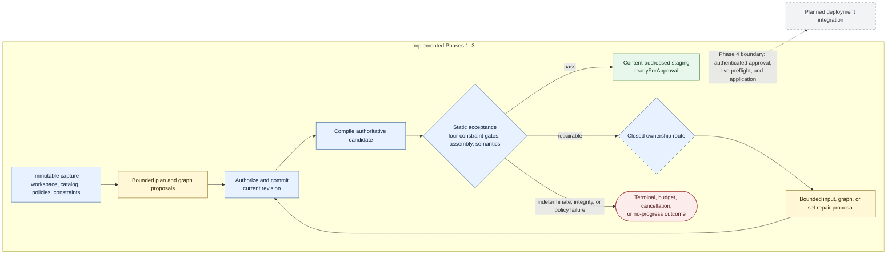
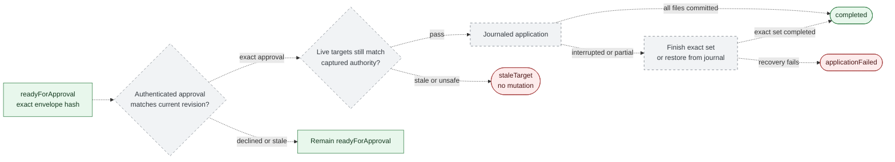

# Synthesize Regions Agent Runtime

## Product Description

> **Cross-project snapshot:** `synthesize-regions` owns the static library
> contracts described here, while runtime-core owns the implemented Phase 1–3
> workflow and this document's authoritative source. Runtime Phase 1–3 ends at
> immutable `readyForApproval` staging; approval and filesystem application are
> future, separately versioned Phase 4 concerns and are not implemented here.

Synthesize Regions Agent Runtime is a local-first agentic system for producing
statically validated TypeScript artifact sets from a controlled catalog of
declarative code templates.

> **Implementation status:** runtime-core implements capture, planning,
> deterministic repair, four constraint phases, compilation, assembly,
> semantics, and content-addressed static staging through `readyForApproval`.
> The exact approval/result-binding protocol exists, but authentication, live
> target preflight, journaled filesystem application, HTTP transport, and
> telemetry are Phase 4 or deployment-integration work and are not implemented
> by this package.

The implemented core combines:

- a deployment-selected OpenAI-compatible structured-output provider (for
  example a locally hosted Qwen model through `llama-server`);
- the Vercel AI SDK;
- JSON Schema-constrained model output;
- the graph, template, and artifact-set APIs from `synthesize-regions`;
- optional repository-owned Workspace Constraints captured as data;
- a declarative workflow definition compiled into protocol and XState tooling;
- a fixed static acceptance pipeline;
- transactional session and approval records.

Models do not edit files, define executable templates, run code, write tests, or
decide whether their work is acceptable. They propose artifact plans, synthesis
graphs, graph patches, and narrowly scoped template inputs. Deterministic
infrastructure validates those proposals and controls every state transition.

The concrete dependency choices, internal module boundaries, and exact
`synthesize-regions` integration allowlist are recorded in the
[Synthesis Workflow Implementation Inventory](./synthesis-workflow-implementation-inventory.md).

## Product Goal

The product provides a controlled alternative to unrestricted source-generating
agents. It is intended for developers who want model-assisted TypeScript
synthesis with explicit answers to these questions:

- Which reviewed template operation produced each source range?
- Which values and fragments were supplied to that operation?
- Does every graph satisfy its catalog contracts?
- Is the complete artifact set valid TypeScript in the target project?
- Which project paths and ranges may be changed?
- What exact change set is waiting for approval?
- Can every accepted decision be reconstructed after interruption?

A caller supplies an objective, authorized targets/create roots, resource
budgets, a workspace-capture draft, a validated declarative catalog, a
deployment-owned policy bundle, and optionally an authorized
[Workspace Constraints](./workspace-constraints-product-description.md) entry.
`captureSessionInput()` derives the immutable workspace, catalog, policy, and
constraint identities; callers do not assert those authority-bearing values.
Every capture-policy required path must be an actual regular file in that
snapshot. A symlink at the path or in an ancestor is recorded but never followed
and cannot satisfy the requirement.

A successful session produces:

- an artifact-set plan;
- one completed synthesis graph per artifact;
- any accepted artifact-fill ledger entries;
- generated TypeScript artifacts and provenance;
- static diagnostics and project-semantic results;
- constraint phase results and diagnostics when constraints are configured;
- a content-addressed staged change set and pointer-only staging receipt.

The Phase 4 design extends that result with authenticated approval, live-target
revalidation, and application history.

## Product Boundaries

The runtime is deliberately static. It does not:

- execute generated TypeScript;
- run test, build, lint, package-manager, or shell commands;
- generate or rewrite tests as part of its validation loop;
- load arbitrary or custom validators;
- install dependencies;
- import user-provided template modules;
- permit models to register templates;
- grant unrestricted filesystem access;
- delete or rename files;
- claim that static acceptance proves runtime behavior or business correctness.

The current runtime stages an artifact set and binds an exact approval envelope.
The Phase 4 application design applies an explicitly approved set as a
controlled delivery operation; it is never model authority.

Workspace Constraints do not weaken this boundary. They are parsed as a closed,
data-only language and evaluated by library-owned fact providers; they cannot
install validators, execute project code, or alter workflow topology.

## Declarative Template Vocabulary

The runtime plans against `synthesize-regions` graph template manifests. A
manifest is deterministic data:

```text
typed input ports
        |
marked TypeScript source string
        |
one declared output fragment
```

A manifest contains a stable model ID, version, planner-facing description,
input-port contracts, an output contract, and marked source. It contains no
callbacks, getters, custom invocation methods, or other author-provided
executable JavaScript.

The library validates and compiles manifests using library-owned code. The
runtime loads manifests from validated data files rather than importing catalog
JavaScript. Models receive implementation-free summaries and cannot alter
manifest source.

Template inputs may accept:

- JSON-like literals;
- fragments generated by compatible templates;
- ordered fragment collections;
- explicitly permitted raw TypeScript snippets;
- controlled unions of those forms.

Raw code remains a narrow source channel. It is parsed in its exact TypeScript
context and checked against port length, newline, substring, pattern, kind, and
type policies. These checks establish source-policy compliance; they are not a
claim about the behavior of that source if another system later executes it.

## Two Catalog Identities

Each catalog snapshot exposes two identities:

- `contractDigest` identifies the normalized planner-facing vocabulary;
- `manifestDigest` identifies the exact normalized manifests and synthesis
  engine contracts that produce source.

Each template also has a content digest recorded in artifact provenance. A
session captures both catalog digests. Planning requires the contract digest,
while compilation, resumption, filling, staging, and approval require both.

Changing only template source changes the manifest digest even when the planner
contract is unchanged. This prevents an old graph from silently producing new
source under the same planner vocabulary.

## Artifact Sets

One session may produce several TypeScript artifacts. Each artifact-set unit has:

- a stable artifact ID;
- one ordinary synthesis graph with one final node;
- a create-file or replace-range target;
- a required final output kind;
- a graph revision and compilation state.

Cross-artifact dependencies are expressed as normal TypeScript relationships,
such as imports and exported declarations. Graph references do not cross
artifact boundaries. The complete artifact set is checked together in one
virtual project overlay.

Existing-file targets are authorized by the request using an exact path, UTF-16
range, expected region kind, and base-file hash. Models may propose new files
only below configured create roots. A model-proposed path never grants permission
to read an existing file.

Optional Workspace Constraints use a separate set of server-authorized,
read-only analysis roots. Those roots let infrastructure derive bounded facts;
they do not authorize writes or automatically disclose analyzed source to a
model. Model visibility remains limited to the summaries, subjects,
diagnostics, and redacted excerpts required for its current role.

## Authoritative Candidate

The graph alone is not sufficient when artifact fills are supported. The
authoritative candidate consists of:

- the artifact-set plan;
- every artifact's current graph revision;
- every graph node's explicit generic type arguments, when its template declares
  parameters;
- the accepted fill ledger;
- contract and manifest digests;
- the workspace snapshot identity;
- the captured constraint identity, when constraints are configured.

Workflow, policy, catalog-manifest/disclosure, and staging identities belong to
the enclosing session and approval envelope. A `StagingReceipt` is session
state derived from the candidate; it is not a field of `ArtifactSetCandidate`.

The optional constraint identity binds the entry path, semantic digest, exact
source snapshot, fact-engine version, and authorized analysis snapshot. Each
fill is bound to an artifact ID, graph hash, base artifact hash, unresolved
input IDs, and resulting artifact hash. Rejected fills do not change state. Any
graph edit invalidates fills for that artifact, and any candidate change
invalidates a previously staged change set or approval.

## Declarative Workflow Model

The session lifecycle has one finite, declarative workflow definition. It names
states, accepted domain events, target states, terminal states, and descriptive
transition metadata. It contains no model calls, compiler work, filesystem
operations, database access, or authorization callbacks.

The normalized definition has a version and digest captured by every session.
This private `0.1.x` core does not migrate or upcast persisted development data:
unsupported workflow, protocol, reducer, or database versions fail explicitly
and require a fresh database.
The current hard-cutover identities are workflow `8`, protocol/reducer `7`,
database schema `9`, model-role contract `4`, prompt set `5`, captured
context/static tasks `5`, and approval envelope `4`. Catalogs use the exact
`synthesize-regions` `0.6.1` `c7_`/`t4_`/`m4_` identity generations. Earlier
development databases and evidence are recreated; there is no migration.
The topology contains the four constraint-check phases and set-repair loop even
when a session has no constraints. Repository `.wsc` files supply policy data
only; they cannot add states, transitions, effects, or authorization logic.

```text
canonical workflow definition
          |
          +-- generated TypeScript state/event unions
          +-- generated permitted-transition index
          +-- generated XState v5 visualization model
          +-- generated JSON Schemas and transition fixtures
          +-- generated state diagram and coverage checks
```

Production state management remains explicit:

- a pure command decider authorizes a request and proposes domain events;
- a pure event reducer reconstructs state from accepted events;
- exhaustive TypeScript matching handles status-specific data changes;
- SQLite appends events and updates materialized state with revision CAS;
- a transactional outbox schedules model and static work only after the state
  transaction commits; workflow 7 contains no filesystem-application work.

XState is a generated workflow representation for visualization, reachability,
path analysis, and model-based testing. XState actor snapshots, actions, and
invocations are not authoritative session state and do not perform production
effects.

## Agent Roles

The runtime uses five bounded roles.

### Artifact-Set Planner

Selects authorized replacement slots, proposes new-file targets below allowed
roots, assigns artifact goals, and creates the initial artifact-set plan.

### Graph Planner

Produces one partial synthesis graph for one artifact using the visible catalog
summaries and captured contract digest.

### Graph Repairer

Returns one scoped graph patch in response to graph or semantic diagnostics.
Patches are validated and applied transactionally.

### Input Synthesizer

Proposes either one authorized graph input or raw/literal values for one exact
unresolved artifact fill. For raw-code ports it receives only the owning
artifact, node, input name, exact region kind, type metadata, source policy, and
a small source excerpt. A fill proposal carries the current artifact, graph,
and base-artifact identities plus only the authorized unresolved input value;
the role input and state-specific schema bind its unresolved-input and port
identities. It carries no resulting artifact hash. A runtime-owned one-shot
worker verifies and applies the proposal and computes that authoritative hash
before the fill may be accepted.

### Artifact-Set Repairer

Proposes one authorized plan-shape change when a constraint violation requires
adding or removing an artifact, or changing an artifact's authorized target or
goal. Added and invalidated artifacts return through plan constraint checking
and Graph Planning. The role cannot grant target authority or modify active
constraint modules.

There is no model-based failure classifier. The runtime routes work from
compiler classifications, artifact identity, target paths, and source
provenance. Ambiguous cross-artifact failures are surfaced to the Artifact-Set
Repairer or set-level coordinator without inventing causal attribution.

## End-to-End Synthesis Flow



Every model result crosses the canonical schema and current-state authorization
gate before it can change the accepted candidate. Static acceptance never
executes generated code, runs tests or linting, or proves behavioral
correctness. Solid arrows are implemented control flow. The dotted gray edge is
the unimplemented Phase 4 boundary; this package stops at `readyForApproval`.

Detailed views are split by the question they answer:

| Question | Diagram |
| --- | --- |
| How are workspace, catalog, policy, and constraint identities captured? | [Immutable capture and reconstruction](./synthesis-workflow-technical-design.md#81-immutable-capture-and-reconstruction) |
| How do generic catalog declarations become planned bindings, repair authority, and provenance? | [Generic catalog dataflow and repair](./synthesis-workflow-technical-design.md#73-catalog-disclosure) |
| How is a model fill turned into an authoritative artifact hash? | [Input Synthesizer sequence](./synthesis-workflow-technical-design.md#114-input-synthesizer) |
| How does a failure reach input, graph, set, or terminal handling? | [Deterministic failure routing](./synthesis-workflow-technical-design.md#12-deterministic-failure-routing) |
| Which evidence gates staging? | [Static acceptance pipeline](./synthesis-workflow-technical-design.md#14-static-acceptance-pipeline) |
| Which lifecycle transitions are authoritative? | [Session state machine](./synthesis-workflow-technical-design.md#15-state-machine) |
| How is work committed and executed after the transaction? | [Atomic outbox sequence](./synthesis-workflow-technical-design.md#173-atomic-append-projection-and-outbox) |
| What happens to expired work after restart? | [External-work reconciliation](./synthesis-workflow-technical-design.md#174-external-work-and-reconciliation) |
| How do exact bytes and evidence become a pointer-only receipt? | [Staging evidence binding](./synthesis-workflow-technical-design.md#18-staging-and-approval) |
| How do Workspace Constraints interleave with synthesis? | [Four-phase evaluation pipeline](./workspace-constraints-technical-design.md#13-evaluation-pipeline) |

## Static Acceptance Pipeline

Before an artifact set may be approved, the runtime requires:

1. canonical protocol and role-specific schema validation;
2. current-session action authorization;
3. workflow, catalog, workspace, and optional constraint identity agreement;
4. plan-constraint evaluation, or an explicit skip when no applicable rules
   exist;
5. graph and artifact-set compilation;
6. artifact/provenance-constraint evaluation or explicit skip;
7. syntax, artifact-integrity, raw-port, and source-policy checks;
8. target, path, range, overlap, and base-hash validation;
9. staging in an immutable project snapshot overlay;
10. assembled tree/syntax-constraint evaluation or explicit skip;
11. TypeScript semantic validation with no new baseline-relative errors;
12. semantic-constraint evaluation or explicit skip;
13. deterministic change-set hashing bound to every captured identity.

The phase topology and fixed gates are runtime policy, not caller-supplied
executable validators. Optional Workspace Constraints supply only bounded rule
data within those phases. A phase records `notConfigured` when the request has
no constraint set and `noApplicableRules` when the captured set has no rule for
that phase.

Semantic and Workspace Constraint analysis always uses the exact captured
`tsconfig` and authorized immutable workspace snapshot. Missing, malformed, or
non-text configuration and inaccessible required analysis files fail closed;
there is no fallback TypeScript project.

Static acceptance means that the candidate satisfied this policy. It does not
prove runtime safety, business behavior, performance, or test correctness.

## Compiler-Guided Repair

Partial graphs may omit required inputs or contain repairable dangling
references. Compilation distinguishes:

- structural graph repair;
- unresolved artifact input filling;
- catalog or manifest policy failures;
- terminal session identity or integrity failures.

Generic templates declare named type parameters in source-free summaries, and
each planned generic node supplies a complete concrete `typeArguments` map.
Catalog-specific schemas enforce names and completeness; authoritative
compilation enforces constraints and compatibility. Candidate-originated
missing, invalid, or incompatible bindings carry exact `typeParameterName`
ownership and grant the Graph Repairer only a revision/hash-bound
`setTypeArgument` action. An exact unknown present argument grants only
`removeTypeArgument`. Accepted repairs increment that artifact's graph revision,
invalidate downstream evidence, and recompile. Successful artifacts retain the
concrete bindings in provenance and therefore in candidate and staging hashes.

Constraint evaluation adds deterministic ownership routes: exact generated
inputs return to the Input Synthesizer, graph-owned violations return to the
Graph Repairer, and plan-shape or cross-artifact violations return to the
Artifact-Set Repairer. Every accepted artifact-set patch is rechecked from the
plan phase before new or invalidated artifacts enter Graph Planning.

Every model response proposes one schema-constrained action. The runtime
validates it against the canonical protocol, the current catalog, and the
current session state before commitment. Failed actions leave the accepted
candidate unchanged.

Semantic failures are mapped through artifact and graph source maps when a
compiler location permits exact attribution. Provenance describes textual
ownership, not behavioral causality.

## Staging and the Phase 4 Approval/Application Boundary

A statically accepted candidate becomes a content-addressed change set in
`readyForApproval`. Resulting files, the ordered change manifest, full library
result, and approval envelope are separate CAS blobs. The session retains a
bounded pointer-only receipt containing their hashes plus ordered file
path/kind/base/result/source-blob metadata; generated source is not stored
inline in session state.

The approval envelope binds a future approval to the current session revision
and exact envelope hash. Authentication, the approval command, and the live
application worker are Phase 4 integration responsibilities. Such an approval
becomes stale after any
candidate, catalog, policy, workflow, workspace, constraint-source,
constraint-engine, or analysis-snapshot change.

The remaining behavior in this section is the Phase 4 design, not current
runtime-core behavior.



Every edge is dotted because this entire process is a planned Phase 4
integration rather than current runtime-core behavior.

Immediately before application, the runtime rechecks:

- workspace-root containment and path normalization;
- symlink traversal;
- base hashes and replacement ranges;
- new-file absence;
- non-overlapping edits;
- approval freshness;
- exact active constraint module bytes and analysis identity, when configured.

Application supports only new-file creation and explicit range replacement. It
uses staged temporary files, a recovery journal, backups, and restart recovery.
The product describes this as recoverable transactional application rather than
claiming filesystem-wide atomicity.

## Transactional Sessions

Sessions use append-only events plus materialized state. Mutations require an
expected revision and idempotency key. A per-session lease and fencing token
prevent concurrent workers from committing competing transitions.

Each stream is bound to the workflow ID, version, and digest used to interpret
its events. The stream also captures the optional constraint identity. Those
identities are carried through staging and approval.

Commands are requests, while domain events are accepted facts. A pure command
decider checks state-specific authorization, hashes, revisions, policies, and
budgets. A separate pure reducer applies committed events. The reducer target
must match the transition declared by the canonical workflow definition.

The event history records proposals, bounded role rejections, accepted graph
revisions, fills, fill invalidations, compilations, constraint captures, phase
passes/failures/skips, artifact-set patches, static diagnostics, staged change
sets, cancellations, budget outcomes, and terminal failures. It contains no
approval or application events; Phase 4 consumes the immutable envelope through
its own versioned protocol.

Content blobs are staged before events reference them. Event append,
materialized-state comparison-and-swap, and insertion of derived outbox work
occur in one database transaction. Model inference, compilation, static
analysis, and future filesystem operations run after commit and report
completion or failure through new commands. Interrupted work is reconciled from
handler recovery metadata after restart. Deterministic work is retried. External
work is retried before its durable start marker, after a gateway-certified
`requestNotSent` outcome, or when the captured gateway capability declares
invocation-ID idempotency. A durably captured `responseReceived` outcome is also
locally replayable without repeating the provider request. A non-idempotent
external call with an unknown post-start outcome terminalizes the still-bound
session instead of being blindly repeated. Received responses are captured and
charged even when their structured output is rejected. Failure kind and external
outcome are recorded as separate facts. Provider-controlled output is normalized
iteratively without invoking accessors and is rejected into a canonical
chargeable envelope when it exceeds the role byte/depth bounds or is not JSON
data.

## Model Runtime

The runtime uses a configured OpenAI-compatible provider. Qwen served by
`llama-server` is one deployment option, not a protocol requirement. The Vercel
AI SDK provides transport, structured output, cancellation, and usage
accounting.

Every role returns one direct JSON value. The initial design does not expose an
open-ended, model-controlled tool loop. Model-facing schemas are conservative
projections of canonical schemas; canonical validation always runs afterward.

Capture persists one complete source-free catalog disclosure and fails closed
if its summary-count or byte limits are exceeded; summaries are never silently
truncated. Artifact planning receives that bounded capability index. Graph and
repair roles receive deterministic compatible-producer closures and referenced
template summaries rather than the full catalog. There is no model-driven
catalog retrieval or expansion loop.

The capability closure is owned by `synthesize-regions`, not reimplemented by
the runtime. It instantiates existing nodes with their exact generic bindings,
uses exact type/schema comparison for concrete contracts, and conservatively
retains placeholder-bearing or indeterminate generic producers only after
output-kind, schema, and source-model restrictions pass. Disclosure remains
source-free and bounded; conservative inclusion never adds catalog authority.

## Security and Resource Model

Generated source and model responses remain untrusted data even after static
acceptance. The runtime never imports or executes generated artifacts.

Security controls include:

- declarative, data-only runtime catalogs;
- data-only constraint parsing with immutable module capture;
- closed structured model protocols;
- state-specific authorization;
- exact existing-file targets and bounded create roots;
- Linux descriptor-rooted workspace capture using held `/proc/self/fd`
  directory handles and `O_NOFOLLOW`, with no path-based fallback;
- evaluator-only analysis roots that grant neither writes nor automatic model
  disclosure;
- immutable workflow, catalog, workspace, and optional constraint identities;
- mandatory source-policy and TypeScript checks;
- explicit approval before filesystem mutation;
- bounded materialized state, single-blob and cumulative session CAS quotas;
- SQLite-reserved write scopes plus exclusive, grace-period, reachability-safe
  blob and stale-temporary sweeping;
- FIFO byte reservations for context materialization and a settled-only,
  effective-budget-keyed weighted LRU;
- redaction, retention, and restricted storage access.

Model and compiler work runs in cancellable one-shot workers for resource
isolation, not for generated-code execution. Captured deployment policy bounds
aggregate worker count, reserved heap, in-flight bytes, and per-operation
input/output sizes. Sessions bound model calls, revisions, rejected
actions, artifacts, nodes, nesting, collection sizes, raw source, schema depth,
generated bytes, diagnostics, storage, wall time, memory, and concurrency.
Configured constraints add bounds for imported modules, rule and expression
structure, files/source/syntax scans, selected subjects, path steps, fact rows,
join pairs, quantifier/aggregate work, type queries, violations, and diagnostics.
Constraint evidence has no wall-clock budget; timeout or heap exhaustion is a
worker failure and fails closed separately.

Repeated candidate and diagnostic fingerprints trigger strategy changes and
then a deterministic no-progress or budget-exhausted result.

## Supported Outputs

Graphs retain exact syntax kinds such as expressions, statements, declarations,
types, members, parameters, and full `sourceFile` artifacts. Higher-level shapes
such as route handlers or configuration modules are catalog-defined programs
represented within those exact kinds.

An artifact set may combine full new files and typed replacements in existing
files. The runtime does not equate product-level shapes with graph region kinds.

## Product Invariant

The core invariant is:

> Models propose bounded synthesis decisions. Deterministic infrastructure
> decides whether the resulting artifact set satisfies the fixed static policy
> and any captured data-only Workspace Constraints, and an authorized caller
> decides whether the exact staged change set may be applied.
