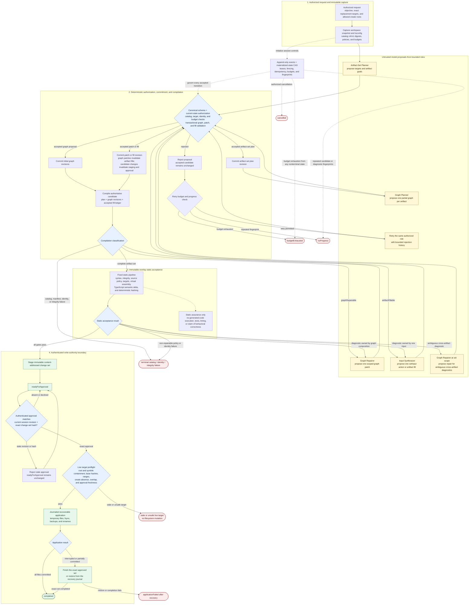

# Synthesize Regions Agent Runtime

## Product Description

Synthesize Regions Agent Runtime is a local-first agentic system for producing
statically validated TypeScript artifact sets from a controlled catalog of
declarative code templates.

The runtime combines:

- locally hosted Qwen models;
- `llama.cpp` inference servers;
- the Vercel AI SDK;
- JSON Schema-constrained model output;
- the graph, template, and artifact-set APIs from `synthesize-regions`;
- a fixed static acceptance pipeline;
- transactional session and approval records.

Models do not edit files, define executable templates, run code, write tests, or
decide whether their work is acceptable. They propose artifact plans, synthesis
graphs, graph patches, and narrowly scoped template inputs. Deterministic
infrastructure validates those proposals and controls every state transition.

## Product Goal

The product provides a controlled alternative to unrestricted source-generating
agents. It is intended for developers who want model-assisted TypeScript
synthesis with explicit answers to these questions:

- Which reviewed template operation produced each source range?
- Which values and fragments were supplied to that operation?
- Does every graph satisfy its catalog contracts?
- Is the complete artifact set valid TypeScript in the target project?
- Which project paths and ranges may be changed?
- What exact change set is waiting for approval?
- Can every accepted decision be reconstructed after interruption?

A request describes an objective, one or more authorized targets, an immutable
workspace snapshot, a TypeScript configuration, catalog identity, static policy,
model profiles, and resource budgets.

A successful session produces:

- an artifact-set plan;
- one completed synthesis graph per artifact;
- any accepted artifact-fill ledger entries;
- generated TypeScript artifacts and provenance;
- static diagnostics and project-semantic results;
- a content-addressed staged change set;
- an approval and application history when application was requested.

## Product Boundaries

The runtime is deliberately static. It does not:

- execute generated TypeScript;
- run test, build, lint, package-manager, or shell commands;
- generate or rewrite tests as part of its validation loop;
- load arbitrary or custom validators;
- install dependencies;
- import user-provided template modules;
- permit models to register templates;
- grant unrestricted filesystem access;
- delete or rename files;
- claim that static acceptance proves runtime behavior or business correctness.

The runtime may stage and apply an explicitly approved artifact set. Application
is a controlled delivery operation, not model authority.

## Declarative Template Vocabulary

The runtime plans against `synthesize-regions` graph template manifests. A
manifest is deterministic data:

```text
typed input ports
        |
marked TypeScript source string
        |
one declared output fragment
```

A manifest contains a stable model ID, version, planner-facing description,
input-port contracts, an output contract, and marked source. It contains no
callbacks, getters, custom invocation methods, or other author-provided
executable JavaScript.

The library validates and compiles manifests using library-owned code. The
runtime loads manifests from validated data files rather than importing catalog
JavaScript. Models receive implementation-free summaries and cannot alter
manifest source.

Template inputs may accept:

- JSON-like literals;
- fragments generated by compatible templates;
- ordered fragment collections;
- explicitly permitted raw TypeScript snippets;
- controlled unions of those forms.

Raw code remains a narrow source channel. It is parsed in its exact TypeScript
context and checked against port length, newline, substring, pattern, kind, and
type policies. These checks establish source-policy compliance; they are not a
claim about the behavior of that source if another system later executes it.

## Two Catalog Identities

Each catalog snapshot exposes two identities:

- `contractDigest` identifies the normalized planner-facing vocabulary;
- `manifestDigest` identifies the exact normalized manifests and synthesis
  engine contracts that produce source.

Each template also has a content digest recorded in artifact provenance. A
session captures both catalog digests. Planning requires the contract digest,
while compilation, resumption, filling, staging, and approval require both.

Changing only template source changes the manifest digest even when the planner
contract is unchanged. This prevents an old graph from silently producing new
source under the same planner vocabulary.

## Artifact Sets

One session may produce several TypeScript artifacts. Each artifact-set unit has:

- a stable artifact ID;
- one ordinary synthesis graph with one final node;
- a create-file or replace-range target;
- a required final output kind;
- a graph revision and compilation state.

Cross-artifact dependencies are expressed as normal TypeScript relationships,
such as imports and exported declarations. Graph references do not cross
artifact boundaries. The complete artifact set is checked together in one
virtual project overlay.

Existing-file targets are authorized by the request using an exact path, UTF-16
range, expected region kind, and base-file hash. Models may propose new files
only below configured create roots. A model-proposed path never grants permission
to read an existing file.

## Authoritative Candidate

The graph alone is not sufficient when artifact fills are supported. The
authoritative candidate consists of:

- the artifact-set plan;
- every artifact's current graph revision;
- the accepted fill ledger;
- contract and manifest digests;
- the workspace snapshot identity;
- the staged change-set hash, when present.

Each fill is bound to an artifact ID, graph hash, base artifact hash, unresolved
input IDs, and resulting artifact hash. Rejected fills do not change state. Any
graph edit invalidates fills for that artifact, and any candidate change
invalidates a previously staged change set or approval.

## Agent Roles

The runtime uses four bounded roles.

### Artifact-Set Planner

Selects authorized replacement slots, proposes new-file targets below allowed
roots, assigns artifact goals, and creates the initial artifact-set plan.

### Graph Planner

Produces one partial synthesis graph for one artifact using the visible catalog
summaries and captured contract digest.

### Graph Repairer

Returns one scoped graph patch in response to graph or semantic diagnostics.
Patches are validated and applied transactionally.

### Input Synthesizer

Supplies one authorized graph input or unresolved artifact fill. For raw-code
ports it receives only the owning artifact, node, input name, exact region kind,
type metadata, source policy, and a small source excerpt.

There is no model-based failure classifier. The runtime routes work from
compiler classifications, artifact identity, target paths, and source
provenance. Ambiguous cross-artifact failures are surfaced as set-level repair
work without inventing causal attribution.

## End-to-End Synthesis Flow



Every model result crosses the canonical schema and current-state authorization
gate before it can change the accepted candidate. Static acceptance never
executes generated code, runs tests or linting, or proves behavioral
correctness. The only path to filesystem mutation crosses exact revision/hash
approval and the live target preflight.

## Static Acceptance Pipeline

Before an artifact set may be approved, the runtime requires:

1. canonical protocol and role-specific schema validation;
2. current-session action authorization;
3. contract and manifest digest agreement;
4. graph and artifact-set compilation;
5. syntax, artifact-integrity, raw-port, and source-policy checks;
6. target, path, range, overlap, and base-hash validation;
7. staging in an immutable project snapshot overlay;
8. TypeScript semantic validation of the complete artifact set;
9. no new semantic errors relative to the workspace baseline;
10. deterministic change-set hashing.

These gates are fixed runtime policy, not caller-supplied executable validators.
A controlled default TypeScript project may be used for standalone new files;
project changes otherwise require a captured project snapshot and `tsconfig`.

Static acceptance means that the candidate satisfied this policy. It does not
prove runtime safety, business behavior, performance, or test correctness.

## Compiler-Guided Repair

Partial graphs may omit required inputs or contain repairable dangling
references. Compilation distinguishes:

- structural graph repair;
- unresolved artifact input filling;
- catalog or manifest policy failures;
- terminal session identity or integrity failures.

Every model response proposes one schema-constrained action. The runtime
validates it against the canonical protocol, the current catalog, and the
current session state before commitment. Failed actions leave the accepted
candidate unchanged.

Semantic failures are mapped through artifact and graph source maps when a
compiler location permits exact attribution. Provenance describes textual
ownership, not behavioral causality.

## Staging, Approval, and Application

A statically accepted candidate becomes a content-addressed change set in
`readyForApproval`. The change set includes the workspace snapshot, both catalog
digests, target descriptors, base hashes, exact generated bytes, and source
provenance.

Approval is a separate authenticated operation containing the current session
revision and exact change-set hash. Approval becomes stale after any candidate,
catalog, policy, or workspace change.

Immediately before application, the runtime rechecks:

- workspace-root containment and path normalization;
- symlink traversal;
- base hashes and replacement ranges;
- new-file absence;
- non-overlapping edits;
- approval freshness.

Application supports only new-file creation and explicit range replacement. It
uses staged temporary files, a recovery journal, backups, and restart recovery.
The product describes this as recoverable transactional application rather than
claiming filesystem-wide atomicity.

## Transactional Sessions

Sessions use append-only events plus materialized state. Mutations require an
expected revision and idempotency key. A per-session lease and fencing token
prevent concurrent workers from committing competing transitions.

The event history records proposals, schema rejections, accepted graph
revisions, fills, fill invalidations, compilations, static diagnostics, staged
change sets, approvals, application attempts, cancellations, budget outcomes,
and terminal failures.

Content blobs are staged before events reference them. Event append and
materialized-state comparison-and-swap occur in one database transaction.
Interrupted model or compiler work is reconciled by invocation ID after restart.

## Local Model Runtime

Qwen models run through configured `llama.cpp` servers. The Vercel AI SDK
provides transport, structured output, cancellation, and usage accounting.

Every role returns one direct JSON value. The initial design does not expose an
open-ended, model-controlled tool loop. Model-facing schemas are conservative
projections of canonical schemas; canonical validation always runs afterward.

Large catalogs are exposed incrementally. A planner first receives a compact
capability index, selects candidate model IDs, and then receives complete
summaries for a bounded session-visible subset. A catalog gap is reported only
after the configured retrieval and expansion budget is exhausted.

## Security and Resource Model

Generated source and model responses remain untrusted data even after static
acceptance. The runtime never imports or executes generated artifacts.

Security controls include:

- declarative, data-only runtime catalogs;
- closed structured model protocols;
- state-specific authorization;
- exact existing-file targets and bounded create roots;
- immutable catalog and workspace identities;
- mandatory source-policy and TypeScript checks;
- explicit approval before filesystem mutation;
- redaction, bounded persistence, retention, and restricted storage access.

Model and compiler work runs in cancellable workers for resource isolation, not
for generated-code execution. Sessions bound model calls, revisions, rejected
actions, artifacts, nodes, nesting, collection sizes, raw source, schema depth,
generated bytes, diagnostics, storage, wall time, memory, and concurrency.

Repeated candidate and diagnostic fingerprints trigger strategy changes and
then a deterministic no-progress or budget-exhausted result.

## Supported Outputs

Graphs retain exact syntax kinds such as expressions, statements, declarations,
types, members, parameters, and full `sourceFile` artifacts. Higher-level shapes
such as route handlers or configuration modules are catalog-defined programs
represented within those exact kinds.

An artifact set may combine full new files and typed replacements in existing
files. The runtime does not equate product-level shapes with graph region kinds.

## Product Invariant

The core invariant is:

> Models propose bounded synthesis decisions. Deterministic infrastructure
> decides whether the resulting artifact set satisfies the fixed static policy,
> and an authorized caller decides whether the exact staged change set may be
> applied.
