# Technical Design: Static Synthesize Regions Agent Runtime

**Status:** Draft  
**Version:** 0.3  
**Primary language:** TypeScript  
**Deployment:** Local-first or private-network  
**Core dependencies:** `synthesize-regions`, Vercel AI SDK, `llama.cpp`, Qwen,
XState v5 tooling

## 1. Purpose

This document defines a general-purpose agentic runtime that synthesizes
statically validated TypeScript artifact sets through `synthesize-regions`.

Models act as constrained planners. They propose artifact plans, synthesis
graphs, graph patches, artifact-set patches, and template inputs. The runtime
validates, persists, stages, and optionally applies those decisions. A request
may also select an immutable, data-only
[Workspace Constraints](./workspace-constraints-technical-design.md) policy.

The runtime never executes generated code, runs project commands, invokes
linters, generates tests, installs dependencies, or loads caller-provided
validators or template modules.

## 2. Goals

The runtime shall:

1. Produce one or more TypeScript artifacts from a natural-language objective.
2. Restrict structural generation to a captured declarative template catalog.
3. Restrict arbitrary TypeScript to explicit raw-code ports.
4. Use schema-constrained local model calls with canonical post-validation.
5. Preserve graph repair and artifact filling as distinct transactional actions.
6. Validate the complete artifact set in an immutable TypeScript project view.
7. Stage a deterministic, content-addressed change set.
8. Require explicit approval before modifying authorized project files.
9. Persist enough state for replay, recovery, audit, and stale-action rejection.
10. Terminate predictably on policy, catalog, identity, resource, or no-progress
    failures.
11. Evaluate optional Workspace Constraints at fixed plan, artifact, assembled,
    and semantic phases without changing workflow or filesystem authority.

## 3. Non-Goals

The runtime will not:

- execute, import, or evaluate generated artifacts;
- run test, build, lint, package-manager, or shell commands;
- write tests or use tests as synthesis feedback;
- load arbitrary/custom validators;
- let repository constraint files define workflow states, transitions, effects,
  or authorization logic;
- install dependencies;
- let models register or modify templates;
- import catalog JavaScript supplied by a session;
- permit unrestricted filesystem edits;
- support deletion or rename in the initial application protocol;
- claim static acceptance proves runtime behavior or business correctness;
- expose an open-ended model-controlled tool loop.

Repository tests for the runtime and library remain normal engineering work and
are unrelated to candidate synthesis.

## 4. Design Invariants

### 4.1 Candidate authority

The authoritative candidate is an artifact-set plan plus accepted fill ledger,
not generated source and not one graph alone.

```ts
interface ArtifactSetCandidate {
  plan: ArtifactSetPlan;
  graphRevisions: Record<string, number>;
  fillLedger: ArtifactFillLedgerEntry[];

  contractDigest: string;
  manifestDigest: string;
  workspaceSnapshotId: string;
  constraintIdentity?: WorkspaceConstraintIdentity;

  stagedChangeSetHash?: string;
}
```

Generated artifacts and change sets are derived values. Any accepted graph,
fill, target, catalog, policy, workspace, or captured constraint/analysis change
invalidates downstream staged state and approval.

### 4.2 Models propose; infrastructure commits

A model result has no direct effect. Before commitment it passes:

1. JSON parsing;
2. model-facing schema validation;
3. canonical protocol validation;
4. current-state authorization;
5. catalog-specific validation;
6. transactional graph or fill validation;
7. resource-budget checks.

### 4.3 Templates are data

Runtime catalogs contain normalized `GraphTemplateManifest` data. Author
callbacks, getters, custom invocation functions, and dynamically imported
catalog modules are unsupported. Only library-owned code compiles and invokes
manifests.

### 4.4 Static acceptance is not behavioral proof

The acceptance pipeline proves only the configured structural, source-policy,
syntax, target, and TypeScript semantic properties. Generated code remains
untrusted data and is never executed by this runtime.

### 4.5 Fail closed

Unknown identity, stale workspace state, indeterminate compatibility, invalid
persisted data, incomplete mandatory analysis, or resource exhaustion never
counts as success.

### 4.6 One workflow topology

One declarative `WorkflowDefinition` is the authoritative finite lifecycle
topology. It is compiled into TypeScript state/event unions, a permitted
transition index, JSON Schemas, an XState v5 machine, diagrams, and transition
fixtures.

The workflow definition contains no executable effects or authorization logic.
A pure command decider remains authoritative for whether a request may produce
domain events. A pure event reducer remains authoritative for reconstructing
status-specific session data. XState is a generated visualization and analysis
projection and cannot commit state or execute production work.
It contains a fixed superset of constraint-check and set-repair states. A `.wsc`
module can provide rule data for those states, but cannot change the topology or
cause effects directly.

## 5. Terminology

**Template manifest:** JSON-safe template metadata, ports, output, and marked
source.

**Contract digest:** identity of planner-facing catalog contracts.

**Manifest digest:** identity of exact normalized template manifests and engine
contracts.

**Artifact unit:** one synthesis graph, one final artifact, and one target.

**Artifact-set plan:** ordered collection of artifact units.

**Fill ledger:** accepted fills bound to graph and artifact hashes.

**Workspace snapshot:** immutable project view used for target and semantic
validation.

**Constraint identity:** optional binding of the captured `.wsc` entry,
semantic digest, exact source snapshot, constraint-engine version, and
authorized analysis snapshot.

**Analysis root:** captured read-only evaluator visibility. It grants neither
write authority nor automatic model disclosure.

**Static change set:** fully assembled file creations and range replacements
that passed all static gates.

**Approval:** authorization for one exact session revision and change-set hash.

**Workflow definition:** data-only declaration of lifecycle states, accepted
domain events, target states, terminal states, and descriptive metadata.

**Command:** authenticated request to make a state change; it may be rejected
without producing an accepted domain event.

**Domain event:** immutable accepted fact that evolves session state.

**Outbox work:** durable post-commit request for model, compiler, constraint,
static-analysis, or application work.

## 6. High-Level Architecture

```text
Client / editor
      |
      v
Agent runtime ---------------------------------------------------+
| generated workflow model  schema and authorization bridge      |
| budget manager            deterministic diagnostic router      |
| pure command/event core   event/state/outbox transaction mgr   |
+-------------+----------------------+----------------------------+
              |                      |
              v                      v
      Model gateway          Synthesis/static/constraint engine
      Vercel AI SDK          synthesize-regions
      llama.cpp/Qwen         manifest catalogs
      structured JSON        graph + artifact-set compilation
                             virtual project + bounded fact validation
                                      |
                                      v
                             Staged change-set store
                                      |
                              explicit approval
                                      |
                                      v
                         Recoverable application coordinator
```

The application coordinator belongs to the runtime. `synthesize-regions`
provides only pure compilation, assembly, and static-analysis primitives and
never writes project files.

The shared reader-facing workflow, including model proposal boundaries, repair
loops, static acceptance, approval, and recoverable application, is shown in
[End-to-End Synthesis Flow](./synthesis-workflow-product-description.md#end-to-end-synthesis-flow).

## 7. Declarative Catalogs

### 7.1 Manifest contract

```ts
interface GraphTemplateManifest<
  I extends Record<string, InputPort> = Record<string, InputPort>,
  M extends string = string,
  O extends OutputPort = OutputPort
> {
  modelId: M;
  version?: string;
  description?: string;
  inputs: I;
  output: O;
  source: string;
}
```

Manifest source uses ordinary `@TYPE`/`@END` markers. Registration requires one
marker for every declared input, no unknown or duplicate marker IDs, exact
marker/port kind agreement, valid fallback bodies, and valid output-context
syntax.

`sourceFile` is the complete-file output kind. It is parsed in file context,
cannot carry value-level type/schema metadata, and cannot be supplied through a
literal or raw-code port.

### 7.2 Catalog capture

```ts
interface CapturedCatalog {
  snapshot: TemplateRegistrySnapshot;
  contractDigest: string; // c4_...
  manifestDigest: string; // m1_...
  summaries: readonly TemplateSummary[];
  capabilityIndex: readonly TemplateCapabilityEntry[];
  strictGraphSchema: JsonSchema;
  partialGraphSchema: JsonSchema;
}
```

The contract digest excludes implementation source and supports planner
compatibility. The manifest digest includes exact LF-normalized marked source,
normalized contracts, per-template `t1_` digests, and engine versions.

Catalog snapshots deep-copy and freeze normalized data. Compilation and filling
require both expected digests. Artifact provenance records the producing
template's content digest.

### 7.3 Catalog disclosure

Large catalogs are not copied wholesale into prompts. The planner receives a
compact capability index, selects candidate IDs, and then receives complete
summaries for a bounded session-visible subset. The subset may expand through
additional direct structured calls. Catalog-gap failure requires exhaustion of
the configured retrieval budget.

## 8. Request and Authorization Model

```ts
interface WorkspaceConstraintRequest {
  entryPath: string;
  expectedConstraintDigest: string;
  analysisRoots: string[];
}

interface SynthesisRequest {
  requestId: string;
  objective: string;

  workspace: {
    snapshotId: string;
    rootPath: string;
    revision: string;
    tsConfigFilePath: string;
  };

  replacementTargets: Array<{
    targetId: string;
    path: string;
    start: number;
    end: number;
    regionKind: RegionKind;
    baseFileHash: string;
  }>;

  allowedCreateRoots: string[];

  expectedCatalogDigest: string;
  expectedCatalogManifestDigest: string;
  staticPolicyId: string;
  modelPolicyId: string;
  budgets: SynthesisBudgets;
  constraints?: WorkspaceConstraintRequest;
}
```

Paths are normalized workspace-relative POSIX paths. Replacement offsets are
zero-based UTF-16 offsets, matching TypeScript and JavaScript string positions.

Authority is intentionally split:

- exact replacement targets and `allowedCreateRoots` define write authority;
- server-authorized `analysisRoots` define read-only constraint-evaluator
  visibility within the immutable workspace snapshot;
- model prompts receive only bounded summaries, subject metadata, diagnostics,
  and redacted excerpts required for the current role.

A model may propose new paths only within `allowedCreateRoots`; a proposed
create path never grants access to an existing file. Analysis roots never grant
write authority or automatic source disclosure, and selectors cannot expand
them.

When `constraints` is present, capture parses the authorized `.wsc` import
closure as untrusted data, validates the expected digest, freezes the modules,
and denies every active module path as a synthesis target. When it is absent,
the workflow still traverses every constraint phase through explicit skip
events.

Static and model policies are server-defined IDs. Requests cannot supply code,
commands, plugins, validator implementations, or arbitrary model paths.

## 9. Artifact-Set Model

```ts
type ArtifactTarget =
  | { kind: "createFile"; path: string }
  | {
      kind: "replaceRange";
      path: string;
      start: number;
      end: number;
      baseFileHash: string;
      regionKind: RegionKind;
    };

interface ArtifactSetUnit {
  id: string;
  graph: SynthesisGraph;
  target: ArtifactTarget;
}

interface ArtifactSetPlan {
  artifacts: ArtifactSetUnit[];
}

interface ArtifactFillLedgerEntry {
  artifactId: string;
  graphHash: string;
  baseArtifactHash: string;
  inputs: TemplateArtifactInputMap;
  resultingArtifactHash: string;
}

interface WorkspaceConstraintIdentity {
  constraintEntryPath: string;
  constraintDigest: string;
  constraintSourceSnapshotHash: string;
  constraintEngineVersion: number;
  analysisSnapshotHash: string;
}
```

Artifact IDs are globally unique within a plan. Graph node IDs remain scoped to
their artifact. Graph references never cross artifacts.

New-file targets require `sourceFile` output. Replacement output must exactly
match the target region kind.

Several range replacements may target one existing file when they share the
same base hash and do not overlap. Assembly applies them from highest offset to
lowest. A create path admits exactly one create operation and no other operation.

## 10. Library Artifact-Set APIs

```ts
function compileArtifactSet(
  plan: ArtifactSetPlan,
  catalog: TemplateCatalogView,
  options: ArtifactSetCompileOptions
): ArtifactSetCompilationResult;

function validateArtifactSetStatic(
	plan: ArtifactSetPlan,
	catalog: TemplateCatalogView,
	options: ArtifactSetCompileOptions
): StaticArtifactSetResult;
```

`compileArtifactSet()` preserves artifact order, compiles each graph in strict or
partial mode, validates fill-ledger hashes, and scopes diagnostics with artifact
identity. It does not hide per-graph results.

Complete `compileArtifactSet()` results already pass mandatory semantics.
`validateArtifactSetStatic()` is the explicit final-gate facade: it accepts the
authoritative plan and fill ledger, recompiles them against the captured
catalog, and never accepts detached caller-constructed artifacts. Its pipeline:

1. validates path and target invariants;
2. verifies base hashes and ranges against the snapshot;
3. assembles changed files in memory;
4. creates a virtual TypeScript project overlay;
5. records baseline semantic diagnostics;
6. applies all candidate files to the overlay;
7. reports new semantic diagnostics with artifact/source provenance;
8. emits a canonical `ValidatedArtifactChangeSet` and SHA-256 hash.

The successful result is discriminated by `validation: "static"` and carries
the catalog contract digest, catalog manifest digest, workspace snapshot hash,
and static-policy version. The hash binds these identities. The lower-level
`assembleArtifactSetTargets()` result is discriminated by
`validation: "syntax"` and is never approval-eligible.

Neither API modifies the workspace.

## 11. Agent Roles

### 11.1 Artifact-Set Planner

Input:

- objective and target authorization;
- artifact and resource budgets;
- compact catalog capability index;
- contract digest;
- static-policy summary.

Output: one artifact-set outline selecting existing target IDs and proposing
normalized create paths and artifact goals.

### 11.2 Graph Planner

Input:

- one fixed artifact ID and target;
- objective scoped to that artifact;
- selected catalog summaries;
- contract digest;
- target region kind.

Output: one partial synthesis graph.

### 11.3 Graph Repairer

Input:

- fixed artifact ID;
- current graph;
- actionable diagnostics;
- relevant summaries and compatible producers;
- rejected actions and remaining budgets;
- currently authorized action kinds.

Output: exactly one scoped patch:

```ts
interface ScopedGraphPatch {
  artifactId: string;
  patch: GraphPatchAction;
}
```

### 11.4 Input Synthesizer

Input is limited to one graph or unresolved artifact input and its exact port
contract. Output is either:

```ts
interface ScopedSetInput {
  artifactId: string;
  action: {
    kind: "setInput";
    nodeId: string;
    inputName: string;
    input: SynthesisInput;
  };
}
```

or:

```ts
interface ScopedArtifactFill {
  artifactId: string;
  baseArtifactHash: string;
  action: {
    kind: "fill";
    inputs: TemplateArtifactInputMap;
  };
}
```

State-specific schemas fix artifact, node, input, and unresolved IDs wherever
possible. The model chooses only the permitted value or source string.

### 11.5 Artifact-Set Repairer

Input is limited to one actionable set-level diagnostic, the current plan,
authorized targets, relevant catalog capabilities, rejected actions, and
remaining budgets. Output is exactly one action:

```ts
type ArtifactSetPatchAction =
  | { kind: "addArtifact"; artifact: ArtifactOutline }
  | { kind: "removeArtifact"; artifactId: string }
  | {
      kind: "setArtifactTarget";
      artifactId: string;
      target: AuthorizedArtifactTarget;
    }
  | {
      kind: "setArtifactGoal";
      artifactId: string;
      goal: SynthesisGoal;
    };
```

The action cannot create target authority. Every accepted set patch invalidates
affected graphs and fills transactionally, clears staging and approval, and
returns through plan constraint checking. Added or invalidated artifacts then
return through Graph Planning.

## 12. Deterministic Failure Routing

There is no classifier model.

| Failure | Route |
| --- | --- |
| Unknown template/reference/input, cycle, duplicate ID | Graph Repairer |
| Kind, source, type, schema, or goal incompatibility | Graph Repairer |
| Omitted graph input | Input Synthesizer via `setInput` or `fill` |
| Rejected raw/literal fill | Input Synthesizer |
| Semantic error mapped to one raw/literal input | Input Synthesizer |
| Semantic error mapped to graph composition | Graph Repairer |
| Artifact count, existence, target, or goal constraint | Artifact-Set Repairer |
| Cross-artifact semantic or constraint error | Artifact-Set Repairer or set-level coordinator |
| Constraint error mapped to one raw/literal input | Input Synthesizer |
| Constraint error mapped to one graph node/template | Graph Repairer |
| Invalid constraint module or stale constraint/analysis identity | Terminal policy/stale state |
| Indeterminate mandatory constraint evidence | Terminal unless deterministically repairable |
| Invalid manifest/catalog | Terminal catalog failure |
| Digest or workspace mismatch | Terminal/stale state |
| Invalid persisted artifact/source map/fill ledger | Terminal integrity failure |
| Unsupported catalog capability | Catalog-gap failure |
| Repeated state without progress | No-progress failure |

Source maps establish textual ownership. When diagnostics do not support exact
attribution, routing stays at artifact or set scope rather than guessing.

## 13. Fill-Ledger Rules

Every accepted fill records artifact ID, current graph hash, base artifact hash,
input map, and resulting artifact hash.

A fill is rejected when any binding differs from current state. Rejected fills
leave both the pending artifact and ledger unchanged.

Any graph patch or graph replacement invalidates all fills for that artifact.
Invalidation is explicit in the event log. Other artifacts' fills remain valid.

The runtime may choose graph patches for model-authored values and fills for
localized or delayed values, but both channels obey the same authorization and
identity checks.

## 14. Static Acceptance Pipeline

The fixed pipeline is:

```text
role-specific constrained output
          |
canonical schema validation
          |
session authorization and budgets
          |
workflow + catalog + workspace + optional constraint identity
          |
artifact-set outline
          |
plan constraints passed or explicitly skipped
          |
graph/artifact-set compilation
          |
artifact/provenance constraints passed or explicitly skipped
          |
syntax, integrity, raw-port, source policy, and target validation
          |
virtual multi-file assembly
          |
assembled tree/syntax constraints passed or explicitly skipped
          |
mandatory TypeScript semantic comparison
          |
semantic constraints passed or explicitly skipped
          |
canonical change-set hash bound to every captured identity
```

The workflow records one of `*ConstraintsPassed`, `*ConstraintsFailed`, or
`*ConstraintsSkipped` for each phase. A skip reason is `notConfigured` when the
request omitted constraints and `noApplicableRules` when the captured set has
no rule for that phase. Skipping optional constraints never skips the fixed
syntax, target, source-policy, or TypeScript semantic gates.

Semantic checking uses the captured `tsconfig` and immutable workspace snapshot.
The baseline is evaluated before candidate changes. Acceptance requires no new
semantic errors; unrelated pre-existing diagnostics are retained for context but
do not become synthesis failures. Constraint warnings are recorded but do not
gate acceptance. Failed or indeterminate error rules do gate acceptance.

Standalone source-file requests may use one versioned default TypeScript project.
All other requests require an explicit snapshot and `tsconfig`.

The pipeline never invokes project scripts, plugins, linters, test frameworks,
package managers, or generated source.

## 15. State Machine

### 15.1 Canonical workflow definition

The lifecycle topology is authored once as declarative TypeScript data. It
contains a fixed superset of constraint phases; `.wsc` modules never contribute
states or transitions:

```ts
interface WorkflowTransition<
  TState extends string = string,
  TEvent extends string = string
> {
  from: TState;
  event: TEvent;
  to: TState;
  description: string;
}

interface WorkflowDefinition<
  TState extends string = string,
  TEvent extends string = string
> {
  id: string;
  version: number;
  initial: TState;
  states: Record<TState, { terminal?: boolean }>;
  transitions: readonly WorkflowTransition<TState, TEvent>[];
  observations?: readonly {
    in: TState | readonly TState[];
    event: TEvent;
    description: string;
  }[];
}

const synthesisSessionWorkflow = defineWorkflow({
  id: "synthesis-session",
  version: 2,
  initial: "created",
  states: {
    created: {},
    planningSet: {},
    planConstraintChecking: {},
    planningGraphs: {},
    compiling: {},
    needsGraphRepair: {},
    needsArtifactInputs: {},
    artifactConstraintChecking: {},
    assembling: {},
    assembledConstraintChecking: {},
    semanticChecking: {},
    semanticConstraintChecking: {},
    constraintRepairRouting: {},
    needsStaticRepair: {},
    needsSetRepair: {},
    staging: {},
    readyForApproval: {},
    applying: {},
    completed: { terminal: true },
    cancelled: { terminal: true },
    budgetExhausted: { terminal: true },
    noProgress: { terminal: true },
    terminalFailure: { terminal: true },
    staleTarget: { terminal: true },
    applicationFailed: { terminal: true }
  },
  transitions: [
    {
      from: "created",
      event: "SessionCaptured",
      to: "planningSet",
      description: "Capture immutable workflow, workspace, catalog, and optional constraint identities."
    },
    {
      from: "planningSet",
      event: "ArtifactPlanAccepted",
      to: "planConstraintChecking",
      description: "Commit the authorized artifact-set plan before plan policy evaluation."
    },
    {
      from: "compiling",
      event: "CompilationNeedsGraphRepair",
      to: "needsGraphRepair",
      description: "Publish graph-repairable diagnostics."
    },
    {
      from: "planConstraintChecking",
      event: "PlanConstraintsSkipped",
      to: "planningGraphs",
      description: "Record notConfigured or noApplicableRules."
    },
    {
      from: "compiling",
      event: "CompilationCompleted",
      to: "artifactConstraintChecking",
      description: "Evaluate compiled artifact and provenance facts."
    },
    {
      from: "semanticConstraintChecking",
      event: "SemanticConstraintsPassed",
      to: "staging",
      description: "Permit deterministic constraint-bound staging."
    },
    {
      from: "readyForApproval",
      event: "ChangeSetApproved",
      to: "applying",
      description: "Bind exact authenticated write authority."
    }
    // The complete definition contains every edge rendered below.
  ]
} as const);
```

The workflow compiler rejects duplicate edges, unknown states or events,
outgoing transitions from terminal states, unreachable states, and
nonterminal dead ends. It generates:

- `SessionStatus` and permitted state/event types;
- a runtime transition index;
- the XState v5 visualization and
  [graph-analysis machine](https://stately.ai/docs/graph);
- canonical JSON Schemas;
- Mermaid/state-table documentation;
- one transition fixture requirement per edge.

Generated outputs are deterministic and checked for drift in CI. Payload
reducers and command authorization are implementations referenced by stable
protocol types, not callbacks embedded in the workflow definition.

The compiler also emits a `workflowDigest` over normalized topology and
generator contracts. Every session stream captures workflow ID, version, and
digest. A runtime upgrade must replay under the captured version or apply an
explicit tested workflow migration; it cannot reinterpret history silently.

Lifecycle events use `transitions` and may change status. Observational events
such as invocation, constraint-capture, diagnostic-detail, and per-file
application records use `observations`; they are authorized for specific states
and may update counters or audit metadata but must preserve status. Proposal
rejections that participate in retry/no-progress accounting are explicit
self-loop lifecycle transitions. Malformed, stale, or unauthorized commands
rejected before commitment produce no domain event, though a separate security
audit sink may record the attempt.

### 15.2 Authority split

```text
authenticated command
        |
pure decide(state, command)
        |
accepted domain events
        |
validate against generated transition index
        |
pure evolve(state, event)
        |
SQLite event + materialized state + outbox CAS transaction
        |
post-commit model/compiler/constraint/application worker
```

Commands request changes. Domain events record accepted facts. The reducer may
only produce the target status declared for the current state/event pair.
XState consumes the same generated topology for visualization and tests, but
its snapshots, actions, actors, and invocations are never persisted as
authoritative session state. Constraint evaluation is external work scheduled
through the transactional outbox. Its result returns as a command and becomes a
passed, failed, or skipped event only after `decide()` validates phase,
revision, identity, and budgets.

### 15.3 Generated state diagram

This generated state machine is the detailed transition view of the shared
[End-to-End Synthesis Flow](./synthesis-workflow-product-description.md#end-to-end-synthesis-flow).
It uses hierarchical state-machine notation similar to diagrams authored with
[StateSmith](https://github.com/StateSmith/StateSmith): transitions are labeled
as `committed event / reducer effect`, composite states group related phases,
and retry paths are explicit cycles. Guards run in the command decider before a
domain event exists.

```mermaid
stateDiagram-v2
  direction LR

  [*] --> created

  created --> ACTIVE: SessionCaptured\n/ persist immutable identities
  created --> terminalFailure: SessionCaptureRejected
  created --> cancelled: SessionCancelled
  created --> budgetExhausted: BudgetExhausted

  state "Active synthesis session" as ACTIVE {
    direction LR

    [*] --> planningSet

    planningSet --> planConstraintChecking: ArtifactPlanAccepted\n/ commit artifact-set revision
    planningSet --> planningSet: ArtifactPlanRejected\n/ preserve accepted state

    planConstraintChecking --> planningGraphs: PlanConstraintsPassed
    planConstraintChecking --> planningGraphs: PlanConstraintsSkipped\n/ record skip reason
    planConstraintChecking --> constraintRepairRouting: PlanConstraintsFailed

    planningGraphs --> planningGraphs: GraphProposalRejected\n/ preserve accepted state
    planningGraphs --> compiling: InitialGraphsAccepted\n/ compile plan + graph revisions + fill ledger

    compiling --> needsGraphRepair: CompilationNeedsGraphRepair\n/ publish scoped diagnostics
    compiling --> needsArtifactInputs: CompilationNeedsArtifactInputs\n/ publish unresolved input IDs
    compiling --> artifactConstraintChecking: CompilationCompleted\n/ evaluate artifact and provenance facts

    needsGraphRepair --> compiling: GraphPatchAccepted\n/ commit graph revision; invalidate artifact fills
    needsGraphRepair --> needsGraphRepair: GraphPatchRejected\n/ preserve accepted candidate

    needsArtifactInputs --> compiling: ArtifactInputAccepted\n/ commit revision
    needsArtifactInputs --> needsArtifactInputs: ArtifactInputRejected\n/ preserve artifact and fill ledger

    artifactConstraintChecking --> assembling: ArtifactConstraintsPassed
    artifactConstraintChecking --> assembling: ArtifactConstraintsSkipped\n/ record skip reason
    artifactConstraintChecking --> constraintRepairRouting: ArtifactConstraintsFailed

    assembling --> assembledConstraintChecking: CandidateAssembled
    assembledConstraintChecking --> semanticChecking: AssembledConstraintsPassed
    assembledConstraintChecking --> semanticChecking: AssembledConstraintsSkipped\n/ record skip reason
    assembledConstraintChecking --> constraintRepairRouting: AssembledConstraintsFailed

    semanticChecking --> semanticConstraintChecking: SemanticCheckPassed
    semanticChecking --> needsStaticRepair: SemanticRepairRequired
    semanticChecking --> needsSetRepair: SemanticSetRepairRequired
    semanticConstraintChecking --> staging: SemanticConstraintsPassed
    semanticConstraintChecking --> staging: SemanticConstraintsSkipped\n/ record skip reason
    semanticConstraintChecking --> constraintRepairRouting: SemanticConstraintsFailed

    constraintRepairRouting --> needsStaticRepair: ConstraintRepairRoutedLocal
    constraintRepairRouting --> needsSetRepair: ConstraintRepairRoutedSet

    needsStaticRepair --> compiling: StaticRepairAccepted\n/ invalidate staged state and approval
    needsStaticRepair --> needsStaticRepair: StaticRepairRejected\n/ preserve accepted candidate

    needsSetRepair --> planConstraintChecking: ArtifactSetPatchAccepted\n/ invalidate affected graphs and fills
    needsSetRepair --> needsSetRepair: ArtifactSetPatchRejected\n/ preserve accepted candidate

    staging --> readyForApproval: ChangeSetStaged\n/ bind all captured identities

    readyForApproval --> readyForApproval: ApprovalDeferred\n/ keep immutable staged change set
    readyForApproval --> readyForApproval: ApprovalRejected\n/ record stale revision or hash
    readyForApproval --> applying: ChangeSetApproved\n/ bind exact write authority
    readyForApproval --> compiling: CandidateInvalidated\n/ invalidate staging and approval
  }

  compiling --> terminalFailure: CompilationFailed
  assembling --> terminalFailure: AssemblyFailed
  semanticChecking --> terminalFailure: SemanticCheckFailed
  constraintRepairRouting --> terminalFailure: ConstraintFailureTerminal
  staging --> terminalFailure: StagingFailed

  applying --> completed: ApplicationCompleted\n/ commit or exact recovery completed
  applying --> staleTarget: ApplicationTargetStale\n/ perform no filesystem mutation
  applying --> applicationFailed: ApplicationFailed

  ACTIVE --> cancelled: SessionCancelled\n/ stop outstanding work
  ACTIVE --> budgetExhausted: BudgetExhausted\n/ reject incomplete work
  ACTIVE --> noProgress: NoProgressDetected
  ACTIVE --> terminalFailure: SessionFailed

  state "completed" as completed
  state "cancelled" as cancelled
  state "budgetExhausted" as budgetExhausted
  state "noProgress" as noProgress
  state "terminalFailure" as terminalFailure
  state "staleTarget" as staleTarget
  state "applicationFailed" as applicationFailed

  classDef success fill:#e8f7ec,stroke:#2f7d43,color:#153b20
  classDef terminal fill:#fdecec,stroke:#a33a3a,color:#4d1717

  class completed success
  class cancelled,budgetExhausted,noProgress,terminalFailure,staleTarget,applicationFailed terminal

  note right of planConstraintChecking
    The state is always traversed.
    Optional policy changes the committed event,
    never the topology.
  end note

  note right of compiling
    Every model proposal crosses canonical schema,
    current-state authorization, identity, and budget
    checks before a revision can be committed.
  end note

  note right of readyForApproval
    Filesystem mutation is reachable only through
    exact approval and live target preflight.
  end note
```



Every nonterminal state also accepts authorized cancellation and budget
exhaustion. Invalid constraint capture, stale identity, inaccessible mandatory
analysis, model/schema transport failure, catalog gaps, integrity failure, and
unrecoverable application failure have explicit terminal transitions.

### 15.4 Transition requirements

| Current state | Accepted event | Result |
| --- | --- | --- |
| `created` | `SessionCaptured` | `planningSet` |
| `planningSet` | `ArtifactPlanAccepted` | `planConstraintChecking` |
| any constraint-check state | matching `*ConstraintsPassed` or `*ConstraintsSkipped` | next fixed phase |
| any constraint-check state | matching `*ConstraintsFailed` | `constraintRepairRouting` |
| `planningGraphs` | all initial graphs accepted | `compiling` |
| `compiling` | graph diagnostics | `needsGraphRepair` |
| `compiling` | unresolved artifact inputs | `needsArtifactInputs` |
| `compiling` | `CompilationCompleted` | `artifactConstraintChecking` |
| repair/input state | accepted patch/fill | `compiling` |
| `assembling` | `CandidateAssembled` | `assembledConstraintChecking` |
| `semanticChecking` | pass, local repair, or set repair | `semanticConstraintChecking`, `needsStaticRepair`, or `needsSetRepair` |
| `constraintRepairRouting` | local or set route | `needsStaticRepair` or `needsSetRepair` |
| `needsSetRepair` | `ArtifactSetPatchAccepted` | `planConstraintChecking` |
| `staging` | `ChangeSetStaged` | `readyForApproval` |
| `readyForApproval` | exact current approval | `applying` |
| `applying` | recovered successful transaction | `completed` |
| any actionable state | stale revision/hash | unchanged plus rejection event |
| any nonterminal state | cancellation | `cancelled` |
| any nonterminal state | exhausted budget | `budgetExhausted` |

An accepted set patch always returns to plan constraint checking. Changing the
candidate while `readyForApproval` clears staged state and returns to
`compiling`.

## 16. Session and Revision Model

```ts
interface SessionBase {
  id: string;
  requestId: string;
  revision: number;
  workflowId: string;
  workflowVersion: number;
  workflowDigest: string;
  contractDigest: string;
  manifestDigest: string;
  workspaceSnapshotId: string;
  constraintIdentity?: WorkspaceConstraintIdentity;
  leaseOwner?: string;
  fencingToken: number;
  counters: SessionCounters;
  createdAt: string;
  updatedAt: string;
}

type ActiveSynthesisSession =
  | (SessionBase & {
      status: "created";
    })
  | (SessionBase & {
      status: "planningSet";
      request: CapturedSynthesisRequest;
    })
  | (SessionBase & {
      status: "planConstraintChecking";
      plan: ArtifactSetPlan;
    })
  | (SessionBase & {
      status: "planningGraphs";
      plan: ArtifactSetPlan;
    })
  | (SessionBase & {
      status: "compiling";
      candidate: ArtifactSetCandidate;
    })
  | (SessionBase & {
      status: "needsGraphRepair";
      candidate: ArtifactSetCandidate;
      diagnostics: SynthesisDiagnostic[];
    })
  | (SessionBase & {
      status: "needsArtifactInputs";
      candidate: ArtifactSetCandidate;
      unresolvedInputs: UnresolvedTemplateInput[];
    })
  | (SessionBase & {
      status: "artifactConstraintChecking";
      candidate: ArtifactSetCandidate;
    })
  | (SessionBase & {
      status: "assembling";
      candidate: ArtifactSetCandidate;
    })
  | (SessionBase & {
      status: "assembledConstraintChecking";
      candidate: ArtifactSetCandidate;
    })
  | (SessionBase & {
      status: "semanticChecking";
      candidate: ArtifactSetCandidate;
    })
  | (SessionBase & {
      status: "semanticConstraintChecking";
      candidate: ArtifactSetCandidate;
    })
  | (SessionBase & {
      status: "constraintRepairRouting";
      candidate: ArtifactSetCandidate;
      diagnostics: WorkspaceConstraintDiagnostic[];
    })
  | (SessionBase & {
      status: "needsStaticRepair";
      candidate: ArtifactSetCandidate;
      diagnostics: SynthesisDiagnostic[];
    })
  | (SessionBase & {
      status: "needsSetRepair";
      candidate: ArtifactSetCandidate;
      diagnostics: WorkspaceConstraintDiagnostic[];
    })
  | (SessionBase & {
      status: "staging";
      candidate: ArtifactSetCandidate;
    })
  | (SessionBase & {
      status: "readyForApproval";
      candidate: ArtifactSetCandidate;
      stagedChangeSet: ValidatedArtifactChangeSet;
    })
  | (SessionBase & {
      status: "applying";
      approvedChangeSetHash: string;
      applicationJournalId: string;
    });

type TerminalStatus =
  | "completed"
  | "cancelled"
  | "budgetExhausted"
  | "noProgress"
  | "terminalFailure"
  | "staleTarget"
  | "applicationFailed";

interface TerminalSynthesisSession extends SessionBase {
  status: TerminalStatus;
  outcome: SynthesisSessionOutcome;
}

type SynthesisSession =
  | ActiveSynthesisSession
  | TerminalSynthesisSession;
```

Status-specific fields are required only in states where they are valid. The
protocol does not represent combinations such as `created` with a staged hash
or `readyForApproval` without exact staged bytes.

Each candidate revision is immutable. A graph patch, accepted fill, fill
invalidation, artifact-set patch, target change, or authorized identity
recapture creates a new revision. Constraint modules are immutable within a
session; changed live bytes make the session stale rather than changing its
policy in place.

Mutating APIs require:

- caller authorization;
- idempotency key;
- expected session revision;
- expected current artifact/change-set hash when applicable.

One worker holds a renewable session lease. Fencing tokens prevent an expired
worker from committing after ownership moves.

## 17. Protocol Decisions, Event Store, and Crash Consistency

### 17.1 Commands, decisions, and events

The protocol separates requested commands from accepted domain events:

```ts
type Decision =
  | { ok: true; events: DomainEvent[] }
  | { ok: false; rejection: ProtocolRejection };

function decide(
  state: SynthesisSession,
  command: ProtocolCommand
): Decision;

function evolve(
  state: SynthesisSession,
  event: DomainEvent
): SynthesisSession;
```

`decide()` applies current-state authorization, expected hashes and revisions,
policy, budgets, and command-specific validation. It performs no I/O and returns
only proposed events or a rejection. `evolve()` applies already accepted
events and performs no authorization or external work.

Both functions use exhaustive matching over discriminated unions. The event
store verifies that every event is permitted by the generated transition or
observation index. For lifecycle events, `evolve()` must return the declared
target status; for observational events it must preserve status. The persisted
next state is always derived by reducing accepted events; a command handler
never persists an independently constructed next state.

### 17.2 Event envelope

```ts
interface EventEnvelope<TType extends string, TPayload> {
  eventId: string;
  sessionId: string;
  sequence: number;
  workflowVersion: number;
  protocolVersion: string;
  reducerVersion: string;
  timestamp: string;
  causationId?: string;
  correlationId?: string;
  payload: TPayload;
}
```

Event families include:

- session, catalog, workspace, policy, and optional constraint capture;
- constraint module/normalized-set blob capture and identity rejection;
- model invocation start/completion/rejection;
- artifact plan and graph proposal;
- artifact-set patch proposal/acceptance/rejection;
- patch proposal/acceptance/rejection;
- fill proposal/acceptance/rejection/invalidation;
- graph and artifact-set compilation;
- constraint-phase start/pass/fail/skip and diagnostic recording;
- assembly, semantic-check, and staging start/completion;
- change-set staging/invalidation;
- approval acceptance/rejection;
- application start/file commit/rollback/recovery/completion;
- cancellation, budget, no-progress, and terminal failure.

### 17.3 Atomic append, projection, and outbox

Content-addressed blobs are fully written and integrity-checked before an event
references them. One short SQLite transaction:

1. verifies the expected session revision and fencing token;
2. resolves or records the idempotency key;
3. validates each state/event pair against the generated transition or
   observation index and captured workflow identity;
4. appends immutable event envelopes with contiguous per-session sequences;
5. derives materialized state by calling `evolve()`;
6. verifies each resulting status against its declared transition target;
7. inserts content-addressed outbox work derived from the committed events;
8. advances the session revision and commits.

`(sessionId, sequence)`, invocation IDs, and scoped idempotency keys are
unique. No SQL transaction remains open during model inference, compilation,
static analysis, user approval, or filesystem work.

### 17.4 External work and reconciliation

Outbox workers claim durable work after commit. Model, compiler, constraint
evaluation, static-analysis, and application results return as new commands,
pass through `decide()`, and produce new events. Constraint work items bind the
session revision, phase, constraint digest, source snapshot, and analysis
snapshot. XState actions and invoked actors never execute this work.

Startup reconciliation marks abandoned external work, resumes idempotent work,
or emits an explicit interruption failure. Reducer upcasters migrate old event
payload versions without rewriting history. An upcast event must still satisfy
the workflow version associated with its stream or an explicit workflow
migration before replay continues.

## 18. Staging and Approval

A `ValidatedArtifactChangeSet` contains:

- workspace snapshot and revision;
- workflow ID, version, and digest;
- contract and manifest digests;
- optional constraint entry, digest, exact source snapshot, engine version, and
  analysis snapshot;
- ordered target descriptors;
- base file hashes;
- exact resulting file bytes;
- artifact and graph provenance;
- static diagnostics and policy version.

Its hash is computed from canonical JSON metadata, including workflow and
optional constraint identity, plus exact file bytes.

Approval supplies:

```ts
interface ApproveChangeSetRequest {
  expectedSessionRevision: number;
  changeSetHash: string;
  idempotencyKey: string;
}
```

Approval never matches by “latest.” Any identity mismatch rejects the request
without changing state.

## 19. Recoverable Application

Application is owned by the runtime, not the model or library.

Before mutation, resolve and recheck every target against the live authorized
root. Reject absolute paths, `..` traversal, symlink escapes, changed base files,
invalid UTF-16 ranges, newly occupied create paths, overlapping edits, or stale
approval.

When constraints were configured, preflight also verifies the exact active
constraint-module bytes and captured analysis identity. Any mismatch rejects as
stale; application does not recapture policy or rerun project commands.

For each affected file:

1. assemble the complete new bytes from the approved change set;
2. write and fsync a same-filesystem temporary file;
3. record the staged path and original identity in a durable journal;
4. preserve a recovery backup for existing files;
5. rename staged files into place;
6. record each committed file;
7. fsync affected directories;
8. remove backups only after the transaction is marked complete.

A crash may occur between per-file atomic renames, so startup recovery either
finishes the exact approved set or restores committed files from the journal.
The system promises recoverable transactional application, not a globally
atomic filesystem primitive.

## 20. Structured Model Output

Every invocation returns exactly one direct structured result. The pipeline is:

```text
llama.cpp constrained decoding
        -> Vercel AI SDK parsing
        -> model-facing schema
        -> canonical schema
        -> session authorization
        -> catalog/target validation
        -> protocol command
        -> pure decision
        -> proposed domain events
```

Model-facing schemas may inline references, narrow strings to state-specific
constants, and expose only one currently allowed action family. Projection must
be conservative: every model-facing value must also be a possible canonical
value. Canonical validation remains authoritative.

Prompts include only accepted state, required summaries, current diagnostics,
bounded rejection history, and applicable policy. Arbitrary transcripts and
unbounded command output do not exist in this architecture.

## 21. Resource and Progress Control

```ts
interface SynthesisBudgets {
  maxModelCalls: number;
  maxRevisions: number;
  maxRejectedActions: number;
  maxArtifacts: number;
  maxGraphNodesPerArtifact: number;
  maxInlineDepth: number;
  maxCollectionItems: number;
  maxRawCodeInputs: number;
  maxRawCodeCharacters: number;
  maxManifestBytes: number;
  maxSchemaDepth: number;
  maxGeneratedBytes: number;
  maxDiagnostics: number;
  maxPersistedBytes: number;
  maxCompilationMs: number;
  maxSessionDurationMs: number;
  workspaceConstraints?: WorkspaceConstraintBudgets;
}

interface WorkspaceConstraintBudgets {
  maxModules: number;
  maxImportDepth: number;
  maxSourceBytes: number;
  maxRules: number;
  maxSelectorsPerRule: number;
  maxAssertionsPerRule: number;
  maxExpressionDepth: number;
  maxSelectedSubjects: number;
  maxFactRows: number;
  maxJoinRows: number;
  maxTypeQueries: number;
  maxDiagnostics: number;
  maxEvaluationMs: number;
  maxEvaluationMemoryBytes: number;
}
```

`WorkspaceConstraintBudgets` bounds imported modules and bytes, import depth,
rules, selectors, assertions, expression depth, selected subjects, fact and join
rows, type queries, diagnostics, evaluation time, and evaluation memory. Request
values may tighten but never raise deployment ceilings.

Deployment policy also caps concurrent sessions and compiler/model worker memory.
Workers support cancellation and hard termination. They isolate resource use;
they do not execute generated code.

The runtime fingerprints canonical candidate state, compilation diagnostics,
constraint phase/diagnostic results, static diagnostics, workflow/catalog/
workspace identities, and optional constraint/analysis identities. Repetition
first selects a different permitted repair strategy and then terminates with
`noProgress` when the configured repetition budget is exhausted.

## 22. Security and Confidentiality

Treat objectives, model responses, manifests and constraint modules loaded from
data, graphs, fills, workspace files, generated artifacts, facts, diagnostics,
and persisted events as untrusted data at every parsing boundary.

Trust only versioned runtime/library code and server configuration. Static
acceptance does not promote generated source to trusted executable code.

Controls include:

- authenticated runtime APIs and per-session authorization;
- fixed policy/model identifiers;
- data-only catalog loading;
- closed `.wsc` parsing, import containment, immutable module capture, and
  active-module target denial;
- exact existing targets and bounded create roots;
- separately authorized evaluator-only analysis roots;
- path normalization and symlink containment;
- source-policy and TypeScript validation;
- explicit content-hash approval;
- bounded and cancellable work;
- prompt and diagnostic redaction;
- restrictive storage permissions and optional encryption;
- configurable retention and deletion;
- disabled external telemetry unless explicitly configured.

Persist secret references rather than values. Debug exports require explicit
authorization and apply the same redaction policy as normal persistence.

## 23. API Surface

```http
POST /v1/synthesis-sessions
POST /v1/synthesis-sessions/{sessionId}/run
GET  /v1/synthesis-sessions/{sessionId}
GET  /v1/synthesis-sessions/{sessionId}/events
POST /v1/synthesis-sessions/{sessionId}/graph-actions
POST /v1/synthesis-sessions/{sessionId}/artifact-set-actions
POST /v1/synthesis-sessions/{sessionId}/artifact-fills
POST /v1/synthesis-sessions/{sessionId}/approve
POST /v1/synthesis-sessions/{sessionId}/cancel
```

Every mutating endpoint accepts an idempotency key and expected session revision.
Graph actions and fills also require artifact identity. Artifact-set actions
require the current plan identity and one authorized patch family. Approval
requires the exact staged change-set hash. There is no endpoint for execution,
arbitrary validators, dependency installation, workflow mutation, constraint
mutation, or direct unreviewed file writes.

## 24. Observability

Record:

- structured-output validity;
- initial plan and graph validity;
- patch and fill acceptance rates;
- revisions and model calls per artifact;
- catalog retrieval expansion and gap rates;
- partial-input counts;
- graph, syntax, policy, target, and semantic failure distributions;
- constraint capture/gap rates, phase pass/fail/skip counts and skip reasons;
- constraint outcomes by rule, mode, phase, ownership route, and
  failed/indeterminate result;
- artifact-set patch acceptance, invalidation, and convergence rates;
- staged, approved, stale, applied, and recovered change sets;
- model, compilation, static-analysis, and application latency;
- no-progress and budget termination;
- persisted bytes and redaction counts.

Trace one root session span with child spans for catalog disclosure, artifact
planning, constraint capture and each fixed phase, graph planning, compilation,
repair, filling, assembly, semantic checking, staging, approval, and application
recovery.

## 25. Engineering Test Strategy

These are tests of the product implementation; the synthesis runtime does not
write or run candidate project tests.

### Library tests

- declarative manifest validation and immutability;
- rejection of callbacks and custom executable definitions;
- contract, manifest, and template digest stability;
- `sourceFile` syntax, graph, provenance, and semantic behavior;
- strict versus partial catalog schemas;
- artifact-set compilation and fill-ledger identity;
- path, hash, range, overlap, and deterministic assembly rules;
- cross-file virtual semantic diagnostics and attribution;
- Workspace Constraint capture, canonical identity, bounded evaluation, and
  provenance attribution;
- TypeBox/Ajv schema and package-export coverage.

### Runtime unit tests

- schema projection and canonical validation;
- workflow-definition validation, deterministic generation, and drift checks;
- command authorization and exhaustive status-specific decisions;
- event-reducer completeness and declared-target parity;
- XState/reducer transition parity, reachability, and terminal-state checks;
- fixed constraint-phase passed/failed/skipped edges, including both skip
  reasons, and proof that `.wsc` input cannot change topology;
- bounded shortest/simple paths generated through `xstate/graph`;
- lease, fencing, compare-and-swap, and idempotency behavior;
- event reduction, workflow-version upcasting, and crash reconciliation;
- transactional event, materialized-state, and outbox atomicity;
- deterministic routing, budgeting, fingerprinting, and redaction;
- constraint identity, analysis-root, artifact-set patch, and phase-result
  authorization;
- approval freshness and path containment.

### Runtime integration tests

- multi-artifact planning and repair;
- model and external fill workflows;
- stale fill and approval rejection;
- immutable workspace and base-hash drift;
- cross-file semantic repair;
- sessions without constraints and active sets with no applicable phase rules;
- plan, artifact, assembled, and semantic constraint repair paths;
- inaccessible analysis, indeterminate evidence, stale digest/module bytes, and
  constraint-bound approval invalidation;
- add/remove/retarget/goal set patches returning through plan checking;
- staged approval and recoverable application;
- cancellation, worker loss, restart, no-progress, and budget exhaustion;
- replay to the same accepted candidate and change-set hashes;
- generated model paths executed through the pure reducer and SQLite repository;
- duplicate/out-of-order worker results and outbox recovery.

No integration test executes generated artifacts or invokes project commands.
Sequential lifecycle coverage does not replace concurrency testing: CAS,
fencing, approval invalidation races, and duplicate work delivery receive
property-based scheduler tests or a small TLA+/PlusCal model.

## 26. Delivery Phases

### Phase 1: Library contracts

- manifest-only templates and schemas;
- dual catalog identity and provenance;
- `sourceFile` support;
- partial catalog graph schema;
- artifact-set compilation and virtual static validation.

### Phase 2: Runtime protocol and persistence

- canonical/model-facing schemas;
- declarative workflow definition and deterministic protocol/XState generators;
- exhaustive command decider and event reducer;
- event store, materialized state, transactional outbox, leases, fencing, and
  budgets;
- catalog disclosure and direct structured model gateway;
- artifact-set, graph, repair, and fill roles;
- optional constraint capture and the Artifact-Set Repairer protocol.

### Phase 3: Static staging

- immutable workspace capture;
- mandatory artifact-set semantic checking;
- fixed plan, artifact, assembled, and semantic constraint phases with explicit
  skips;
- deterministic routing and no-progress detection;
- content-addressed change-set staging.

### Phase 4: Approval and application

- authenticated approval protocol;
- target revalidation and symlink defense;
- journaled application, rollback, and restart recovery;
- editor/API presentation of staged diffs and provenance.

## 27. Acceptance Criteria

The initial runtime architecture is satisfied when the system can:

1. Load a data-only catalog and capture both digests.
2. Generate protocol types, transition indexes, schemas, an XState model,
   diagrams, and transition fixtures from one workflow definition.
3. Prove reducer/XState parity for every declared edge and reach every
   nonterminal state through bounded model paths.
4. Produce a schema-constrained multi-artifact plan.
5. Compile and repair one partial graph per artifact.
6. Accept graph inputs and hash-bound artifact fills transactionally.
7. Reject stale actions without changing accepted state.
8. Assemble create and range-replacement targets in a snapshot overlay.
9. Require mandatory project-wide TypeScript semantic acceptance.
10. Traverse every optional constraint phase through passed, failed, or explicit
    skipped events without changing workflow topology.
11. Route localized constraint failures to input/graph repair and set-shape
    failures through one authorized Artifact-Set Repairer patch.
12. Bind configured constraint and analysis identities to the candidate, event
    stream, staged bytes, approval, and application preflight.
13. Stage one deterministic change set with complete provenance.
14. Require an exact revision/hash approval.
15. Recheck live targets and apply through a recoverable journal.
16. Persist and reconstruct every accepted transition through the pure reducer.
17. Atomically commit events, materialized state, and derived outbox work.
18. Stop with explicit catalog-gap, stale-state, policy, no-progress, budget,
    cancellation, or terminal-integrity results.
19. Never execute generated code or invoke project/test/lint commands.

## 28. Architectural Decisions

| Area | Decision |
| --- | --- |
| Template runtime | Declarative manifests; library-owned compilation |
| Catalog identity | Separate planner contract and exact manifest digests |
| Candidate authority | Artifact-set plan plus fill ledger |
| Artifact scope | Multiple independent graphs per session |
| Full files | First-class `sourceFile` output |
| Model protocol | One role-specific structured result per call |
| Workflow topology | One declarative definition; generated protocol and tooling projections |
| Constraint topology | Fixed optional phase states; repository rules cannot alter workflow topology |
| Constraint identity | Optional semantic/source/engine/analysis identity bound through approval |
| Workflow identity | Versioned topology digest bound to streams, staging, and approval |
| State decisions | Pure command decider with exhaustive TypeScript matching |
| State reconstruction | Pure event reducer checked against declared targets |
| XState | Generated visualization, path-analysis, and model-test projection only |
| Failure routing | Deterministic classification and provenance |
| Set repair | One authorized artifact-set patch followed by plan rechecking |
| Validation | Mandatory fixed static acceptance pipeline |
| Generated code | Never executed or imported |
| Project commands | Unsupported |
| Filesystem authority | Exact replacements plus bounded new-file roots |
| Analysis authority | Separate read-only roots for evaluator facts; no write or automatic model access |
| Application | Explicit hash approval and recoverable transaction |
| Persistence | Atomic events, CAS materialized state, and transactional outbox |
| Completion | Static policy passed and approved change set applied |

## 29. Source Basis

Template and graph behavior follows the package's Graph Template Authoring and
Synthesis Graph guides. This design extends those single-graph primitives with
data-only manifests, exact manifest identity, full-file output, and pure
artifact-set static validation. Optional repository-wide policy follows the
[Workspace Constraints technical design](./workspace-constraints-technical-design.md).
Session lifecycle topology is declared once and compiled into authoritative
protocol support plus non-authoritative XState tooling, while constraint data,
orchestration effects, and filesystem application remain unable to modify that
topology.
