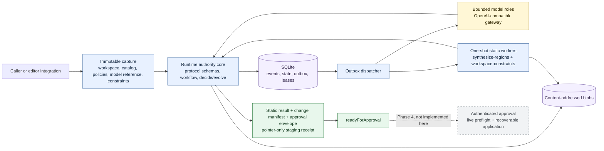
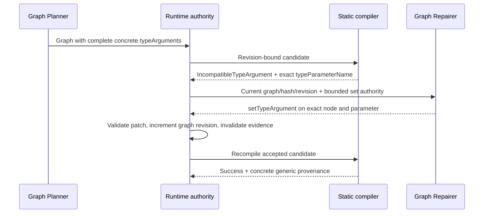
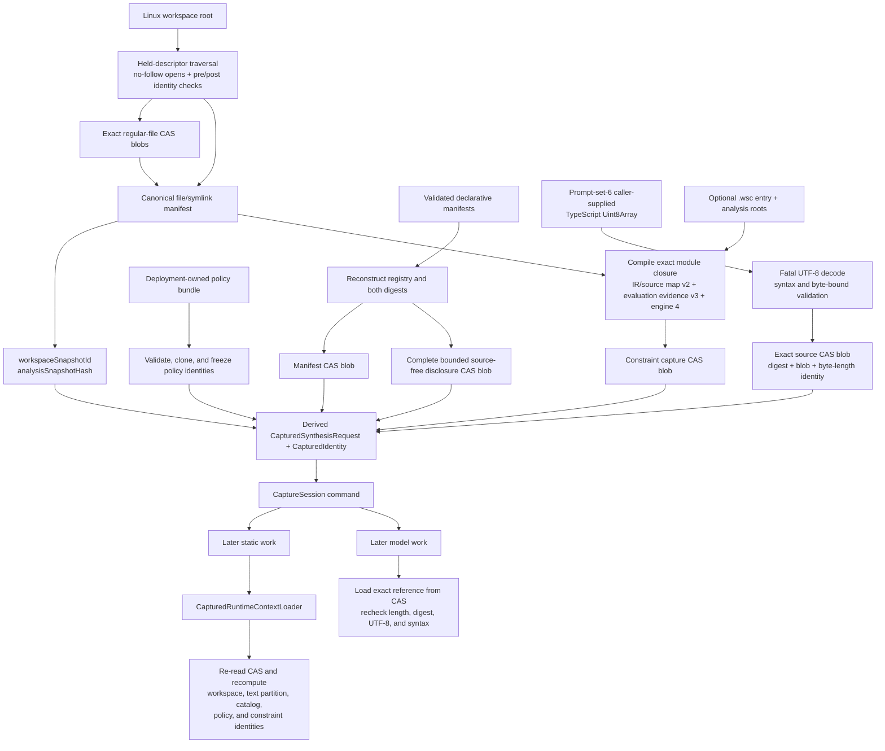
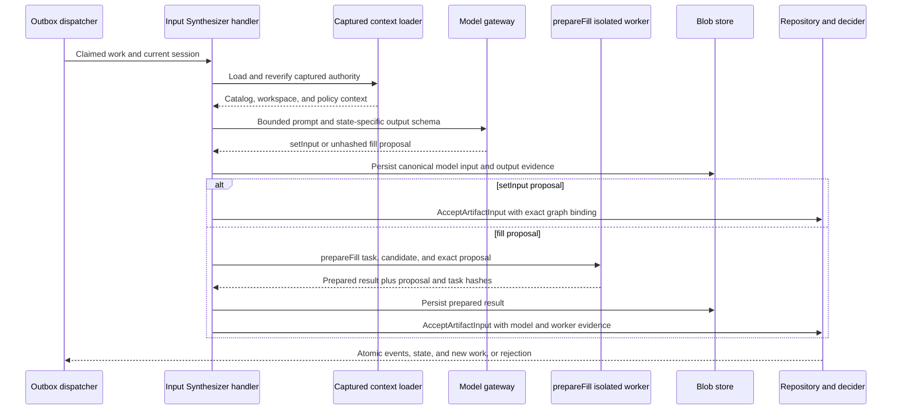
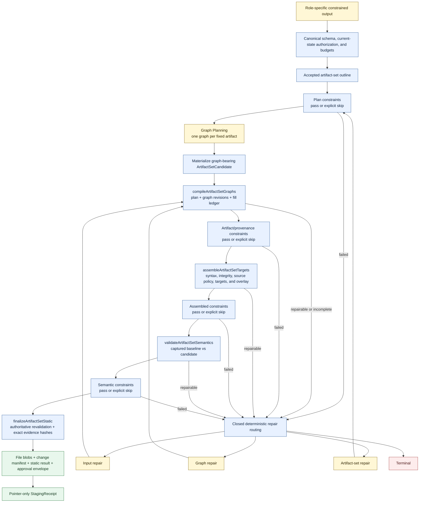
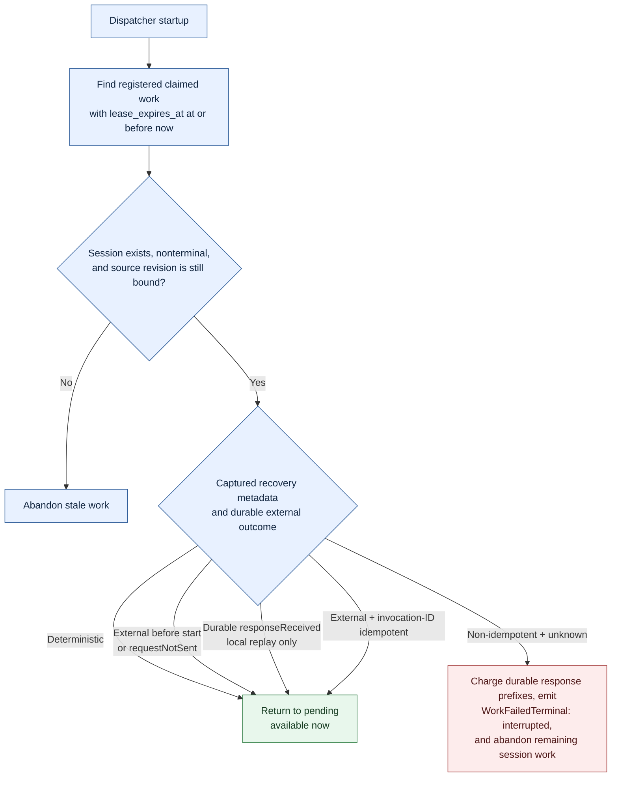
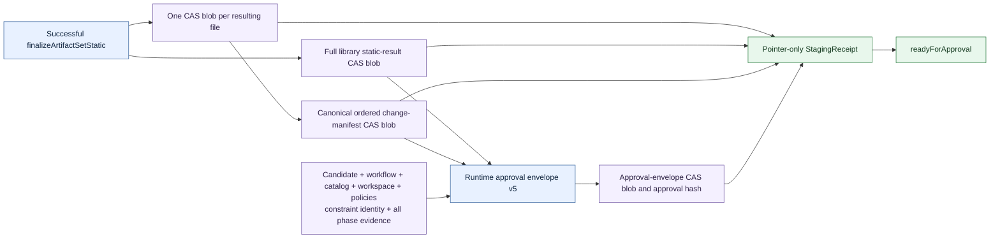

# Technical Design: Static Synthesize Regions Agent Runtime

> **Cross-project snapshot:** `synthesize-regions` owns the static library
> contracts used by this design; runtime-core owns the live workflow and this
> document's authoritative source. Phase 1–3 terminates at
> `readyForApproval`. Approval, live-target preflight, filesystem application,
> and recovery are future Phase 4 work and are not package exports.

**Status:** Phase 1-3 implemented; Phase 4 live application is design-only  
**Version:** 0.4  
**Primary language:** TypeScript  
**Deployment:** Local-first or private-network  
**Core dependencies:** `synthesize-regions`, `workspace-constraints`, Vercel AI
SDK with an OpenAI-compatible provider, SQLite, TypeScript 5.9.3, and XState v5
tooling

## 1. Purpose

This document defines a general-purpose agentic runtime that synthesizes
statically validated TypeScript artifact sets through `synthesize-regions`.

Models act as constrained planners. They propose artifact plans, synthesis
graphs, graph patches, artifact-set patches, and template inputs. The runtime
validates, persists, and stages those decisions. Runtime-core terminates at an
immutable `readyForApproval` envelope; approval, authentication, live-target
preflight, journaling, application, and their protocol belong to a separately
versioned Phase 4 workflow. A request may
also select an immutable, data-only
[Workspace Constraints](./workspace-constraints-technical-design.md) policy.

The runtime never executes generated code, runs project commands, invokes
linters, generates tests, installs dependencies, or loads caller-provided
validators or template modules.

The selected implementation stack, internal runtime module map, and exact
public `synthesize-regions` surface consumed by this design are maintained in
the [Synthesis Workflow Implementation Inventory](./synthesis-workflow-implementation-inventory.md).

## 2. Goals

The runtime shall:

1. Produce one or more TypeScript artifacts from a natural-language objective.
2. Restrict structural generation to a captured declarative template catalog.
3. Restrict arbitrary TypeScript to explicit raw-code ports.
4. Use schema-constrained local model calls with canonical post-validation.
5. Preserve graph repair and artifact filling as distinct transactional actions.
6. Validate the complete artifact set in an immutable TypeScript project view.
7. Stage a deterministic, content-addressed change set.
8. Require explicit approval before modifying authorized project files.
9. Persist enough state for replay, recovery, audit, and stale-action rejection.
10. Terminate predictably on policy, catalog, identity, resource, or no-progress failures.
11. Evaluate optional Workspace Constraints at fixed plan, artifact, assembled,
    and semantic phases without changing workflow or filesystem authority.

## 3. Non-Goals

The runtime will not:

- execute, import, or evaluate generated artifacts;
- run test, build, lint, package-manager, or shell commands;
- write tests or use tests as synthesis feedback;
- load arbitrary/custom validators;
- let repository constraint files define workflow states, transitions, effects,
  or authorization logic;
- install dependencies;
- let models register or modify templates;
- import catalog JavaScript supplied by a session;
- permit unrestricted filesystem edits;
- define deletion, rename, or any other Phase 4 application protocol;
- claim static acceptance proves runtime behavior or business correctness;
- expose an open-ended model-controlled tool loop.

Repository tests for the runtime and library remain normal engineering work and
are unrelated to candidate synthesis.

## 4. Design Invariants

### 4.1 Candidate authority

The authoritative candidate is an artifact-set plan plus accepted fill ledger,
not generated source and not one graph alone.

```ts
interface ArtifactSetCandidate {
  plan: ArtifactSetPlan;
  graphRevisions: Record<string, number>;
  fillLedger: ArtifactFillLedgerEntry[];

  contractDigest: string;
  manifestDigest: string;
  workspaceSnapshotId: string;
  constraintIdentity?: WorkspaceConstraintIdentity;
}
```

Generated artifacts and change sets are derived values. Any accepted graph,
fill, target, catalog, policy, workspace, or captured constraint/analysis change
invalidates downstream staged state and approval. Staging is represented by a
`StagingReceipt` on the enclosing session, never by a field on the candidate.

### 4.2 Models propose; infrastructure commits

A model result has no direct effect. Before commitment it passes:

1. JSON parsing;
2. model-facing schema validation;
3. canonical protocol validation;
4. current-state authorization;
5. catalog-specific validation;
6. transactional graph or fill validation;
7. resource-budget checks.

### 4.3 Templates are data

Runtime catalogs contain normalized `GraphTemplateManifest` data. Author
callbacks, getters, custom invocation functions, and dynamically imported
catalog modules are unsupported. Only library-owned code compiles and invokes
manifests.

### 4.4 Static acceptance is not behavioral proof

The acceptance pipeline proves only the configured structural, source-policy,
syntax, target, and TypeScript semantic properties. Generated code remains
untrusted data and is never executed by this runtime.

### 4.5 Fail closed

Unknown identity, stale workspace state, indeterminate compatibility, invalid
persisted data, incomplete mandatory analysis, or resource exhaustion never
counts as success.

### 4.6 One workflow topology

One declarative `WorkflowDefinition` is the authoritative finite lifecycle
topology. It is compiled into TypeScript state/event unions, a permitted
transition index, JSON Schemas, an XState v5 machine, diagrams, and transition
fixtures.

The workflow definition contains no executable effects or authorization logic.
A pure command decider remains authoritative for whether a request may produce
domain events. A pure event reducer remains authoritative for reconstructing
status-specific session data. XState is a generated visualization and analysis
projection and cannot commit state or execute production work.
It contains a fixed superset of constraint-check and set-repair states. A `.wsc`
module can provide rule data for those states, but cannot change the topology or
cause effects directly.

## 5. Terminology

**Template manifest:** JSON-safe template metadata, ports, output, and marked
source.

**Contract digest:** identity of planner-facing catalog contracts.

**Manifest digest:** identity of exact normalized template manifests and engine
contracts.

**Artifact unit:** one synthesis graph, one final artifact, and one target.

**Artifact-set plan:** ordered collection of artifact units.

**Fill ledger:** accepted fills bound to graph and artifact hashes.

**Workspace snapshot:** immutable project view used for target and semantic
validation.

**Constraint identity:** optional binding of the captured `.wsc` entry,
semantic digest, exact source snapshot, constraint-engine version, and
authorized analysis snapshot.

**Analysis root:** captured read-only evaluator visibility. It grants neither
write authority nor automatic model disclosure.

**Static change set:** fully assembled file creations and range replacements
that passed all static gates.

**Approval:** authorization for one exact session revision and change-set hash.

**Workflow definition:** data-only declaration of lifecycle states, accepted
domain events, target states, terminal states, and descriptive metadata.

**Command:** authenticated request to make a state change; it may be rejected
without producing an accepted domain event.

**Domain event:** immutable accepted fact that evolves session state.

**Outbox work:** durable post-commit request for model, compiler, constraint, or
static-analysis work. Phase 1-3 exposes no application work kind.

## 6. High-Level Architecture



`synthesize-regions` provides pure compilation, assembly, semantic, and final
static-analysis primitives and never writes project files. The Phase 4
application coordinator shown as a dotted edge is a future runtime integration,
not a current module in this package.

Flowcharts use solid arrows for implemented control flow and dotted arrows for
evidence dependencies or explicitly labeled future boundaries. Sequence
diagrams retain dashed response arrows. Diamonds are decisions. Where color is
used, blue is deterministic runtime work, yellow is a model proposal, green is
an accepted or staged result, red is terminal, and gray is future integration.

The shared reader-facing workflow, including model proposal boundaries, repair
loops, static acceptance, approval, and recoverable application, is shown in
[End-to-End Synthesis Flow](./synthesis-workflow-product-description.md#end-to-end-synthesis-flow).

## 7. Declarative Catalogs

### 7.1 Manifest contract

```ts
interface GraphTemplateManifest<
  I extends Record<string, InputPort> = Record<string, InputPort>,
  M extends string = string,
  O extends OutputPort = OutputPort,
  P extends Record<string, TemplateTypeParameterDefinition> | undefined =
    Record<string, TemplateTypeParameterDefinition> | undefined
> {
  modelId: M;
  version?: string;
  description?: string;
  typeParameters?: P;
  inputs: I;
  output: O;
  source: string;
}
```

Manifest source uses ordinary `@TYPE`/`@END` markers. Registration requires one
marker for every declared input, no unknown or duplicate marker IDs, exact
marker/port kind agreement, valid fallback bodies, and valid output-context
syntax.

`sourceFile` is the complete-file output kind. It is parsed in file context,
cannot carry value-level type/schema metadata, and cannot be supplied through a
literal or raw-code port.

### 7.2 Catalog capture

```ts
interface CapturedCatalog {
  snapshot: TemplateRegistrySnapshot;
  contractDigest: string; // c7_...
  manifestDigest: string; // m4_...
  manifests: readonly GraphTemplateManifest[];
  summaries: readonly TemplateSummary[];
}
```

The contract digest excludes implementation source and supports planner
compatibility. The manifest digest includes exact LF-normalized marked source,
normalized contracts, per-template `t4_` digests, and engine versions. The
runtime accepts exactly `synthesize-regions` `0.6.2`, catalog contract version
`7`, template/catalog-manifest versions `4`, planner-schema version `4`, and
capability-closure version `3`; it does not accept wildcard future prefixes.

Catalog snapshots deep-copy and freeze normalized manifest data and source-free
summaries. Compilation and filling require both expected digests. Artifact
provenance records the producing template's content digest. State-specific
model schemas are derived later from the captured manifests and current
authority; they are not mutable fields on `CapturedCatalog`.

### 7.3 Catalog disclosure

Capture persists the complete source-free summary set and fails closed when its
configured summary-count or canonical-byte limit is exceeded; it never silently
truncates disclosure. The Artifact-Set Planner receives the complete bounded
capability index. Graph Planner and repair roles receive deterministic
compatible-producer closures and summaries for templates already referenced by
the graph. The package-owned closure instantiates exact bindings on existing
nodes, compares concrete contracts exactly, and conservatively retains
placeholder-bearing or indeterminate generic producers after output-kind,
schema, and source-allowlist checks. An unknown referenced template fails over
to the complete already-authorized disclosure; it never expands catalog
authority. There is no model-controlled catalog retrieval or expansion loop.

```mermaid
flowchart LR
  manifest["Manifest typeParameters<br/>source remains captured only"] --> summary["Source-free TemplateSummary"]
  summary --> closure["Package-owned capability closure<br/>exact bound consumers + conservative generic producers"]
  closure --> schema["Catalog-specific planner schema<br/>complete concrete typeArguments"]
  schema --> graph["Accepted graph node bindings"]
  graph --> compiler["Authoritative graph compilation<br/>constraint + compatibility checks"]
  compiler --> provenance["Concrete typeArguments in provenance"]
  provenance --> evidence["Candidate, phase, staging, and approval CAS identities"]

  classDef runtime fill:#e8f1ff,stroke:#315f9b,color:#10243e;
  classDef proposal fill:#fff7d6,stroke:#8a6d1d,color:#2f2500;
  classDef infrastructure fill:#f4f0ff,stroke:#7057a3,color:#2f2347;
  class manifest,summary,closure,schema,compiler runtime;
  class graph proposal;
  class provenance,evidence infrastructure;
```

Generic constraint assignability remains a compiler decision, not a structural
planner-schema decision. Candidate-originated generic diagnostics carry exact
artifact, node, template, parameter, and path attribution. Missing, invalid, or
incompatible declared arguments authorize only `setTypeArgument`; an exact
unknown present argument authorizes only `removeTypeArgument`.



## 8. Request and Authorization Model

```ts
interface WorkspaceConstraintRequest {
  entryPath: string;
  expectedConstraintDigest: string;
  analysisRoots: string[];
}

interface CaptureSynthesisRequest {
  requestId: string;
  objective: string;
  workspace: SessionWorkspaceCaptureDraft;
  replacementTargets: ReplacementTarget[];
  allowedCreateRoots: string[];
  budgets: SynthesisBudgets;
  constraints?: SessionConstraintCaptureDraft;
}

interface CaptureSessionInput {
  request: CaptureSynthesisRequest;
  catalog: CapturedCatalog;
  policyBundle: DeploymentPolicyBundle;
  verifiedStaticToolchain: VerifiedStaticToolchain;
  snapshotProvider: ImmutableWorkspaceSnapshotProvider;
  modelPromptReference?: SessionModelPromptReferenceDraft;
  modelContext?: SessionModelContextDraft;
  // blob ownership and optional constraint capture budgets
}

interface CapturedSynthesisRequest {
  requestId: string;
  objective: string;

  workspace: {
    snapshotId: string;
    manifestBlobHash: string;
    snapshotProviderId: string;
    providerSnapshotId: string;
    capturePolicyDigest: string;
    rootPath: string;
    revision: string;
    tsConfigFilePath: string;
    existingFilePaths: string[];
    symlinkPaths: string[];
  };

  replacementTargets: Array<{
    targetId: string;
    path: string;
    start: number;
    end: number;
    regionKind: RegionKind;
    baseFileHash: string;
  }>;

  allowedCreateRoots: string[];

  expectedCatalogDigest: string;
  expectedCatalogManifestDigest: string;
  staticPolicyId: string;
  staticPolicyVersion: number;
  modelPolicyId: string;
  policyBundleDigest: string;
  policyBundleBlobHash: string;
  staticToolchainId: string;
  staticToolchainManifestBlobHash: string;
  modelPromptReference?: ModelPromptReferenceIdentity;
  modelContext?: ModelContextIdentity;
  budgets: SynthesisBudgets;
  constraints?: WorkspaceConstraintRequest;
}
```

Paths are normalized workspace-relative POSIX paths. Replacement offsets are
zero-based UTF-16 offsets, matching TypeScript and JavaScript string positions.

Authority is intentionally split:

- exact replacement targets and `allowedCreateRoots` define write authority;
- server-authorized `analysisRoots` define read-only constraint-evaluator
  visibility within the immutable workspace snapshot;
- model prompts receive only the captured per-session domain reference plus
  bounded summaries, subject metadata, diagnostics, and redacted excerpts
  required for the current role.

Prompt set `7` has one explicit opt-in exception: when
`CaptureSessionInput.modelContext.technicalDesign` is supplied, the complete
captured Markdown is disclosed to every role. It is bounded by byte and prompt
limits but is neither role-minimized nor excerpt-redacted. Callers and
deployments must therefore authorize the document itself for provider
disclosure; its analysis roots still grant no automatic workspace-source
disclosure.

A model may propose new paths only within `allowedCreateRoots`; a proposed
create path never grants access to an existing file. Analysis roots never grant
write authority or automatic source disclosure, and selectors cannot expand
them.

When `constraints` is present, capture parses the authorized `.wsc` import
closure as untrusted data, validates the expected digest, freezes the modules,
and denies every active module path as a synthesis target. When it is absent,
the workflow still traverses every constraint phase through explicit skip
events.

Static and model policies are server-defined IDs. Requests cannot supply code,
commands, plugins, validator implementations, or arbitrary model paths.
`CaptureSynthesisRequest` contains only caller-controlled material and draft
selectors. The persisted `CapturedSynthesisRequest` contains the resulting
workspace, catalog, policy, toolchain, prompt-reference, model-context, and
constraint identities; callers cannot assert those fields. `captureSessionInput()`
accepts the caller request plus validated deployment-owned capabilities,
captures and reconstructs their identities, and returns `CapturedSessionInput`.

Secure capture is supported only on Linux deployments with `/proc/self/fd`.
The runtime opens the root directory and every descendant with no-follow flags,
enumerates through held parent descriptors, keeps ancestor descriptors alive,
and compares directory/file identity and metadata before and after enumeration
or reading. Symlink metadata is recorded without opening the link. A platform
that cannot guarantee this descriptor-rooted containment fails closed; there is
no path-rooted fallback.

Capture-policy `requiredPaths` are regular-file requirements, not mere directory
entry requirements. An exact symlink never satisfies one, and a symlink in any
ancestor prevents traversal and makes the requirement fail closed. Blocking
symlink metadata is retained as capture evidence; its target is never opened.

### 8.1 Immutable capture and reconstruction



## 9. Artifact-Set Model

```ts
type AuthorizedArtifactTarget =
  | { kind: "createFile"; path: string }
  | { kind: "replaceTarget"; targetId: string };

interface ArtifactOutline {
  id: string;
  target: AuthorizedArtifactTarget;
  goal?: SynthesisGoal;
}

interface ArtifactSetOutline {
  artifacts: ArtifactOutline[];
}

type ArtifactTarget =
  | { kind: "createFile"; path: string }
  | {
      kind: "replaceRange";
      path: string;
      start: number;
      end: number;
      baseFileHash: string;
      regionKind: RegionKind;
    };

interface ArtifactSetUnit {
  id: string;
  graph: SynthesisGraph;
  target: ArtifactTarget;
}

interface ArtifactSetPlan {
  artifacts: ArtifactSetUnit[];
}

interface ArtifactFillLedgerEntry {
  artifactId: string;
  graphHash: string;
  baseArtifactHash: string;
  inputs: TemplateArtifactInputMap;
  resultingArtifactHash: string;
}

interface WorkspaceConstraintIdentity {
  constraintEntryPath: string;
  constraintDigest: string;
  constraintSourceSnapshotHash: string;
  constraintEngineVersion: 4;
  constraintCompilerIdentity: string;
  constraintEvaluatorIdentity: string;
  constraintToolchainIdentity: string;
  analysisSnapshotHash: string;
  analysisRoots: string[];
  captureBlobHash: string;
  modulePaths: string[];
}
```

`ArtifactSetOutline` is the planning and set-repair contract. It contains no
graphs and cannot expand captured target authority. The runtime normalizes its
optional goals from target authority, runs plan constraints, asks the Graph
Planner for every artifact graph, and only then materializes the library-owned
`ArtifactSetPlan`. That plan is deliberately graph-bearing because it is the
input to compilation and remains embedded in `ArtifactSetCandidate`.

Artifact IDs are globally unique within a plan. Graph node IDs remain scoped to
their artifact. Graph references never cross artifacts.

New-file targets require `sourceFile` output. Replacement output must exactly
match the target region kind.

Several range replacements may target one existing file when they share the
same base hash and do not overlap. Assembly applies them from highest offset to
lowest. A create path admits exactly one create operation and no other operation.

## 10. Library Artifact-Set APIs

```ts
function compileArtifactSetGraphs(
  plan: ArtifactSetPlan,
  catalog: TemplateCatalogView,
  options: ArtifactSetCompileOptions
): ArtifactSetGraphCompilationResult;

function assembleArtifactSetTargets(
  units: readonly ArtifactSetAssemblyUnit[],
  catalog: TemplateCatalogView,
  options: ArtifactSetAssemblyOptions
): ArtifactSetAssemblyResult;

function validateArtifactSetSemantics(
  plan: ArtifactSetPlan,
  catalog: TemplateCatalogView,
  options: ArtifactSetCompileOptions
): ArtifactSetSemanticValidationResult;

function finalizeArtifactSetStatic(
  plan: ArtifactSetPlan,
  catalog: TemplateCatalogView,
  options: ArtifactSetCompileOptions,
  constraintAcceptance?: ConstraintBoundStaticAcceptance
): ArtifactSetStaticValidationResult;
```

Production Phase 3 uses these phase-granular APIs through closed isolated-worker
tasks. Graph compilation produces complete or partial artifacts without target
assembly. Assembly validates paths, manifests, base hashes, ranges, source
policy, and syntax while constructing the multi-file overlay. Semantic
validation compares captured baseline and candidate TypeScript programs.
Each later worker receives the exact schema-validated prior result, CAS hash,
and task hash; it recomputes the transitive task identities before reuse. A
semantic worker may remain leased to one exact session/authority/target affinity
across input or graph repair so its candidate TypeScript `Program` can be passed
as `oldProgram`. Set or target changes, authority drift, cancellation, terminal
events, timeout, abort, or exception terminate the worker and its compiler owner.
Finalization verifies that evidence chain and binds it to the exact four
constraint phase-result blob hashes instead of compiling the unchanged
candidate a fourth time.

Graph, assembly, and semantic results are evidence boundaries but are never
approval-eligible. Only successful finalization returns `validation: "static"`
and the package-owned `ValidatedArtifactChangeSet` hash. `compileArtifactSet()`
and `validateArtifactSetStatic()` remain compatibility facades composed from
the same helpers; production runtime handlers use the phase-granular operations
so constraint evidence can be inserted at the documented boundaries.

No library API modifies the workspace.

## 11. Agent Roles

### 11.1 Artifact-Set Planner

Input:

- objective and target authorization;
- artifact and resource budgets;
- compact catalog capability index;
- contract digest;
- static-policy summary.

Output: a version-5 result containing one artifact-set outline selecting
existing target IDs and proposing normalized create paths and artifact goals.

### 11.2 Graph Planner

Input:

- one fixed artifact ID and target;
- objective scoped to that artifact;
- selected catalog summaries;
- contract digest;
- target region kind.

Output: one version-5 partial synthesis-graph result. The runtime sorts artifact
IDs, preflights the full call budget, invokes this role once per artifact with a
stable batch index, and commits the complete result batch atomically.

The artifact goal is already normalized from target authority: a `createFile`
target requires `sourceFile`, while a replacement requires the captured target
region kind. The disclosed capability closure contains only templates that may
produce that effective goal. Prompt set `7` asks for the smallest sufficient
graph, an explicit empty collection for each intentionally empty optional
collection, and helper nodes only when justified by the objective or captured
context.

Before accepting the batch, the runtime materializes the candidate and checks
that every resolved `finalNodeId` names a captured template whose output kind
and resolved type/schema metadata may satisfy the graph goal. An unresolved
generic placeholder is conservatively deferred to compilation, where concrete
type arguments are authoritative. The same acceptance boundary checks the
minimum unavoidable raw-code demand against the global session budget. A
failure returns a bounded `RejectGraphProposal`; it never commits the invalid
candidate or spends a repair revision. Repository evidence validation repeats
these checks before accepting a worker command.

### 11.3 Graph Repairer

Input:

- fixed artifact ID;
- current graph;
- actionable diagnostics;
- relevant summaries and compatible producers;
- rejected actions and remaining budgets;
- currently authorized action kinds.

Output: exactly one version-5 scoped patch:

```ts
interface ScopedGraphPatch {
  artifactId: string;
  expectedGraphRevision: number;
  expectedGraphHash: string;
  patch: GraphPatchAction;
}
```

For fragment-owned repairs, that single patch may set an input to a recursively
inline producer tree already admitted by `SynthesisInput`. The runtime derives a
state-specific schema from the captured capability closure, restricts refs and
inline templates by fragment compatibility, permits only a bounded fresh node-ID pool,
and normalizes accepted inline descendants into the artifact graph. The whole
tree consumes one graph revision and one repair revision; it does not widen the
patch protocol into a model-authored action batch.

After normalization, a scoped patch must change the artifact's canonical graph
hash. A canonically equivalent Graph Repairer, statically dispatched Graph Repairer, or Input
Synthesizer `setInput` action is a bounded model rejection: the accepted
candidate, graph revision, and fills remain unchanged. The rejection reason is
disclosed to the next attempt within policy limits, and the runtime records a
rejection progress fingerprint. Repeating the same rejected output under the
same stable authority advances no-progress detection; proposing a different
output resets the repeat count.

TS6133 retains its exact compiler/source-map owner at the parameter identifier.
The runtime separately resolves the parameter's unique direct consumer through
captured `callableScope` metadata and grants only `setInput` on the declared
structured body. Missing or ambiguous ownership fails before provider dispatch.

#### Static repair dispatch

`needsStaticRepair` is not a sixth model role. It preserves the fact that a
graph-scoped repair originated after compilation, during assembly, semantic
checking, or constraint routing. Its `invokeStaticRepairer` work dispatches the
Graph Repairer with the same `graphRepairer` role identity and output protocol,
but under the exact post-compilation diagnostic and patch authorization. The
distinct state and `StaticRepairAccepted`/`StaticRepairRejected` events retain
that routing context without granting another role.

### 11.4 Input Synthesizer

Input is limited to exact raw-code or literal graph inputs and their captured
port contracts. Each action is paired with a canonical source-free target
context containing its current value, graph goal, signature dependencies,
direct consumers, and peer signatures. Callable peer bodies and unrelated
graph, template, and workspace source are excluded. Output is one proposal:

```ts
type InputSynthesizerProposal =
  | {
      kind: "setInput";
      artifactId: string;
      expectedGraphRevision: number;
      expectedGraphHash: string;
      nodeId: string;
      inputName: string;
      input: SynthesisInput;
    }
  | {
      kind: "fill";
      artifactId: string;
      expectedGraphRevision: number;
      expectedGraphHash: string;
      baseArtifactHash: string;
      inputs: Record<string, LiteralOrRawCodeInput>;
    };
```

State-specific schemas fix artifact, node, input, and unresolved IDs wherever
possible and restrict the input union to the authorized literal/raw-code port.
For a fill, the model supplies only exact unresolved input values; it cannot
manufacture the resulting artifact hash. The runtime submits the proposal and
current candidate to the schema-closed `prepareFill` static-worker operation.
That isolated worker reconstructs and verifies captured catalog, workspace, and
policy authority; verifies graph and base-artifact bindings; applies the values;
and returns a canonical `PreparedArtifactFillResult` with the authoritative
hash. The result and its CAS blob hash must match the original proposal exactly
before the pure decider accepts the fill.



### 11.5 Artifact-Set Repairer

Input is limited to one actionable set-level diagnostic, the current plan,
authorized targets, relevant catalog capabilities, rejected actions, and
remaining budgets. Output is exactly one version-5 action:

```ts
type ArtifactSetPatchAction =
  | { kind: "addArtifact"; artifact: ArtifactOutline }
  | { kind: "removeArtifact"; artifactId: string }
  | {
      kind: "setArtifactTarget";
      artifactId: string;
      target: AuthorizedArtifactTarget;
    }
  | {
      kind: "setArtifactGoal";
      artifactId: string;
      goal: SynthesisGoal;
    };
```

The action cannot create target authority. Every accepted set patch invalidates
affected graphs and fills transactionally, clears staging and approval, and
returns through plan constraint checking. Added or invalidated artifacts then
return through Graph Planning.

## 12. Deterministic Failure Routing

There is no classifier model.

| Failure | Route |
| --- | --- |
| Unknown template/reference/input, cycle, duplicate ID | Graph Repairer |
| Kind, source, type, schema, or localized final-goal incompatibility | Graph Repairer |
| Omitted raw/literal graph input | Input Synthesizer via exact `setInput` |
| Omitted fragment producer | Graph Repairer |
| Rejected raw/literal fill | Input Synthesizer |
| Semantic error mapped to one raw/literal input | Input Synthesizer |
| Semantic error mapped to graph composition | Graph Repairer |
| TS6133 mapped through `callableScope` to a structured body | Graph Repairer, body `setInput` only |
| TS6133 mapped through `callableScope` to a raw-code body | Input Synthesizer, raw body `setInput` only |
| TS6133 with missing or ambiguous callable ownership | Terminal fail-closed |
| Artifact count, existence, target, or set-level goal-shape constraint | Artifact-Set Repairer |
| Cross-artifact semantic or constraint error | Artifact-Set Repairer or set-level coordinator |
| Constraint error mapped to one raw/literal input | Input Synthesizer |
| Constraint error mapped to one graph node/template | Graph Repairer |
| Invalid constraint module or stale constraint/analysis identity | Terminal policy/stale state |
| Indeterminate mandatory constraint evidence | Terminal |
| Invalid manifest/catalog | Terminal catalog failure |
| Digest or workspace mismatch | Terminal/stale state |
| Invalid persisted artifact/source map/fill ledger | Terminal integrity failure |
| Unsupported or unavailable catalog capability | Terminal catalog/invalid-result failure |
| Repeated state without progress | No-progress failure |

Source maps establish textual ownership. When diagnostics do not support exact
attribution, routing stays at artifact or set scope rather than guessing.
Assembly and semantic analysis may report a cascade spanning several rendered
nodes. The runtime persists the complete library result, then deterministically
projects the first exact artifact/node owner into one bounded repair request;
command validation independently recomputes that projection. A rendered
TypeScript diagnostic's `inputName` identifies the deepest source span but does
not by itself grant input-rewrite authority. Unattributed, cross-artifact,
mixed set-owned, and terminal evidence is never narrowed by this projection.

```mermaid
flowchart TD
  result["Compilation, assembly, semantic, or constraint result"] --> known{"Known package-owned code and classification?"}
  known -->|No| terminal["Terminal failure"]
  known -->|Yes| indeterminate{"Mandatory evidence indeterminate?"}
  indeterminate -->|Yes| terminal
  indeterminate -->|No| classification{"Classification and exact ownership"}
  classification -->|"one artifact + node + raw/literal input"| input["Input Synthesizer"]
  classification -->|"one artifact + node/template"| graph["Graph Repairer"]
  classification -->|"cross-artifact, ambiguous, target, set goal, count, or shape"| setRepair["Artifact-Set Repairer"]
  classification -->|"identity, scope, policy, budget, or integrity"| terminal
  input --> compile["Recompile candidate"]
  graph --> compile
  setRepair --> plan["Recheck plan constraints and replan affected graphs"]

  classDef runtime fill:#e8f1ff,stroke:#315f9b,color:#10243e;
  classDef model fill:#fff7d6,stroke:#8a6d1d,color:#2f2500;
  classDef failure fill:#fdecec,stroke:#a33a3a,color:#4d1717;
  class result,known,indeterminate,classification,compile,plan runtime;
  class input,graph,setRepair model;
  class terminal failure;
```

## 13. Fill-Ledger Rules

Every accepted fill records artifact ID, current graph hash, base artifact hash,
input map, and resulting artifact hash.

A fill is rejected when any binding differs from current state. Rejected fills
leave both the pending artifact and ledger unchanged.

Any graph patch or graph replacement invalidates all fills for that artifact.
Invalidation is explicit in the event log. Other artifacts' fills remain valid.

The runtime may choose graph patches for model-authored values and fills for
localized or delayed values, but both channels obey the same authorization and
identity checks.

## 14. Static Acceptance Pipeline

The fixed pipeline is:



The workflow records one of `*ConstraintsPassed`, `*ConstraintsFailed`, or
`*ConstraintsSkipped` for each phase. A skip reason is `notConfigured` when the
request omitted constraints and `noApplicableRules` when the captured set has
no rule for that phase. Skipping optional constraints never skips the fixed
syntax, target, source-policy, or TypeScript semantic gates.

Semantic checking uses the captured `tsconfig` and immutable workspace snapshot.
The baseline is evaluated before candidate changes. Acceptance requires no new
semantic errors; unrelated pre-existing diagnostics are retained for context but
do not become synthesis failures. Constraint warnings are recorded but do not
gate acceptance. Failed or indeterminate error rules do gate acceptance.

All semantic and Workspace Constraint analysis uses the exact captured
`tsconfig` and authorized immutable workspace snapshot. Missing, malformed, or
non-text configuration and inaccessible required analysis files fail closed;
there is no fallback TypeScript project.

The pipeline never invokes project scripts, plugins, linters, test frameworks,
package managers, or generated source.

## 15. State Machine

### 15.1 Canonical workflow definition

The lifecycle topology is authored once as declarative TypeScript data. It
contains a fixed superset of constraint phases; `.wsc` modules never contribute
states or transitions:

```ts
interface WorkflowTransition<
  TState extends string = string,
  TEvent extends string = string
> {
  from: TState;
  event: TEvent;
  to: TState;
  description: string;
}

interface WorkflowDefinition<
  TState extends string = string,
  TEvent extends string = string
> {
  id: string;
  version: number;
  initial: TState;
  states: Record<TState, { terminal?: boolean }>;
  transitions: readonly WorkflowTransition<TState, TEvent>[];
  observations?: readonly {
    in: TState | readonly TState[];
    event: TEvent;
    description: string;
  }[];
}

const synthesisSessionWorkflow = defineWorkflow({
  id: "synthesis-session",
  version: 8,
  initial: "created",
  states: {
    created: {},
    planningSet: {},
    planConstraintChecking: {},
    planningGraphs: {},
    compiling: {},
    needsGraphRepair: {},
    needsArtifactInputs: {},
    artifactConstraintChecking: {},
    assembling: {},
    assembledConstraintChecking: {},
    semanticChecking: {},
    semanticConstraintChecking: {},
    constraintRepairRouting: {},
    needsInputRepair: {},
    needsStaticRepair: {},
    needsSetRepair: {},
    staging: {},
    readyForApproval: { terminal: true },
    cancelled: { terminal: true },
    budgetExhausted: { terminal: true },
    noProgress: { terminal: true },
    terminalFailure: { terminal: true }
  },
  transitions: [
    {
      from: "created",
      event: "SessionCaptured",
      to: "planningSet",
      description: "Capture immutable workflow, workspace, catalog, policy, toolchain, and optional constraint identities."
    },
    {
      from: "planningSet",
      event: "ArtifactPlanAccepted",
      to: "planConstraintChecking",
      description: "Commit the authorized artifact-set plan before plan policy evaluation."
    },
    {
      from: "compiling",
      event: "CompilationNeedsGraphRepair",
      to: "needsGraphRepair",
      description: "Publish graph-repairable diagnostics."
    },
    {
      from: "planConstraintChecking",
      event: "PlanConstraintsSkipped",
      to: "planningGraphs",
      description: "Record notConfigured or noApplicableRules."
    },
    {
      from: "compiling",
      event: "CompilationCompleted",
      to: "artifactConstraintChecking",
      description: "Evaluate compiled artifact and provenance facts."
    },
    {
      from: "semanticConstraintChecking",
      event: "SemanticConstraintsPassed",
      to: "staging",
      description: "Permit deterministic constraint-bound staging."
    },
    // The complete definition contains every edge rendered below.
  ]
} as const);
```

The workflow compiler rejects duplicate edges, unknown states or events,
outgoing transitions from terminal states, unreachable states, and
nonterminal dead ends. It generates:

- `SessionStatus` and permitted state/event types;
- a runtime transition index;
- the XState v5 visualization and
  [graph-analysis machine](https://stately.ai/docs/graph);
- canonical JSON Schemas;
- Mermaid/state-table documentation;
- one transition fixture requirement per edge.

Generated outputs are deterministic and checked for drift in CI. Payload
reducers and command authorization are implementations referenced by stable
protocol types, not callbacks embedded in the workflow definition.

The compiler also emits a `workflowDigest` over normalized topology and
generator contracts. Every session stream captures workflow ID, version, and
digest. A runtime upgrade must replay under the captured version or apply an
explicit tested workflow migration; it cannot reinterpret history silently.

Lifecycle events use `transitions` and may change status. Current observational
events include `ModelInvocationRecorded`, which binds the SHA-256 digest of the
complete rendered prompt without storing prompt text, and
`ProgressFingerprintRecorded`.
Any application observations belong to a separately versioned Phase 4 workflow. Observations are authorized
for specific states and may update counters or metadata but must preserve
status. Constraint capture is bound by `SessionCaptured`, and phase diagnostics
live in validated result evidence rather than invented diagnostic-detail events. Proposal
rejections that participate in retry/no-progress accounting are explicit
self-loop lifecycle transitions. Repeated identical rejected outputs therefore
advance deterministic no-progress detection rather than consuming the entire
rejection budget. Malformed, stale, or unauthorized commands
rejected before commitment produce no domain event, though a separate security
audit sink may record the attempt.

### 15.2 Authority split

```text
authorized caller or claimed-worker command
        |
pure decide(state, command)
        |
accepted domain events
        |
validate against generated transition index
        |
pure evolve(state, event)
        |
SQLite event + materialized state + outbox CAS transaction
        |
post-commit model/compiler/constraint worker
```

Authentication and the application worker are integration/Phase 4 boundaries.

Commands request changes. Domain events record accepted facts. The reducer may
only produce the target status declared for the current state/event pair.
XState consumes the same generated topology for visualization and tests, but
its snapshots, actions, actors, and invocations are never persisted as
authoritative session state. Constraint evaluation is external work scheduled
through the transactional outbox. Its result returns as a command and becomes a
passed, failed, or skipped event only after `decide()` validates phase,
revision, identity, and budgets.

### 15.3 Reader-focused state diagram

This compressed state machine is the reader-focused transition view of the shared
[End-to-End Synthesis Flow](./synthesis-workflow-product-description.md#end-to-end-synthesis-flow).
It uses hierarchical state-machine notation similar to diagrams authored with
[StateSmith](https://github.com/StateSmith/StateSmith): transitions are labeled
as `committed event / reducer effect`, composite states group related phases,
and retry paths are explicit cycles. Guards run in the command decider before a
domain event exists. The byte-generated exhaustive projection, including every
global terminal edge, is [`generated/workflow.mmd`](../generated/workflow.mmd)
and is drift-checked from `src/workflow/definition.ts`.

```mermaid
stateDiagram-v2
  direction LR

  [*] --> created

  created --> ACTIVE: SessionCaptured\n/ persist immutable identities
  created --> terminalFailure: SessionCaptureRejected
  created --> cancelled: SessionCancelled
  created --> budgetExhausted: BudgetExhausted

  state "Active synthesis session" as ACTIVE {
    direction LR

    [*] --> planningSet

    planningSet --> planConstraintChecking: ArtifactPlanAccepted\n/ commit artifact-set revision
    planningSet --> planningSet: ArtifactPlanRejected\n/ preserve accepted state

    planConstraintChecking --> planningGraphs: PlanConstraintsPassed
    planConstraintChecking --> planningGraphs: PlanConstraintsSkipped\n/ record skip reason
    planConstraintChecking --> constraintRepairRouting: PlanConstraintsFailed

    planningGraphs --> planningGraphs: GraphProposalRejected\n/ preserve accepted state
    planningGraphs --> compiling: InitialGraphsAccepted\n/ compile plan + graph revisions + fill ledger

    compiling --> needsInputRepair: CompilationNeedsInputRepair\n/ publish exact raw/literal ownership
    compiling --> needsGraphRepair: CompilationNeedsGraphRepair\n/ publish scoped diagnostics
    compiling --> needsSetRepair: CompilationNeedsSetRepair\n/ publish set-scoped diagnostics
    compiling --> needsArtifactInputs: CompilationNeedsArtifactInputs\n/ publish unresolved input IDs
    compiling --> artifactConstraintChecking: CompilationCompleted\n/ evaluate artifact and provenance facts

    needsGraphRepair --> compiling: GraphPatchAccepted\n/ commit graph revision; invalidate artifact fills
    needsGraphRepair --> needsGraphRepair: GraphPatchRejected\n/ preserve accepted candidate

    needsArtifactInputs --> compiling: ArtifactInputAccepted\n/ commit revision
    needsArtifactInputs --> needsArtifactInputs: ArtifactInputRejected\n/ preserve artifact and fill ledger

    artifactConstraintChecking --> assembling: ArtifactConstraintsPassed
    artifactConstraintChecking --> assembling: ArtifactConstraintsSkipped\n/ record skip reason
    artifactConstraintChecking --> constraintRepairRouting: ArtifactConstraintsFailed

    assembling --> assembledConstraintChecking: CandidateAssembled
    assembling --> needsInputRepair: AssemblyInputRepairRequired
    assembling --> needsStaticRepair: AssemblyGraphRepairRequired
    assembling --> needsSetRepair: AssemblySetRepairRequired
    assembledConstraintChecking --> semanticChecking: AssembledConstraintsPassed
    assembledConstraintChecking --> semanticChecking: AssembledConstraintsSkipped\n/ record skip reason
    assembledConstraintChecking --> constraintRepairRouting: AssembledConstraintsFailed

    semanticChecking --> semanticConstraintChecking: SemanticCheckPassed
    semanticChecking --> needsInputRepair: SemanticInputRepairRequired
    semanticChecking --> needsStaticRepair: SemanticGraphRepairRequired
    semanticChecking --> needsSetRepair: SemanticSetRepairRequired
    semanticConstraintChecking --> staging: SemanticConstraintsPassed
    semanticConstraintChecking --> staging: SemanticConstraintsSkipped\n/ record skip reason
    semanticConstraintChecking --> constraintRepairRouting: SemanticConstraintsFailed

    constraintRepairRouting --> needsInputRepair: ConstraintRepairRoutedInput
    constraintRepairRouting --> needsStaticRepair: ConstraintRepairRoutedGraph
    constraintRepairRouting --> needsSetRepair: ConstraintRepairRoutedSet

    needsInputRepair --> compiling: ArtifactInputAccepted\n/ invalidate evidence from compilation onward
    needsInputRepair --> needsInputRepair: ArtifactInputRejected\n/ preserve accepted candidate

    needsStaticRepair --> compiling: StaticRepairAccepted\n/ invalidate staged state and approval
    needsStaticRepair --> needsStaticRepair: StaticRepairRejected\n/ preserve accepted candidate

    needsSetRepair --> planConstraintChecking: ArtifactSetPatchAccepted\n/ invalidate affected graphs and fills
    needsSetRepair --> needsSetRepair: ArtifactSetPatchRejected\n/ preserve accepted candidate

  }

  staging --> readyForApproval: ChangeSetStaged\n/ bind all captured identities and terminate Phase 1-3

  compiling --> terminalFailure: CompilationFailed
  assembling --> terminalFailure: AssemblyFailed
  semanticChecking --> terminalFailure: SemanticCheckFailed
  constraintRepairRouting --> terminalFailure: ConstraintFailureTerminal
  staging --> terminalFailure: StagingFailed

  ACTIVE --> cancelled: SessionCancelled\n/ stop outstanding work
  ACTIVE --> budgetExhausted: BudgetExhausted\n/ reject incomplete work
  ACTIVE --> noProgress: NoProgressDetected
  ACTIVE --> terminalFailure: SessionFailed

  state "readyForApproval" as readyForApproval
  state "cancelled" as cancelled
  state "budgetExhausted" as budgetExhausted
  state "noProgress" as noProgress
  state "terminalFailure" as terminalFailure

  classDef success fill:#e8f7ec,stroke:#2f7d43,color:#153b20
  classDef terminal fill:#fdecec,stroke:#a33a3a,color:#4d1717

  class readyForApproval success
  class cancelled,budgetExhausted,noProgress,terminalFailure terminal

  note right of planConstraintChecking
    The state is always traversed.
    Optional policy changes the committed event,
    never the topology.
  end note

  note right of compiling
    Every model proposal crosses canonical schema,
    current-state authorization, identity, and budget
    checks before a revision can be committed.
  end note

  note right of readyForApproval
    This is terminal for Phase 1-3. A separate
    Phase 4 workflow may consume the envelope.
  end note
```



Every nonterminal state also accepts authorized cancellation and budget
exhaustion. Invalid constraint capture, stale identity, inaccessible mandatory
analysis, model/schema transport failure, catalog gaps, and integrity failure
have explicit terminal transitions.

### 15.4 Transition requirements

| Current state | Accepted event | Result |
| --- | --- | --- |
| `created` | `SessionCaptured` | `planningSet` |
| `planningSet` | `ArtifactPlanAccepted` | `planConstraintChecking` |
| any constraint-check state | matching `*ConstraintsPassed` or `*ConstraintsSkipped` | next fixed phase |
| any constraint-check state | matching `*ConstraintsFailed` | `constraintRepairRouting` |
| `planningGraphs` | all initial graphs accepted | `compiling` |
| any model-planning/repair state | bounded role proposal rejected | same state plus rejection and progress-fingerprint events |
| `compiling` | graph diagnostics | `needsGraphRepair` |
| `compiling` | unresolved artifact inputs | `needsArtifactInputs` |
| `compiling` | `CompilationCompleted` | `artifactConstraintChecking` |
| repair/input state | accepted patch/fill | `compiling` |
| `assembling` | `CandidateAssembled` | `assembledConstraintChecking` |
| `semanticChecking` | pass, input repair, graph repair, or set repair | `semanticConstraintChecking`, `needsInputRepair`, `needsStaticRepair`, or `needsSetRepair` |
| `constraintRepairRouting` | input, graph, or set route | `needsInputRepair`, `needsStaticRepair`, or `needsSetRepair` |
| `needsSetRepair` | `ArtifactSetPatchAccepted` | `planConstraintChecking` |
| `staging` | `ChangeSetStaged` | terminal `readyForApproval` |
| any actionable state | stale revision/hash | `Decision.ok=false`; no domain event or state/revision/sequence/counter change |
| any nonterminal state | cancellation | `cancelled` |
| any nonterminal state | exhausted budget | `budgetExhausted` |
| any model-planning/repair state | identical rejected output reaches repeat limit | `noProgress` |

An accepted set patch always returns to plan constraint checking. No candidate
mutation is accepted after terminal `readyForApproval`; Phase 4 consumes the
immutable approval envelope by exact hash.

## 16. Session and Revision Model

```ts
interface SessionBase {
  id: string;
  requestId: string;
  revision: number;
  workflowId: string;
  workflowVersion: number;
  workflowDigest: string;
  fencingToken: number;
  counters: SessionCounters;
  staticEvidence: StaticEvidence;
  rejectionHistory: RejectedActionSummary[];
  progress?: ProgressRecord;
  createdAt: string;
  updatedAt: string;
}

type Diagnostic = ArtifactSetDiagnostic | WorkspaceConstraintDiagnostic;
type CapturedContext = {
  request: CapturedSynthesisRequest;
  identity: CapturedIdentity;
};

type InProgressSynthesisSession =
  | (SessionBase & { status: "created" })
  | (SessionBase & CapturedContext & { status: "planningSet" })
  | (SessionBase & CapturedContext & {
      status: "planConstraintChecking" | "planningGraphs";
      outline: ArtifactSetOutline;
    })
  | (SessionBase & CapturedContext & {
      status:
        | "compiling"
        | "artifactConstraintChecking"
        | "assembling"
        | "assembledConstraintChecking"
        | "semanticChecking"
        | "semanticConstraintChecking"
        | "staging";
      outline: ArtifactSetOutline;
      candidate: ArtifactSetCandidate;
    })
  | (SessionBase & CapturedContext & {
      status: "needsGraphRepair" | "needsStaticRepair" | "needsInputRepair";
      outline: ArtifactSetOutline;
      candidate: ArtifactSetCandidate;
      diagnostics: Diagnostic[];
      repairContext: CallableBodyRepairContext | null;
    })
  | (SessionBase & CapturedContext & {
      status: "needsArtifactInputs";
      outline: ArtifactSetOutline;
      candidate: ArtifactSetCandidate;
      unresolvedInputs: UnresolvedInput[];
    })
  | (SessionBase & CapturedContext & {
      status: "constraintRepairRouting" | "needsSetRepair";
      outline: ArtifactSetOutline;
      candidate?: ArtifactSetCandidate;
      diagnostics: Diagnostic[];
    });

type FailureTerminalStatus =
  | "cancelled"
  | "budgetExhausted"
  | "noProgress"
  | "terminalFailure";

type ReadyForApprovalSynthesisSession = SessionBase & CapturedContext & {
  status: "readyForApproval";
  outline: ArtifactSetOutline;
  candidate: ArtifactSetCandidate;
  stagingReceipt: StagingReceipt;
};

interface FailureTerminalSynthesisSession extends SessionBase {
  status: FailureTerminalStatus;
  outcome: SynthesisSessionOutcome;
}

type TerminalStatus = "readyForApproval" | FailureTerminalStatus;
type TerminalSynthesisSession =
  | ReadyForApprovalSynthesisSession
  | FailureTerminalSynthesisSession;
type SynthesisSession = InProgressSynthesisSession | TerminalSynthesisSession;
```

Status-specific fields are required only in states where they are valid. The
protocol does not represent combinations such as `created` with a staged hash
or `readyForApproval` without exact staged bytes.

Each candidate revision is immutable. A graph patch, accepted fill, fill
invalidation, artifact-set patch, target change, or authorized identity
recapture creates a new revision. Constraint modules are immutable within a
session; changed live bytes make the session stale rather than changing its
policy in place.

Mutating APIs require:

- caller authorization;
- idempotency key;
- expected session revision;
- expected current artifact/change-set hash when applicable.

One worker holds a renewable session lease. Fencing tokens prevent an expired
worker from committing after ownership moves.

## 17. Protocol Decisions, Event Store, and Crash Consistency

### 17.1 Commands, decisions, and events

The protocol separates requested commands from accepted domain events:

```ts
type Decision =
  | { ok: true; events: DomainEvent[] }
  | { ok: false; rejection: ProtocolRejection };

function decide(
  state: SynthesisSession,
  command: ProtocolCommand
): Decision;

function evolve(
  state: SynthesisSession,
  event: DomainEvent
): SynthesisSession;
```

`decide()` applies current-state authorization, expected hashes and revisions,
policy, budgets, and command-specific validation. It performs no I/O and returns
only proposed events or a rejection. `evolve()` applies already accepted
events and performs no authorization or external work.

Both functions use exhaustive matching over discriminated unions. The event
store verifies that every event is permitted by the generated transition or
observation index. For lifecycle events, `evolve()` must return the declared
target status; for observational events it must preserve status. The persisted
next state is always derived by reducing accepted events; a command handler
never persists an independently constructed next state.

### 17.2 Event envelope

```ts
interface EventEnvelope {
  eventId: string;
  sessionId: string;
  sequence: number;
  workflowVersion: number;
  protocolVersion: string;
  reducerVersion: string;
  timestamp: string;
  causationId?: string;
  correlationId?: string;
  event: DomainEvent;
}
```

Event families include:

- authoritative session capture, including catalog, workspace, policy,
  prompt-reference, and optional constraint identities;
- artifact-plan, graph, input, graph-repair, static-repair, and set-repair
  acceptance or rejection, with model invocations recorded as bounded
  observational evidence;
- graph and artifact-set compilation results;
- constraint-phase pass/fail/skip results and their evidence hashes;
- assembly and semantic-check results, including exact repair routing;
- change-set staging/invalidation;
- cancellation, budget, no-progress, and terminal failure.

### 17.3 Atomic append, projection, and outbox

Content-addressed blobs are fully written and integrity-checked before an event
references them. One short SQLite transaction:

1. verifies the expected session revision and fencing token;
2. resolves or records the idempotency key;
3. validates each state/event pair against the generated transition or
   observation index and captured workflow identity;
4. appends immutable event envelopes with contiguous per-session sequences;
5. derives materialized state by calling `evolve()`;
6. verifies each resulting status against its declared transition target;
7. inserts content-addressed outbox work derived from the committed events;
8. advances the session revision and commits.

```mermaid
sequenceDiagram
  participant C as Caller or worker completion
  participant R as Repository
  participant D as Pure decider and reducer
  participant Q as SQLite session, events, and outbox
  participant O as Outbox dispatcher
  participant H as Registered handler

  C->>R: Command + expected revision + idempotency/work binding
  R->>D: decide(current state, command)
  D-->>R: Accepted events or rejection
  alt accepted
    R->>D: evolve state through accepted events
    R->>Q: One transaction: events + state CAS + derived work
    Q-->>R: Commit
    O->>Q: One transaction: reconcile, validate binding,<br/>claim work + matching session lease
    loop every lease TTL / 3
      O->>Q: Renew session and outbox leases with fresh time
    end
    O->>H: Execute outside the transaction
    H-->>O: Revision- and work-bound completion command
    O->>R: Complete with both live leases and fencing tokens
    R->>Q: One transaction: result events + state + next work + source completion
  else rejected
    R-->>C: Deterministic protocol rejection; no domain event
  end
```

`(sessionId, sequence)`, invocation IDs, and scoped idempotency keys are
unique. No normal command transaction remains open during model inference,
compilation, static analysis, user approval, or filesystem work. The CAS
maintenance sweeper is the deliberate exception: one exclusive SQLite
transaction freezes reachability and active reservations across its bounded,
hash-verified filesystem deletion pass.

### 17.4 External work and reconciliation

Outbox workers claim durable work after commit. Caller commands and claimed
worker completions use separate repository entry points. Model, compiler,
constraint-evaluation, and static-analysis results return as new commands, pass
through `decide()`, and produce new events. A future Phase 4 workflow may consume
the approval envelope but is not an extension point in this protocol. Every worker command
must reproduce the exact persisted work binding: work ID, source event and
session revision, workflow digest, candidate hash when present, catalog,
workspace, constraint and policy identities, and canonical input blob hashes.
Both the outbox claim and session lease must be live, owned by the same worker,
and carry their current fencing tokens. XState actions and invoked actors never
execute this work.

```ts
interface ModelGatewayCapabilities {
  invocationIdIdempotency: boolean;
}
```

`invocationIdIdempotency: true` is a deployment assertion, not an inferred
property of an “OpenAI-compatible” endpoint. It asserts that the configured
provider account, endpoint, model, and idempotency-header contract deduplicate
the same invocation ID across process restarts for at least the captured retry
lifetime. Runtime invocation IDs are `${workId}:${role}:${index}`. Every retry
reconstructs the same role input, prompt digest, output schema, and authority and
sends that exact ID. The capability is persisted with claimed work before it can
authorize recovery; changing live gateway configuration does not reinterpret
already captured work.

A gateway may certify `requestNotSent` only when it proves locally that provider
transport did not begin, such as validation or cancellation before dispatch.
Once transport may have begun, an absent response is `unknown`; status codes,
timeouts, connection resets, and cancellation after dispatch cannot be guessed
as unsent. An unknown post-start invocation is redispatched only when its
persisted idempotency capability is true. Otherwise it terminates explicitly.

Startup reconciliation abandons stale work, resumes deterministic work, and
resumes external work only before its durable start marker, after a certified
`requestNotSent` outcome, after a durably captured `responseReceived` outcome,
or under captured invocation-ID idempotency. A captured response is replayed
locally and never reissued to the provider. Received responses remain durable
and chargeable. Other non-idempotent post-start work emits an explicit
interruption failure. This private `0.3.0` kernel does not
upcast legacy persisted contracts: database schema, workflow, protocol, or
reducer version mismatches fail with an explicit unsupported-schema or
integrity error and require a fresh database.

Reconciliation is part of the transactional bound-claim operation, not an
optional dispatcher-construction toggle. Dispatcher ownership and all lease,
timeout, and retry durations are validated and snapshotted at construction;
durations must be positive bounded timer integers and the retry maximum cannot
be lower than its base.

Gateway failure kind (`transient`, `providerConfiguration`, `invalidRequest`,
or `invalidResult`) and external outcome (`requestNotSent`, `responseReceived`,
or `unknown`) remain independent. A definitive response is first normalized as
accessor-free, depth- and byte-bounded JSON, written as canonical CAS evidence,
and charged even when rejected. Permanent received failures retain their exact
kind instead of becoming ordinary model-output rejections; malformed usage
metadata is discarded rather than preventing response durability.

The current hard-cutover set is workflow `8`, protocol/reducer `10`, database
schema `9`, model-role contract `5`, prompt set `7`, captured synthesis
context `5`, static tasks `7`, and approval envelope `5`. There is no migration from
the prior development contracts; old databases and evidence must be recreated.



## 18. Staging and Approval

The library returns a `ValidatedArtifactChangeSet` and package-owned static
hash covering the artifact-set acceptance identity, ordered changes, and exact
result bytes. The runtime stores the full library result, ordered change
manifest, each resulting file, and the runtime approval envelope as separate
CAS blobs. The version-5 approval envelope contains bounded metadata and hashes:

- session ID and source revision;
- workspace snapshot and revision;
- workflow ID, version, and digest;
- contract and manifest digests;
- catalog-manifest and source-free-disclosure blob hashes;
- the per-session model prompt-reference digest, source-blob hash, and byte
  length;
- the optional path-free technical-design identity, exact source-blob hash, and
  embedded-constraint provenance;
- optional constraint entry, digest, exact source snapshot, engine version, and
  analysis snapshot;
- static/model policy identities;
- every required phase-evidence blob hash;
- the exact finalization task hash and complete static-result blob hash;
- the package-owned library change-set hash;
- the ordered change-manifest blob hash; and
- ordered path/kind/base/result/source-blob/byte-length file summaries.

The staged hash used by approval is the runtime-owned approval-envelope hash.
The source-blob and result hashes bind the exact file bytes without storing
generated source inline in session state. The package-level static hash and
runtime approval-envelope hash are different identities with different owners;
approval never accepts the library hash by itself.



Runtime-core exposes no Phase 4 approval or application command. A future,
separately versioned workflow must consume the immutable envelope by exact hash,
authenticate the approver, and perform live-target preflight before gaining any
filesystem authority. It may never select an envelope by “latest.”

## 19. Recoverable Application — Phase 4 Design

This section is the unimplemented Phase 4 design. Application will be owned by
the runtime integration, not the model or either sibling library.

Before mutation, resolve and recheck every target against the live authorized
root. Reject absolute paths, `..` traversal, symlink escapes, changed base files,
invalid UTF-16 ranges, newly occupied create paths, overlapping edits, or stale
approval.

When constraints were configured, preflight also verifies the exact active
constraint-module bytes and captured analysis identity. Any mismatch rejects as
stale; application does not recapture policy or rerun project commands.

Application is a write-ahead state machine. One private journal directory and
per-target same-filesystem transaction directories contain the staged files and
recovery backups. The journal binds the transaction ID and approval-envelope
hash to an ordered file list. Every entry records the exact target path,
approved resulting hash, staged-file identity, application state, and either an
exact original hash/backup identity or `originalAbsent` for a create.

| Durable state | Meaning and next action |
| --- | --- |
| `prepared` | Every staged file and existing-file backup is complete and fsynced; creates record `originalAbsent`; the journal and all transaction/target parent directories are fsynced. No target has changed. |
| `applying` | Target renames are in progress in journal order. After each rename, fsync the target directory, record that entry as applied, and fsync the journal before continuing. |
| `committed` | Every target has the approved resulting identity and every affected directory is fsynced. The committed journal marker is then fsynced before any backup is removed. |
| `rollingBack` | An incomplete pre-commit transaction is being restored in reverse application order. Each restoration and directory fsync precedes its journal update. |
| `rolledBack` | Every target has its captured original identity or absence. Recovery evidence may now be cleaned. |
| `complete` | Post-commit or post-rollback cleanup is durable; the journal is removed last and its parent directory is fsynced. |
| `recoveryFailed` | Live target identity was unexpected. Stop, retain the journal, staged bytes, and backups, and require explicit operator recovery. |

Preparation performs all live-target checks first, writes and fsyncs every
approved staged file, copies each existing original into a private backup and
fsyncs it, records `originalAbsent` for every create, and finally writes and
fsyncs the `prepared` journal plus every relevant directory. The first
destructive rename is forbidden until that complete write-ahead boundary is
durable.

Before a durable `committed` marker, startup recovery always rolls back rather
than choosing opportunistically between roll-forward and rollback. Existing
files are atomically restored from their exact backups. A newly created file is
unlinked only when it still has the approved resulting identity; an already
absent target is a completed rollback step. Unapplied staged files are merely
discarded. If a target matches neither its captured original nor approved
resulting identity, recovery enters `recoveryFailed` without deleting evidence.

After the durable `committed` marker, startup recovery never rolls back; it
finishes cleanup. Backups and staged remnants are removed only after commit,
their directories are fsynced, and the journal is removed last. A crash may
still occur between per-file atomic renames, so this protocol promises
recoverable transactional application, not a globally atomic filesystem
primitive.

## 20. Structured Model Output

Every invocation returns exactly one direct structured result. The pipeline is:

```mermaid
flowchart LR
  input["Bounded role input<br/>captured state + policy + disclosure + context identity"] --> prompt["Versioned canonical prompt<br/>v7 stable context prefix + dynamic input"]
  prompt --> gateway["Configured OpenAI-compatible provider<br/>schema-constrained output"]
  gateway --> modelSchema["State-specific model-facing schema"]
  modelSchema --> outputBlob["Canonical output CAS evidence"]
  outputBlob --> canonical["Canonical role schema"]
  canonical --> authority["Session, revision, catalog, reference, target,<br/>and budget authorization"]
  authority --> command["Work-bound protocol command"]
  command --> decision["Pure decide(state, command)"]
  decision --> events["Accepted domain events"]
  modelSchema -->|invalid structured output| rejection["Chargeable bounded role rejection<br/>canonical failure-envelope blob"]

  classDef runtime fill:#e8f1ff,stroke:#315f9b,color:#10243e;
  classDef model fill:#fff7d6,stroke:#8a6d1d,color:#2f2500;
  classDef success fill:#e8f7ec,stroke:#2f7d43,color:#153b20;
  classDef infrastructure fill:#f4f0ff,stroke:#7057a3,color:#2f2347;
  classDef failure fill:#fdecec,stroke:#a33a3a,color:#4d1717;
  class input,prompt,modelSchema,canonical,authority,command,decision runtime;
  class gateway model;
  class outputBlob infrastructure;
  class events success;
  class rejection failure;
```



Model-facing schemas may inline references, narrow strings to state-specific
constants, and expose only one currently allowed action family. Projection must
be conservative: every model-facing value must also be a possible canonical
value. Canonical validation remains authoritative.

Prompts include only accepted state, required summaries, current diagnostics,
bounded rejection history, applicable policy, and captured per-session context
required by the prompt version. For prompt set `7`, that context may include the
explicitly opted-in complete technical design described in Section 8; it is not
a role-redacted excerpt. Arbitrary transcripts and unbounded command output do
not exist in this architecture.

Prompt set `7` serializes runtime-owned instructions and immutable captured
context in a leading `context` value, followed by changing role `input`. This
stable-first layout enables provider prefix caching without weakening the
canonical prompt contract. Every `ModelInvocationRecorded` event carries a
`promptDigest`; repository command acceptance reconstructs the exact prompt
from captured CAS bytes and verifies that digest without persisting prompt
source, response headers, or provider request metadata.

The session-capture and persisted-identity boundaries are:

```ts
interface SessionModelPromptReferenceDraft {
  language: "typescript";
  source: Uint8Array;
}

interface ModelPromptReferenceIdentity {
  schemaVersion: 1;
  language: "typescript";
  digest: `sha256:${string}`;
  sourceBlobHash: `sha256:${string}`;
  byteLength: number;
}

interface SessionModelContextDraft {
  technicalDesign?: {
    format: "markdown";
    source: Uint8Array;
    analysisRoots?: readonly string[];
  };
}

interface ModelContextIdentity {
  schemaVersion: 1;
  technicalDesign: {
    schemaVersion: 1;
    format: "markdown";
    mediaType: "text/markdown";
    digest: `sha256:${string}`;
    sourceBlobHash: `sha256:${string}`;
    byteLength: number;
    embeddedConstraints?: {
      blockCount: number;
      ruleCount: number;
      modulePath: string;
      moduleSourceHash: `sha256:${string}`;
      constraintDigest: `wc1_${string}`;
      analysisRoots: readonly string[];
    };
  };
}
```

Prompt sets `6` and `7` require `CaptureSessionInput.modelPromptReference` and
prompt sets `3`–`5` reject it. Prompt set `7` additionally permits the optional
`CaptureSessionInput.modelContext.technicalDesign`; sets `3`–`6` reject model
context. The caller owns any source-file access and supplies an
exact `Uint8Array`; a self-contained external `collectAssociatedTypes(...)`
result is one valid source. Capture copies the input, fatally decodes valid,
non-whitespace UTF-8, verifies that re-encoding preserves the exact bytes,
syntax-validates it with TypeScript, and writes the unaltered bytes to CAS. The
request and `CapturedIdentity` persist only the schema version, language,
SHA-256 digest, source-blob hash, and byte length. A source path is neither
accepted by the core boundary nor persisted.

The runtime never invokes that collector, discovers a source path, or packages
a global reference artifact. The integration may collect immediately before a
session or reuse independently prepared self-contained bytes, but every session
crosses the same byte-oriented capture boundary and receives its own immutable
CAS identity.

Later role handling loads the blob named by immutable session authority
asynchronously, rechecks its byte length and digest, validates the source again,
and reuses the result within one claimed work item or graph batch. Synchronous
loading is limited to repository-side capture verification. Replay therefore
uses the captured CAS bytes even if the caller's original file changes or
disappears. Source content may differ between sessions without changing the
prompt-set version; that version governs prompt behavior, not a global reference
artifact. The manual validate-edit workflow's `modelPromptReferencePath` and
optional caller-owned `technicalDesignSource` accept only bytes at the reusable
harness boundary. Its runner reads `SYNTHESIS_TECHNICAL_DESIGN_PATH` once,
enforces a default 16 KiB guard configurable through
`SYNTHESIS_TECHNICAL_DESIGN_MAX_BYTES`, and forwards copied bytes plus any
comma-separated `SYNTHESIS_TECHNICAL_DESIGN_ANALYSIS_ROOTS`. The design is
opt-in because its complete text is included in every role prompt. A reusable
`SYNTHESIS_STATE_DIRECTORY` avoids deliberately cold workspace/CAS capture;
content-free heartbeats distinguish capture time from model and static work.

Each version-`6` or version-`7` role receives this prompt-facing value:

```ts
interface ModelPromptReferenceContract {
  language: "typescript";
  version: 1;
  digest: `sha256:${string}`;
  source: string;
  instruction:
    "Use these declarations and JSDoc for domain and field semantics. "
    + "The supplied output JSON Schema and invocation authority are exhaustive "
    + "and override this reference if they differ.";
}
```

Every version-`7` role also receives the same complete Markdown under
`context.projectContext.technicalDesign`, including its digest and, when
applicable, the enforced constraint digest. Capture defensively copies and fatally decodes
non-empty UTF-8, verifies exact re-encoding, and persists the original bytes.
It does not validate general Markdown or Mermaid syntax; Mermaid fences and all
other non-targeted content pass through verbatim.

Only column-zero fences whose entire info string is
`workspace-constraints` are enforceable. Each targeted fence must be terminated
and contain one or more `rule` declarations. Multiple blocks are concatenated
in document order and wrapped in one deterministic digest-named module. The
module is compiled as an explicit additional root in the same constraint
closure as any configured `.wsc` entry; without an external entry, capture
creates a deterministic synthetic entry. Non-empty design `analysisRoots` are
required when these blocks exist and are unioned and sorted with configured
constraint roots. Repository verification re-extracts the Markdown and
reproduces the module, closure, digest, and provenance, preventing forged
request, work, or approval evidence.

The structured output JSON Schema and captured invocation authority remain the
enforceable contract and take precedence over advisory TypeScript/JSDoc and
technical-design prose. The design is followed unless the task objective
explicitly changes it; embedded Workspace Constraints remain authoritative.
Storage `maxSingleBlobBytes`, the combined TypeScript-plus-Markdown request
`maxPersistedBytes`, and a conservative
byte ceiling based on the smallest configured role `maxPromptCharacters`
jointly bound capture. Version `7` preflights every role even with otherwise
empty role input. The canonical prompt, including JSON escaping of complete
context, must also fit the invoked role's exact deployment-owned
`maxPromptCharacters` before provider dispatch; context is never truncated or
omitted by role. README ingestion and automatic document discovery remain out
of scope.

## 21. Resource and Progress Control

```ts
interface SynthesisBudgets {
  maxModelCalls: number;
  maxRevisions: number;
  maxRejectedActions: number;
  maxRepairRevisions: number;
  maxNoProgressRepeats: number;
  maxArtifacts: number;
  maxGraphNodesPerArtifact: number;
  maxRawCodeInputs: number;
  maxRawCodeCharacters: number;
  maxGeneratedBytes: number;
  maxDiagnostics: number;
  maxPersistedBytes: number;
  maxSessionDurationMs: number;
}

interface ConstraintCaptureBudgets {
  maxModules: number;
  maxImportDepth: number;
  maxSourceBytes: number;
  maxRules: number;
  maxSelectorsPerRule: number;
  maxAssertionsPerRule: number;
  maxExpressionDepth: number;
}

interface ConstraintEvaluationBudgets {
  maxFiles: number;
  maxSourceBytes: number;
  maxSyntaxNodes: number;
  maxSubjectScans: number;
  maxSelectedSubjects: number;
  maxPathSteps: number;
  maxFactRows: number;
  maxJoinPairs: number;
  maxQuantifierIterations: number;
  maxAggregateRows: number;
  maxTypeQueries: number;
  maxViolationRows: number;
  maxDiagnostics: number;
  maxExpressionDepth: number;
}
```

`maxSessionDurationMs` is uninterrupted wall time measured from the persisted
session `createdAt`. Lease loss, process shutdown, idle time, and unavailable
workers do not pause it. The pure decider compares the repository-supplied
command time with that origin. Immediately before the deadline, an otherwise
valid command is evaluated normally; at or after it, the next eligible command
emits only `BudgetExhausted`. `CancelSession`, an explicit `ExhaustBudget`, and
`FailSession` retain their requested terminal meaning. No timer autonomously
transitions a quiet session, so expiry becomes durable only when another command
is decided.

Capture budgets bound imported modules and bytes, import depth, rules,
selectors, assertions, and expression depth. Evaluation budgets independently
bound every attempted file/source/syntax scan, subject selection, path step,
fact row, join pair, quantifier iteration, aggregate row, type query, violation,
diagnostic, and expression depth. These deterministic counters are policy
evidence. Wall-clock timeout and heap exhaustion are classified worker failures,
never constraint-policy results. Request values may tighten but never raise the
captured deployment ceilings.

The deployment policy bundle also captures aggregate worker admission
(`maxConcurrentWorkers`, reserved heap, and in-flight serialized bytes),
per-task input/output ceilings, retry ceilings, and three distinct storage
bounds: materialized state, one blob, and cumulative session-referenced blob
bytes. Pre-session workspace/catalog/toolchain/prompt-reference capture and
every claimed handler write through byte-bounded SQLite scopes. Each exact hash and length is reserved
transactionally before filesystem access and marked materialized only after the
CAS has durably verified it. `CaptureSession` atomically consumes its capture
scope; other accepted commands promote exact transitive blob reachability.
Abandoned scopes expire. An exclusive maintenance transaction deletes only old,
hash-valid blobs that are unreferenced and outside active scopes, and also
reclaims stale, inactive CAS and write-lease temporary files after the same
grace cutoff. Workers support cancellation and hard termination and never
execute generated code.

Context reconstruction has separate admission and cache bounds. Before a
distinct immutable key is loaded, a FIFO queue reserves
`min(maxContextBytes, session.maxPersistedBytes)` against both concurrent-load
and in-flight-byte ceilings; identical keys share one promise. One cumulative
read budget covers policy, toolchain, catalog, disclosure, manifest, and file
blobs. Loading entries cannot be evicted. A completed context is measured in
canonical bytes, converted to its exact cache weight, and only settled
least-recently-used entries may then be evicted.

Model prompt-reference and technical-design loading are separate from static
context materialization. The runtime reads exact CAS blobs asynchronously under
captured byte ceilings, revalidates their identities and contents, and reuses
them within one claimed work item or graph batch.

The runtime fingerprints canonical candidate state, compilation diagnostics,
constraint phase/diagnostic results, static diagnostics, workflow/catalog/
workspace identities, and optional constraint/analysis identities. It also
fingerprints rejected model output by stable authority, role, output-blob hash,
and bounded rejection reason while excluding invocation IDs, revisions, and
growing rejection history. A different rejected output resets the repeat count;
an identical output under the same authority terminates with `noProgress` when
the configured repetition budget is exhausted. Candidate repair repetition may
first select a different permitted repair strategy before the same terminal
rule applies.

## 22. Security and Confidentiality

Treat objectives, model responses, prompt-reference text, manifests and
constraint modules loaded from data, graphs, fills, workspace files, generated
artifacts, facts, diagnostics, and persisted events as untrusted data at every
parsing boundary.

Trust only versioned runtime/library code and server configuration. Static
acceptance does not promote generated source to trusted executable code.

Current runtime-core controls include:

- fixed policy/model identifiers;
- data-only catalog loading;
- exact bounded per-session prompt-reference capture, with output JSON Schema
  and invocation authority taking precedence over advisory declarations;
- explicit prompt-set-`7` full-document disclosure authorization: opted-in
  technical-design Markdown is byte-bounded but sent unredacted to every role;
- closed `.wsc` parsing, import containment, immutable module capture, and
  active-module target denial;
- exact existing targets and bounded create roots;
- separately authorized evaluator-only analysis roots;
- path normalization and symlink containment;
- source-policy and TypeScript validation;
- exact approval-envelope and staged-byte binding for the future Phase 4 consumer;
- bounded and cancellable work;
- source-free catalog disclosure and bounded diagnostic/prompt projections;
- restrictive blob-file permissions; and
- no telemetry exporter in the core package.

Authentication, API authorization, optional encryption, retention/deletion,
redacted operational logging, and any explicitly configured telemetry exporter
belong to the deployment integration. They are requirements for Phase 4 or an
exposed service, not implemented modules in runtime-core.

Persist secret references rather than values. Debug exports require explicit
authorization and apply the same redaction policy as normal persistence.

## 23. Proposed HTTP API Surface

runtime-core currently exposes an in-process TypeScript API and canonical
protocol schemas; it does not include HTTP routes or authentication. A future
deployment adapter may expose routes such as:

```http
POST /v1/synthesis-sessions
POST /v1/synthesis-sessions/{sessionId}/run
GET  /v1/synthesis-sessions/{sessionId}
GET  /v1/synthesis-sessions/{sessionId}/events
POST /v1/synthesis-sessions/{sessionId}/graph-actions
POST /v1/synthesis-sessions/{sessionId}/artifact-set-actions
POST /v1/synthesis-sessions/{sessionId}/artifact-fills
POST /v1/synthesis-sessions/{sessionId}/approve
POST /v1/synthesis-sessions/{sessionId}/cancel
```

Every future mutating endpoint must accept an idempotency key and expected session revision.
Graph actions and fills also require artifact identity. Artifact-set actions
require the current plan identity and one authorized patch family. Approval
requires the exact staged change-set hash. There is no endpoint for execution,
arbitrary validators, dependency installation, workflow mutation, constraint
mutation, or direct unreviewed file writes.

## 24. Proposed Observability

No logger, metrics SDK, tracer, or exporter is installed by runtime-core. Each
validated static task does publish one content-free phase duration on Node's
`synthesize-regions-agent-runtime-core.static-task-timing` diagnostics channel;
the record contains only schema version, operation, outcome, and elapsed
milliseconds. A deployment observability adapter may subscribe to that bounded
signal and should otherwise record redacted signals such as:

- structured-output validity;
- initial plan and graph validity;
- patch and fill acceptance rates;
- revisions and model calls per artifact;
- catalog-disclosure size and compatible-closure size;
- partial-input counts;
- graph, syntax, policy, target, and semantic failure distributions;
- constraint capture/gap rates, phase pass/fail/skip counts and skip reasons;
- constraint outcomes by rule, mode, phase, ownership route, and
  failed/indeterminate result;
- artifact-set patch acceptance, invalidation, and convergence rates;
- staged change sets and stale candidate invalidations;
- model, compilation, and static-analysis latency;
- no-progress and budget termination;
- persisted bytes and redaction counts.

Such an adapter may trace one root session span with child spans for catalog disclosure, artifact
planning, constraint capture and each fixed phase, graph planning, compilation,
repair, filling, assembly, semantic checking, and staging. A Phase 4 adapter may
add approval, live-preflight, application, and recovery spans.

## 25. Engineering Test Strategy

These are tests of the product implementation; the synthesis runtime does not
write or run candidate project tests.

### Library tests

- declarative manifest validation and immutability;
- rejection of callbacks and custom executable definitions;
- contract, manifest, and template digest stability;
- `sourceFile` syntax, graph, provenance, and semantic behavior;
- strict versus partial catalog schemas;
- artifact-set compilation and fill-ledger identity;
- path, hash, range, overlap, and deterministic assembly rules;
- cross-file virtual semantic diagnostics and attribution;
- Workspace Constraint capture, canonical identity, bounded evaluation, and
  provenance attribution;
- TypeBox/Ajv schema and package-export coverage.

### Runtime unit tests

- schema projection and canonical validation;
- exact TypeScript/JSDoc session capture, UTF-8 and syntax validation, CAS
  identity/reload, storage bounds, and distinct references across sessions;
- prompt-set `3`–`5` reference rejection and rendering compatibility;
  prompt-set-`6` required top-level `referenceContract`; and prompt-set-`7`
  stable `context`-before-`input` rendering, optional exact technical-design
  pass-through, precedence instructions, canonicalization, and prompt-size
  enforcement;
- durable prompt-digest reconstruction from captured CAS context, including
  forged invocation-evidence rejection without persisted prompt text;
- workflow-definition validation, deterministic generation, and drift checks;
- command authorization and exhaustive status-specific decisions;
- event-reducer completeness and declared-target parity;
- XState/reducer transition parity, reachability, and terminal-state checks;
- fixed constraint-phase passed/failed/skipped edges, including both skip
  reasons, and proof that `.wsc` input cannot change topology;
- bounded shortest/simple paths generated through `xstate/graph`;
- lease, fencing, compare-and-swap, and idempotency behavior;
- event reduction, explicit unsupported-version rejection, and crash reconciliation;
- transactional event, materialized-state, and outbox atomicity;
- deterministic routing, prospective raw-code budgeting, final-node/goal
  feasibility, rejection fingerprinting, no-progress termination, and bounded
  disclosure;
- constraint identity, analysis-root, artifact-set patch, and phase-result
  authorization;
- approval-envelope hash freshness and captured path containment.

### Runtime integration tests

- prompt-set-`6` and prompt-set-`7` durable model-response replay without a
  second provider call, bound to immutable captured context, reconstructed
  prompt digest, and canonical input evidence;
- multi-artifact planning and repair;
- generic planning and exact type-argument repair with concrete provenance,
  replay, and inline/isolated-worker hash parity;
- model and external fill workflows;
- stale fill and approval rejection;
- immutable workspace and base-hash drift;
- cross-file semantic repair;
- sessions without constraints and active sets with no applicable phase rules;
- plan, artifact, assembled, and semantic constraint repair paths;
- inaccessible analysis, indeterminate evidence, stale digest/module bytes, and
  constraint-bound approval invalidation;
- add/remove/retarget/goal set patches returning through plan checking;
- pointer-only staging receipts and approval-envelope binding;
- cancellation, worker loss, restart, no-progress, and budget exhaustion;
- replay to the same accepted candidate and change-set hashes;
- generated model paths executed through the pure reducer and SQLite repository;
- duplicate/out-of-order worker results and outbox recovery.

No integration test executes generated artifacts or invokes project commands.
Sequential lifecycle coverage does not replace concurrency testing: CAS,
fencing, invalidation races, and duplicate work delivery receive property-based
scheduler tests. Phase 4 will add live-target and application-journal tests when
those workers exist.

## 26. Delivery Phases

### Phase 1: Library contracts — implemented

- manifest-only templates and schemas;
- `c7_`/`t4_`/`m4_` catalog identity, explicit generic parameters/bindings,
  package-owned source-free capability closure, and concrete provenance;
- `sourceFile` support;
- partial catalog graph schema;
- artifact-set compilation and virtual static validation.

### Phase 2: Runtime protocol and persistence — implemented

- canonical/model-facing schemas;
- declarative workflow definition and deterministic protocol/XState generators;
- exhaustive command decider and event reducer;
- event store, materialized state, transactional outbox, leases, fencing, and
  budgets;
- catalog disclosure and direct structured model gateway;
- artifact-set, graph, exact generic repair, and fill roles;
- optional constraint capture and the Artifact-Set Repairer protocol.

### Phase 3: Static staging — implemented

- immutable workspace capture;
- mandatory artifact-set semantic checking;
- fixed plan, artifact, assembled, and semantic constraint phases with explicit
  skips;
- deterministic routing and no-progress detection;
- content-addressed change-set staging.

### Phase 4: Approval and application — planned

- a separately versioned authenticated workflow consuming one exact approval envelope;
- target revalidation and symlink defense;
- journaled application, rollback, and restart recovery;
- editor/API presentation of staged diffs and provenance.

## 27. Acceptance Criteria

The Phase 1-3 criteria below are implemented. Criteria 14 and 15 belong to the
separately versioned Phase 4 boundary.

1. Load a data-only catalog and capture both digests.
2. Generate protocol types, transition indexes, schemas, an XState model,
   diagrams, and transition fixtures from one workflow definition.
3. Prove reducer/XState parity for every declared edge and reach every
   nonterminal state through bounded model paths.
4. Produce a schema-constrained multi-artifact plan.
5. Compile and repair one partial graph per artifact.
6. Accept graph inputs and hash-bound artifact fills transactionally.
7. Reject stale actions without changing accepted state.
8. Assemble create and range-replacement targets in a snapshot overlay.
9. Require mandatory project-wide TypeScript semantic acceptance.
10. Traverse every optional constraint phase through passed, failed, or explicit
    skipped events without changing workflow topology.
11. Route localized constraint failures to input/graph repair and set-shape
    failures through one authorized Artifact-Set Repairer patch.
12. Bind configured constraint and analysis identities to the candidate, event
    stream, staged bytes, and approval envelope.
13. Stage one deterministic change set with complete provenance.
14. **Phase 4:** require an authenticated exact revision/envelope-hash approval.
15. **Phase 4:** recheck live targets and apply through a recoverable journal.
16. Persist and reconstruct every accepted transition through the pure reducer.
17. Atomically commit events, materialized state, and derived outbox work.
18. Stop with explicit catalog-disclosure, stale-state, policy, no-progress, budget,
    cancellation, or terminal-integrity results.
19. Never execute generated code or invoke project/test/lint commands.

## 28. Architectural Decisions

| Area | Decision |
| --- | --- |
| Template runtime | Declarative manifests; library-owned compilation |
| Catalog identity | Separate planner contract and exact manifest digests |
| Candidate authority | Artifact-set plan plus fill ledger |
| Artifact scope | Multiple independent graphs per session |
| Full files | First-class `sourceFile` output |
| Model protocol | One role-specific structured result per call |
| Workflow topology | One declarative definition; generated protocol and tooling projections |
| Constraint topology | Fixed optional phase states; repository rules cannot alter workflow topology |
| Constraint identity | Optional semantic/source/engine/analysis identity bound through approval |
| Workflow identity | Versioned topology digest bound to streams, staging, and approval |
| State decisions | Pure command decider with exhaustive TypeScript matching |
| State reconstruction | Pure event reducer checked against declared targets |
| XState | Generated visualization, path-analysis, and model-test projection only |
| Failure routing | Deterministic classification and provenance |
| Set repair | One authorized artifact-set patch followed by plan rechecking |
| Validation | Mandatory fixed static acceptance pipeline |
| Generated code | Never executed or imported |
| Project commands | Unsupported |
| Filesystem authority | Exact replacements plus bounded new-file roots |
| Analysis authority | Separate read-only roots for evaluator facts; no write or automatic model access |
| Application | Phase 4: authenticated exact-hash approval, live preflight, and recoverable transaction |
| Persistence | Atomic events, CAS materialized state, and transactional outbox |
| Phase 3 completion | Static policy passed and exact change set staged in `readyForApproval` |
| Full product completion | Phase 4 approved change set applied or recovered exactly |

## 29. Source Basis

Template and graph behavior follows the package's Graph Template Authoring and
Synthesis Graph guides. This design extends those single-graph primitives with
data-only manifests, exact manifest identity, full-file output, and pure
artifact-set static validation. Optional repository-wide policy follows the
[Workspace Constraints technical design](./workspace-constraints-technical-design.md).
Session lifecycle topology is declared once and compiled into authoritative
protocol support plus non-authoritative XState tooling, while constraint data,
orchestration effects, and filesystem application remain unable to modify that
topology.
