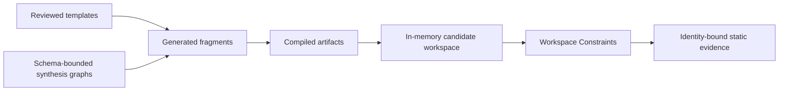
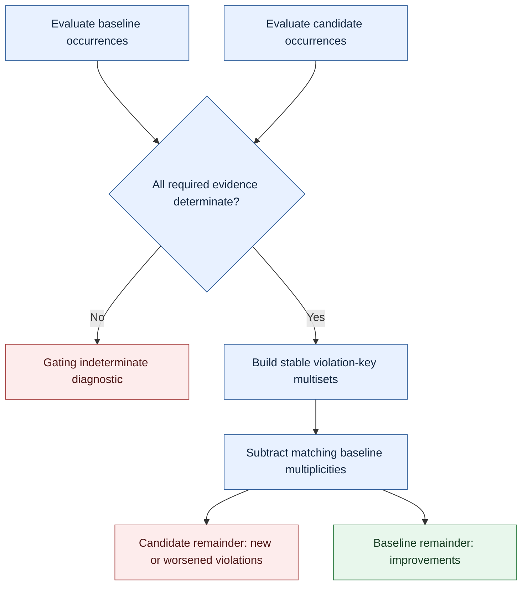
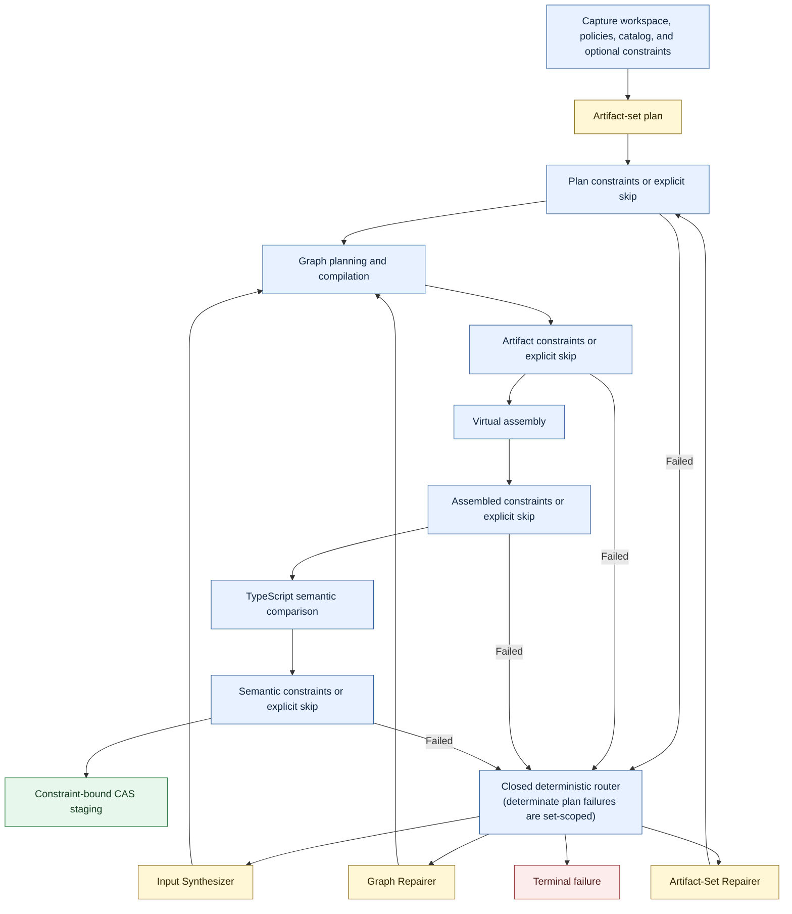

# Workspace Constraints

## Product Description

> **Cross-project snapshot:** Workspace Constraints owns declarative static
> evaluation; runtime-core owns orchestration and this integration document's
> authoritative source. Phase 1–3 binds evaluator evidence through immutable
> staging and ends at `readyForApproval`; approval and filesystem application
> belong to a future external Phase 4 workflow.

Workspace Constraints is a declarative policy layer for the Synthesize Regions
Agent Runtime. It lets a project describe directory, file, module, TypeScript
semantic, dependency, and synthesis-provenance invariants that every accepted
artifact set must satisfy.

[Graph templates and synthesis graphs](./synthesis-workflow-synthesize-regions-contracts.md)
define and compose controlled source-producing operations. Workspace Constraints
evaluates the larger result:



For syntax and examples, see the
[Workspace Constraints authoring guide](./workspace-constraints-README.md).
For interfaces and evaluator behavior, see the
[technical design](./workspace-constraints-technical-design.md). The containing
agent product is described in the
[runtime product description](./synthesis-workflow-product-description.md) and
[runtime technical design](./synthesis-workflow-technical-design.md).

> **Status:** Workspace Constraints v1 is implemented as a data-only parser,
> normalized typed IR, four-phase evaluator, and runtime staging integration.
> The source-language/parser contract is version `1`, normalized evaluation
> contracts are schema version `3`, and evaluator evidence uses engine `4`.

## Product Goal

The product gives project owners deterministic answers to questions that
template-local and compiler checks cannot answer alone:

- Does every controller have its required routes file?
- Are new files placed in the correct architectural directory?
- Do changed modules use the required import and export conventions?
- Do resolved dependencies remain inside permitted layer boundaries?
- Does a public handler implement the project-defined TypeScript contract?
- Was sensitive generated source produced only by approved templates?
- Did the candidate introduce a new violation into a legacy workspace?
- Which artifact, graph node, template, or input owns a failed assertion?

Workspace Constraints is intended for teams that want model-assisted generation
without turning architectural policy into prompt prose or executable validator
plugins. Constraint sets are repository configuration, captured with the
workspace and enforced by library-owned code.

## The Feature-Module Use Case

Consider a project with this layout:

```text
src/features/orders/
  orders.controller.ts
  orders.routes.ts
  orders.service.ts
  index.ts
```

The project requires:

- every `*.controller.ts` to have a matching `*.routes.ts`;
- changed feature files to avoid default exports;
- route imports to remain within their feature or `src/shared`;
- generated services to use reviewed template models;
- exported route handlers to be assignable to `RouteHandler`.

The repository expresses those requirements in
`.synthesize-regions/constraints.wsc`:

```wsc
constraints "feature-modules" version 1 {
  rule "controller-route-pair" {
    phase assembled
    mode candidate
    severity error

    select files "src/features/:feature/:name.controller.ts" as controller
    require file(
      "src/features/${controller.capture.feature}/${controller.capture.name}.routes.ts"
    )
  }

  rule "changed-source-has-named-exports" {
    phase assembled
    mode changed
    severity error

    select files "src/features/**/*.ts" as source
    require source.exports.default.count == 0
  }

  rule "route-dependencies-stay-bounded" {
    phase semantic
    mode noNewViolations
    severity error

    select imports
      from files "src/features/:feature/**/*.routes.ts"
      as dependency

    require dependency.resolvedPath is under(
      "src/features/${dependency.file.capture.feature}/**",
      "src/shared/**"
    )
  }

  rule "generated-service-provenance" {
    phase artifact
    mode changed
    severity error

    select generated ranges
      in files "src/features/**/*.service.ts"
      as generated

    require generated.provenance.templateId in {
      "ServiceDeclaration",
      "ServiceMethod",
      "NamedImport"
    }
  }

  rule "route-handler-contract" {
    phase semantic
    mode noNewViolations
    severity error

    select exports named "handler"
      from files "src/features/**/*.routes.ts"
      as handler

    require handler.type assignableTo type("RouteHandler")
  }
}
```

The constraints do not prescribe the exact generated bytes. The template
catalog retains that responsibility. They define independently reviewable
properties of the complete result.

## Product Principles

### Constraints are data

Constraint modules contain selectors, typed expressions, and assertions. They
cannot contain callbacks, getters, JavaScript, TypeScript validators, arbitrary
AST visitors, compiler plugins, or shell commands.

The readable language compiles into a normalized JSON
`WorkspaceConstraintSet`. Canonical schema validation remains authoritative.

### Project policy is separate from model intent

Models do not author, select, weaken, or approve the active constraint set. A
production capture draft may name a repository entry path and authorized
analysis roots. The runtime captures the exact files, derives the normalized
`constraintDigest`, and writes that derived identity into the authoritative
request before planning. A session that omits constraints still traverses the
runtime's fixed constraint phases through explicit skip events.

Constraint modules cannot be modified by the same session whose candidate they
govern.

### Analysis authority is not write authority

Directory-wide and semantic checks require a read-only project view. Captured
analysis roots grant the evaluator enough visibility to derive facts, but they:

- do not authorize replacement or creation;
- do not grant the model direct access to all source;
- do not alter exact replacement targets or allowed create roots;
- cannot be expanded by a constraint file or model proposal.

The runtime gives models only bounded policy/catalog summaries and diagnostics
needed for the current repair. It does not disclose constraint source or the
normalized constraint set.

### Acceptance is reproducible

The normalized constraint set has a semantic digest, and the exact captured
module bytes have a separate source-snapshot hash. Both are bound to:

- the authoritative candidate;
- persisted session and event state;
- the staged change set;
- the runtime-owned approval envelope;
- the deterministic change-set hash.

Changing rule meaning, the parser contract, the fact-engine contract, or a
supported semantic operation changes the digest. Comment-only and formatting
changes preserve the digest but change the captured source-snapshot hash. A
captured session cannot silently switch to changed files or changed semantics.
Checking a later mutable live target against that capture belongs to the
Phase 4 application preflight and is not part of Phase 3 static staging.

### Failure is attributable

Constraint diagnostics identify the rule and subject. When generated source
maps permit it, they also identify the artifact, graph node, template, and input
that contributed the failed range.

Attribution describes textual or structural ownership. It does not invent
behavioral causality.

### Mandatory uncertainty fails closed

A false assertion and an indeterminate assertion are distinct outcomes.
Indeterminate results include inaccessible selected paths, incomplete mandatory
fact extraction, unresolved required types, and exhausted analysis budgets.

Indeterminate evidence always fails closed before enforcement-mode comparison,
regardless of the authored rule severity. In `noNewViolations`, only determinate
failed occurrences can be subtracted; inaccessible baseline and candidate facts
can never cancel each other.

## Constraint Capabilities

### Workspace structure

Rules can select files and directories, capture path segments, require related
paths, enforce counts and uniqueness, and relate planned targets to the
candidate tree.

Examples include companion files, public indexes, generated-file roots, naming
rules, and bounded artifact counts.

### TypeScript structure

The evaluator exposes parsed declarations, modifiers, decorators, imports, and
exports through versioned, typed facts. Rules can quantify and aggregate over
these facts without defining custom AST traversal logic.

### Semantic relationships

Using the captured `tsconfig` and workspace snapshot, rules can inspect
resolved modules, symbols, signatures, and TypeScript types. They can express
assignability and bounded cross-file relationships. The evaluator parses that
exact captured configuration without a fallback project and fails closed when
configuration, imports, aliases, descriptors, or required compiler evidence
cannot be resolved within the authorized analysis roots.

These checks prove only compiler-visible static properties.

### Dependency architecture

Resolved imports can be compared with path captures and module layers. Rules
can prohibit new cross-feature dependencies, require type-only imports, or
constrain public entry points.

### Synthesis provenance

Rules can select generated ranges and inspect their artifact, graph, template,
and input ownership. A project can require reviewed template IDs for sensitive
files or prohibit raw-code provenance in selected ranges.

## Baseline-Aware Adoption

Existing projects frequently contain violations that cannot be fixed in one
synthesis request. Workspace Constraints therefore requires every rule to make
its adoption policy explicit:

| Mode | Product meaning |
| --- | --- |
| `candidate` | The complete selected candidate state must comply. |
| `changed` | Only candidate subjects changed or created by this artifact set must comply. |
| `noNewViolations` | The candidate may preserve baseline violations but cannot add or worsen them. |

There is no global implicit mode. Reviewers can see from each rule whether it
enforces strict convergence, changed-code quality, or non-regression.

For `noNewViolations`, indeterminate evidence is handled before comparison:



## Evaluation and Repair

Rules run at one declared phase, and the compiler verifies that every referenced
fact is available by that phase:

- plan rules check proposed artifacts, goals, and authorized target layouts;
- artifact rules check compiled fragments and provenance;
- assembled rules check the virtual candidate file tree and syntax facts;
- semantic rules check compiler-resolved project relationships.

The containing runtime owns these states in its canonical `WorkflowDefinition`.
The same fixed topology is used for constrained and unconstrained sessions. Each
phase records passed, failed, or skipped; skip reasons distinguish
`notConfigured` from `noApplicableRules`. A `.wsc` module cannot define states,
transitions, effects, or authorization logic.

Failures use deterministic routing:

- local graph/template failures go to the Graph Repairer;
- localized raw or literal failures go to the Input Synthesizer;
- missing or extra artifacts and target/goal layout failures go to an
  Artifact-Set Repairer;
- invalid configurations, stale identities, and inaccessible mandatory
  analysis terminate as policy or stale-state failures;
- ambiguous cross-artifact failures remain at set scope.

The Artifact-Set Repairer proposes one schema-constrained plan patch at a time.
It cannot grant new target authority. Added or invalidated artifacts pass
through plan constraint checking, normal graph planning, compilation, and static
acceptance.

Production orchestration follows the runtime's command → pure decision → domain
event → pure reducer protocol. Constraint evaluation is durable outbox work;
its revision- and digest-bound result returns as a command before a phase event
can be committed.

## Successful Outcome

A successful Phase 3 static-staging session with Workspace Constraints
provides:

- the captured constraint entry path and exact digest;
- the normalized rule summary captured alongside the IR;
- phase results that include baseline/candidate comparison where the selected
  mode requires it;
- structured constraint diagnostics, including non-gating warnings;
- provenance attribution for generated subjects;
- a statically accepted change set bound to the constraint identity;
- a content-addressed approval envelope for those exact bytes under those exact
  rules.

Static acceptance means the candidate satisfied the configured structural,
source-policy, TypeScript, and Workspace Constraint gates. It is not a claim
about runtime behavior.

## Product Boundaries

Workspace Constraints does not:

- execute, import, or evaluate generated TypeScript;
- run tests, builds, linters, package managers, or project commands;
- prove business behavior, correctness, security, or performance;
- load caller-provided code, validators, AST visitors, or compiler plugins;
- allow unrestricted recursion or unbounded queries;
- grant filesystem read or write authority through selectors or model output;
- expose all analyzed source to a model;
- permit constraints to override target authorization;
- let a candidate edit the active constraint modules;
- replace graph port, manifest, artifact-integrity, syntax, or TypeScript
  semantic validation;
- treat warnings as acceptance failures.

Project tests and repository engineering checks remain ordinary development
work outside candidate synthesis.

## Security and Resource Model

Constraint source, imports, workspace files, compiler facts, and diagnostics
are untrusted input. Only versioned parser, schema, normalizer, fact-engine, and
evaluator code are trusted.

Deployments bound:

- imported module count, depth, and bytes;
- rule and expression count;
- selector result and fact-row counts;
- join width and aggregate work;
- TypeScript compiler work;
- diagnostic volume;
- deterministic attempted-work counters for every evaluation family.

Wall-clock timeout and heap ceilings are runtime worker failures, not
constraint-policy evidence.

Unknown syntax, unsupported facts, root escapes, import cycles, duplicate IDs,
stale digests, and mandatory resource exhaustion are rejected explicitly.

## Relationship to the Agent Runtime

Workspace Constraints extends the fixed static acceptance pipeline described in
the [agent runtime technical design](./synthesis-workflow-technical-design.md):



Phase 3 produces the exact approval envelope and the protocol can bind an exact
approval. The authenticated approval coordinator, live-target revalidation, and
recoverable filesystem journal/application worker are Phase 4 work and are not
implemented here. Workspace Constraints changes acceptance and repair inputs;
it does not change the rule that models propose and trusted infrastructure
commits.

## Implemented v1 Acceptance Criteria

The implemented v1 product can:

1. Capture a repository entry module and explicit import closure as data.
2. Produce the same normalized IR and digest for semantically identical input.
3. Type-check selectors and expressions against a versioned fact vocabulary.
4. Evaluate plan, artifact, assembled, and semantic rules.
5. Distinguish `candidate`, `changed`, and `noNewViolations` behavior.
6. Fail closed for stale identity, inaccessible scope, indeterminate mandatory
   semantics, or resource exhaustion.
7. Attribute generated-source violations through artifact provenance.
8. Route plan-shape failures through bounded set repair.
9. Bind successful evaluation to staged bytes and the exact approval envelope.
10. Perform no generated-code execution or project-command invocation.
