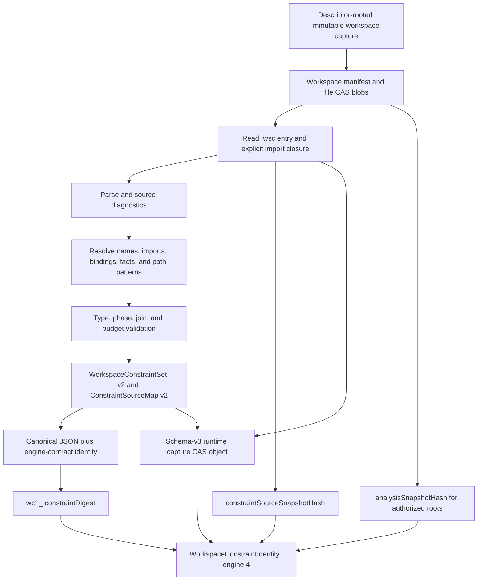
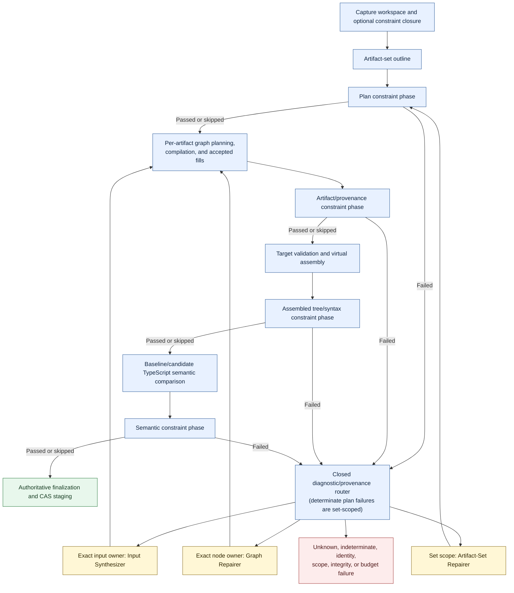

# Technical Design: Workspace Constraints

> **Cross-project snapshot:** Workspace Constraints owns parsing, normalized
> policy, facts, diagnostics, and evaluation. Runtime-core owns orchestration
> and this integration document's authoritative source. Runtime Phase 1–3 ends
> at immutable staging; approval and filesystem application are Phase 4 concerns,
> not Workspace Constraints features.

**Status:** Phase 3 implemented
**Version:** 1.0
**Primary language:** TypeScript
**Integration:** `synthesize-regions` artifact-set APIs and agent runtime

## 1. Purpose

This document defines Workspace Constraints, a declarative language and static
evaluation engine for directory-, file-, TypeScript-, dependency-, and
synthesis-provenance-wide invariants.

Workspace Constraints complements the controlled graph-template and
synthesis-graph model summarized in the
[runtime's copied `synthesize-regions` contracts](./synthesis-workflow-synthesize-regions-contracts.md).
It extends the fixed acceptance pipeline in the
[agent runtime design](./synthesis-workflow-technical-design.md) without adding
executable validators or project-command execution.

See the [authoring guide](./workspace-constraints-README.md) for language usage
and the [product description](./workspace-constraints-product-description.md)
for goals and boundaries.

The v1 parser, normalized typed IR, source maps, evaluator contracts, four-phase
evaluation API, and published JSON Schemas are implemented by the sibling
`workspace-constraints` package. This runtime captures their exact source
closure and normalized identities and binds every phase result into staging.
The source-language/parser contract remains version `1`; normalized IR and
source-map contracts remain schema version `2`; compiled capture,
evaluation-input, and phase-result evidence use schema version `3`. The
corrected sole evaluator uses engine version `4` while semantic digests retain
the `wc1_` prefix.

## 2. Goals

Workspace Constraints shall:

1. Express project-wide invariants as repository-owned, data-only modules.
2. Compile readable `.wsc` syntax into one canonical JSON intermediate
   representation.
3. Evaluate structural, syntactic, semantic, dependency, and provenance facts.
4. Distinguish whole-candidate, changed-subject, and baseline non-regression
   enforcement.
5. Operate against immutable baseline and candidate workspace views.
6. Preserve existing read/write authorization boundaries.
7. Produce structured diagnostics with artifact and generated-source
   attribution where available.
8. Route repair deterministically, including bounded artifact-set plan repair.
9. Bind the exact constraint identity to session, staging, and approval state.
10. Fail closed when mandatory analysis is invalid, incomplete, stale,
    inaccessible, indeterminate, or exhausted.

## 3. Non-Goals

The design does not:

- execute, import, or evaluate generated or repository TypeScript;
- invoke tests, builds, linters, package managers, or shell commands;
- load custom validators, callbacks, AST visitors, or compiler plugins;
- provide a general-purpose programming language;
- permit user-defined functions or arbitrary recursion;
- prove runtime behavior, business correctness, security, or performance;
- grant read or write authority through selectors;
- disclose all analyzed source to models;
- allow a candidate to modify the constraints governing its own acceptance;
- replace template, graph, artifact-integrity, syntax, or compiler gates.

## 4. Design Invariants

### 4.1 Authoring syntax is not authoritative

The `.wsc` language is a readable authoring layer. The authoritative contract
is a schema-validated, normalized `WorkspaceConstraintSet` JSON value.



Runtime evaluation never reparses source strings from session fields. At the
session repository boundary, the schema-v3 capture CAS object, module hashes,
exact source text, workspace manifest, and captured identity are cross-checked.
A phase handler later reads that immutable object, checks its normalized digest,
and submits the schema-validated normalized set to a one-shot static worker.

### 4.2 Constraint modules are data

Parsing accepts only the versioned Workspace Constraints grammar. Imports load
only `.wsc` modules as source data. There is no JavaScript/TypeScript module
resolution, dynamic import, callback field, plugin hook, or caller-supplied
predicate implementation.

### 4.3 Rules cannot grant authority

A selector can observe only facts available below captured read-only analysis
roots. It cannot read outside those roots and cannot grant a create or
replacement target.

Write authority remains:

- exact captured replacement targets; and
- explicitly authorized create roots.

### 4.4 Active constraints are immutable

The complete imported module closure is captured before planning. Every module
path and content hash is part of the constraint capture. Active module paths
are rejected as artifact targets for the entire session.

Changing repository constraint files never changes an already captured session
in place. Comparing a later mutable live target with the approved capture is a
Phase 4 application-preflight responsibility; Phase 3 evaluates and stages only
against the immutable capture.

### 4.5 Required uncertainty fails closed

Rule evaluation has three outcomes:

```ts
type ConstraintOutcome = 'passed' | 'failed' | 'indeterminate'
```

`indeterminate` is not equivalent to `false`. It represents unavailable or
incomplete mandatory evidence. Every indeterminate evaluation fails closed as
an error before enforcement-mode comparison, even when the authored rule has
warning severity. Warning severity is non-gating only for determinate failed
assertions.

### 4.6 Evaluation is bounded

Every parser, selector, fact extraction, join, aggregation, compiler query, and
diagnostic operation is charged against fixed deployment and request budgets.
The language contains no construct whose work cannot be estimated and bounded.

## 5. Terminology

**Constraint entry:** The request-selected root module, normally
`.synthesize-regions/constraints.wsc`.

**Constraint module:** One data-only `.wsc` file in the explicit import
closure.

**Constraint set:** The normalized, flattened, typed rule representation used
by evaluation.

**Constraint digest:** Identity of the normalized set and versioned parser,
normalization, expression, fact, and compatibility contracts.

**Analysis root:** A captured workspace-relative path below which trusted
infrastructure may derive facts. It grants no model or write authority.

**Workspace view:** Either the immutable baseline snapshot or the in-memory
candidate overlay.

**Subject:** A typed value selected for rule evaluation, such as a file,
declaration, symbol, artifact, or generated range.

**Violation key:** A stable identity used to compare baseline and candidate
violations for `noNewViolations`.

**Fact provider:** Library-owned code that derives one versioned family of
facts.

## 6. Source Language

### 6.1 Entry and modules

The conventional entry file is:

```text
.synthesize-regions/constraints.wsc
```

An entry declares exactly one constraint set:

```wsc
constraints "feature-modules" version 1 {
  import "./constraints/shared.wsc"

  rule "changed-source-has-named-exports" {
    phase assembled
    mode changed
    severity error

    select files "src/features/**/*.ts" as source
    require source.exports.default.count == 0
  }
}
```

Imported files declare modules. A module may contain explicit imports of other
modules:

```wsc
module "shared-feature-rules" version 1 {
  import "./naming.wsc"

  rule "feature-index-exists" {
    phase assembled
    mode candidate
    severity error

    select directories "src/features/:feature" as feature
    require file("${feature.path}/index.ts")
  }
}
```

Imports are declarations, not textual includes. Comments and formatting have no
effect on normalized identity.

### 6.2 Rule shape

The v1 source shape is:

```wsc
rule "<stable-id>" {
  phase plan | artifact | assembled | semantic
  mode candidate | changed | noNewViolations
  severity error | warning

  select <typed-selector> as <binding>
  join <bounded-selector> as <binding>

  require <boolean-expression>
  require <boolean-expression>
}
```

Rules require at least one selector and one assertion. Binding names are local
to one rule. Rule IDs are unique across the complete imported closure.

### 6.3 Path patterns

Path patterns are workspace-relative POSIX patterns:

- `*` matches exactly one complete segment;
- `**` matches zero or more complete segments;
- `:name` captures one segment;
- `:name.suffix.ts` captures the prefix of one segment;
- all other characters are literals subject to path normalization.

Captures cannot contain separators or NUL and cannot equal `.` or `..`.
Interpolation is permitted only in path-template operands and validates
captures as complete segments.

The pattern language is not a regular-expression dialect. A future regex fact
must use a separately versioned, bounded predicate.

### 6.4 Expressions

Expressions are statically typed. V1 supports:

- scalar literals and set literals;
- subject field access;
- `and`, `or`, and `not`;
- typed equality and ordering;
- set and collection membership;
- path `matches` and `under` predicates;
- `all`, `some`, `none`, and `exactly N` quantifiers;
- bounded `count`, `unique`, and `contains` aggregates;
- explicit selector joins;
- TypeScript `assignableTo` and exact-symbol predicates;
- a closed set of versioned pure helpers such as `pascal(PathSegment)`.

Short-circuiting affects work but not observable diagnostics: every failed
top-level `require` produces at most one primary diagnostic with bounded
supporting evidence.

User-defined functions, mutation, loops, recursion, reflection, dynamic field
access, and dynamic selector construction are invalid.

## 7. Normalized Intermediate Representation

### 7.1 Top-level contract

```ts
interface WorkspaceConstraintSet {
  schemaVersion: 2;
  id: string;
  modules: ConstraintModuleReference[];
  rules: WorkspaceConstraintRule[];
}

interface ConstraintModuleReference {
  moduleId: string;
  normalizedPath: string;
}

interface ConstraintModuleCapture extends ConstraintModuleReference {
  sourceHash: string;
}

interface WorkspaceConstraintRule {
  id: string;
  modulePath: string;
  phase: ConstraintPhase;
  mode: ConstraintMode;
  severity: ConstraintSeverity;
  selector: ConstraintSelector;
  joins: ConstraintSelector[];
  assertions: ConstraintExpression[];
}

type ConstraintPhase = 'plan' | 'artifact' | 'assembled' | 'semantic';
type ConstraintMode = 'candidate' | 'changed' | 'noNewViolations';
type ConstraintSeverity = 'error' | 'warning';
```

The published schema is closed and strict. Canonical compilation also performs
name resolution, selector typing, expression typing, phase/fact availability,
baseline comparability, join correlation, and budget validation.

### 7.2 Selector representation

Selectors use one closed normalized shape whose fields are constrained by the
selector kind:

```ts
interface ConstraintSelector {
  kind:
    | 'files'
    | 'directories'
    | 'artifacts'
    | 'declarations'
    | 'imports'
    | 'exports'
    | 'generatedRanges';
  bindingId: string;
  subjectType: ConstraintSubjectTypeId;
  pathPattern?: ConstraintPathPattern;
  named?: string;
  predicate?: ConstraintExpression;
}

interface ConstraintPathPattern {
  segments: ConstraintPathSegment[];
  singleton: boolean;
  correlatedBindingIds: string[];
}
```

Semantic symbols and signatures are reached through typed syntax/export
subjects rather than an unbounded global symbol-table scan. This preserves a
path-bounded selector anchor.

### 7.3 Expression representation

The IR stores expression operators, resolved binding references, typed fact
IDs, navigation behavior, and a resolved `valueType` on every node rather than
free-form source-language names. Representative nodes are:

```ts
type ConstraintExpression = ExpressionBase & (
  | { kind: 'literal'; value: string | number | boolean | null }
  | { kind: 'pathLiteral'; pattern: ConstraintPathPattern }
  | { kind: 'set'; values: ConstraintExpression[] }
  | { kind: 'binding'; bindingId: string }
  | {
      kind: 'fact';
      subject: ConstraintExpression;
      factId: WorkspaceFactId;
      navigation: 'value' | 'project' | 'filter';
    }
  | { kind: 'capture'; subject: ConstraintExpression; name: string }
  | {
      kind: 'helper';
      helperId: 'file' | 'type' | 'pascal' | 'count' | 'unique' | 'contains';
      arguments: ConstraintExpression[];
    }
  | {
      kind: 'logical';
      operator: 'and' | 'or';
      operands: ConstraintExpression[];
    }
  | {
      kind: 'not';
      operand: ConstraintExpression;
    }
  | {
      kind: 'compare';
      operator:
        | 'equal'
        | 'notEqual'
        | 'lessThan'
        | 'lessThanOrEqual'
        | 'greaterThan'
        | 'greaterThanOrEqual';
      left: ConstraintExpression;
      right: ConstraintExpression;
    }
  | {
      kind: 'membership';
      operator: 'in' | 'notIn';
      item: ConstraintExpression;
      collection: ConstraintExpression;
    }
  | {
      kind: 'pathPredicate';
      operator: 'matches' | 'under';
      path: ConstraintExpression;
      patterns: ConstraintExpression[];
    }
  | {
      kind: 'quantifier';
      operator: 'all' | 'some' | 'none' | 'exactly';
      collection: ConstraintExpression;
      itemBindingId: string;
      count?: number;
      predicate: ConstraintExpression;
    }
  | {
      kind: 'typePredicate';
      operator: 'assignableTo' | 'sameSymbol';
      actual: ConstraintExpression;
      expected: ConstraintExpression;
    }
);

interface ExpressionBase {
  valueType: ConstraintValueType;
}
```

The implementation may use more specialized internal nodes, but persisted IR
remains closed, JSON-safe, and schema-backed.

### 7.4 Source locations

Compilation returns a separate `ConstraintSourceMap` from normalized rule,
selector, and assertion IDs to module UTF-16 ranges, plus exact
`ConstraintModuleCapture` records. Source locations and source hashes support
author diagnostics and stale-file detection but are excluded from semantic
canonicalization, so comments and formatting do not change
`constraintDigest`.

Normalized module paths and module IDs remain in the IR and do affect identity.

## 8. Type and Fact Model

### 8.1 Core types

The expression checker recognizes:

```text
Boolean, Integer, String, Path, PathSegment, JSON, Null
opaque Symbol and Type values
File, Directory, Artifact, ArtifactTarget, ArtifactGoal
Declaration, Import, Export, Signature, Edit
GeneratedRange, Provenance, GraphNode, TemplateInput
Collection<T>
```

There is no implicit conversion between `String`, `Path`, and
`PathSegment`. TypeScript `Type` values are opaque handles owned by the
semantic fact provider and cannot be serialized as compiler objects.
Set literals normalize to deterministic `Collection<T>` values. Decorators and
modifiers are string collections on declaration subjects rather than separate
subject types.

### 8.2 Fact families

Fact IDs are versioned public contracts. Initial families include:

| Family | Representative facts |
| --- | --- |
| Path/tree | normalized path, basename, extension, parent, captures, child files |
| Candidate change | created, modified, intersecting edits, owning artifact IDs |
| Plan | artifact ID, target kind/path/range, goal kind/type |
| Syntax | declarations, kind, name, modifiers, decorators, imports, exports |
| Module | specifier, resolved path, external/package status, type-only status |
| Symbol | exported symbol, declarations, aliases, signatures |
| Type | display descriptor, assignability handle, return and parameter types |
| Provenance | generated range, artifact, node, template, input, raw-code owner |

Fact providers return values plus evidence metadata and an availability status.
They do not expose mutable compiler objects to the expression evaluator.

### 8.3 Phase availability

Each fact declares its earliest phase:

```ts
interface WorkspaceFactDefinition {
  id: WorkspaceFactId;
  subjectType: ConstraintTypeId;
  resultType: ConstraintType;
  earliestPhase: ConstraintPhase;
  baselineAvailable: boolean;
  providerVersion: number;
}
```

A rule cannot reference a fact earlier than its declared phase. A
`noNewViolations` rule cannot use a selector or fact for which
`baselineAvailable` is false. Consequently, plan-only and generated
provenance facts normally use `candidate` or `changed`, not
`noNewViolations`.

### 8.4 TypeScript semantics

Semantic evaluation uses the same captured `tsconfig`, normalized workspace
paths, and baseline/candidate overlay required by artifact-set static
acceptance. It parses that exact configuration without a fallback project and
admits only authorized analysis-root files plus trusted TypeScript libraries.
Missing or malformed configuration, inaccessible imports, unresolved aliases
or descriptors, and compiler roots outside that authority are indeterminate
and fail closed.

The fact provider creates or reuses two programs:

- baseline program from the immutable workspace snapshot;
- candidate program from the baseline plus assembled changes.

Type operations are library-owned:

- assignability uses the pinned TypeScript compatibility contract;
- symbols are identified by normalized declaration identities, not object
  addresses;
- aliases are resolved with bounded depth;
- diagnostics produced while constructing mandatory semantic facts are
  retained as evidence;
- unsupported or unresolved mandatory relationships return indeterminate.

Compiler-visible truth is not treated as runtime proof.

## 9. Import Resolution and Compilation

### 9.1 Resolution

The compiler starts from the request-authorized entry path. For every import it:

1. validates a relative `.wsc` path;
2. normalizes it relative to the importing module;
3. rejects absolute paths, traversal, and constraint-root escapes;
4. verifies the path lies in the captured workspace and authorized config root;
5. loads exact captured bytes;
6. detects cycles by normalized path;
7. charges module count, depth, and byte budgets.

Imports are traversed in authored order for diagnostics, then normalized by
module identity for canonicalization.

### 9.2 Validation

Compilation rejects:

- malformed source or unsupported language versions;
- multiple entry declarations or imports outside a set/module declaration;
- duplicate set, module, rule, or binding IDs;
- unknown facts, helpers, fields, or operators;
- invalid path patterns or capture references;
- type-incompatible expressions;
- facts unavailable in the selected phase;
- non-baseline-comparable `noNewViolations` rules;
- joins that are neither provably singleton nor atomically correlated with an
  earlier binding;
- statically unbounded aggregates;
- expressions exceeding configured structural budgets.

No partially valid constraint set may enter a synthesis session.

### 9.3 Normalization

Normalization:

- resolves imports and binding references;
- converts source sugar into explicit expression nodes;
- normalizes paths to workspace-relative POSIX form;
- normalizes sets into deterministic value order;
- preserves assertion order for diagnostic identity;
- sorts modules and rules by stable IDs;
- inserts no policy defaults for phase, mode, or severity;
- removes comments, trivia, and source formatting.

## 10. Identity

### 10.1 Digest

`constraintDigest` uses a domain-separated SHA-256 hash, rendered with a
versioned `wc1_` prefix:

```text
wc1_ SHA-256(
  canonical JSON {
    compilerIdentity: {
      sourceLanguageVersion: 1,
      normalizedIrVersion: 2,
      sourceMapVersion: 2,
      compiledCaptureSchemaVersion: 3,
      evaluatorVersion: 4,
      factProviderVersion: 2,
      pathPatternVersion: 4
    },
    constraintSet: WorkspaceConstraintSet
  }
)
```

Module source hashes produce a separate `constraintSourceSnapshotHash`, while
semantic identity comes from normalized IR and engine contracts. Comment or
whitespace changes do not change the digest, but they do change that source
snapshot hash. Rule meaning, module path/identity, imports, or engine contract
changes change the digest.

### 10.2 Session binding

The existing candidate and acceptance identities gain:

```ts
interface WorkspaceConstraintIdentity {
  constraintEntryPath: string;
  constraintDigest: string;
  constraintSourceSnapshotHash: string;
  constraintEngineVersion: 4;
  constraintCompilerIdentity: string;
  constraintEvaluatorIdentity: string;
  constraintToolchainIdentity: string;
  analysisSnapshotHash: string;
  analysisRoots: string[];
  captureBlobHash: string;
  modulePaths: string[];
}

interface ArtifactSetCandidate {
  // Existing plan, revisions, fills, and catalog/workspace identities.
  constraintIdentity?: WorkspaceConstraintIdentity;
}
```

When present, the static change-set hash binds this identity. Constraint
recapture, semantic digest change, exact module-byte change, or
analysis-snapshot change invalidates staged state and approval.

## 11. Request and Authorization

The authoritative captured synthesis request contains:

```ts
interface WorkspaceConstraintRequest {
  entryPath: string;
  expectedConstraintDigest: string;
  analysisRoots: string[];
}

interface SynthesisRequest {
  // Existing objective, workspace, targets, catalog, policy, and budgets.
  constraints?: WorkspaceConstraintRequest;
}
```

Production callers do not assert `expectedConstraintDigest`. Their
`SessionConstraintCaptureDraft` supplies only `entryPath` and `analysisRoots`.
`captureSessionInput()` captures and compiles the exact module bytes, derives
the digest and source-snapshot hash, persists the schema-v3 capture object, and
then constructs the internal request above with the derived digest. The
`expectedConstraintDigest` field is therefore a later integrity check, not a
source of authority.

Omitting `constraints` disables repository-specific constraint evaluation for
that session, but does not remove states from the canonical workflow. Each fixed
phase commits a skipped result with reason `notConfigured`. When a captured set
has no rule for a phase, the reason is `noApplicableRules`.

Server authorization constrains:

- permitted entry/config roots;
- maximum read-only analysis roots;
- relationship between analysis roots and workspace snapshot;
- maximum constraint and evaluation budgets.

The client cannot gain access merely by naming a broader root. Constraint
selectors cannot expand `analysisRoots`.

### 11.1 Visibility classes

Information has separate visibility:

| Consumer | Visibility |
| --- | --- |
| Parser/compiler | Captured constraint module closure |
| Fact providers | Captured files below authorized analysis roots |
| Evaluator | Typed facts and bounded evidence |
| Models | Bounded policy/catalog summaries and actionable diagnostics after failure; never rule source or normalized IR |
| Approval envelope consumer | Constraint identity, phase-evidence hashes, resulting-file summaries, and CAS references |

Constraint diagnostic projections contain bounded structured evidence and
provenance, not raw constraint modules or analyzed workspace source.

### 11.2 Immutable module targets

After capture, every active module path is added to a session-level denylist for
artifact targets. Any create or replace target overlapping an active module is
rejected before planning or compilation.

This restriction applies even if the path would otherwise fall within an
allowed create root or exact replacement target.

## 12. Workspace Views and Change Semantics

### 12.1 Baseline and candidate

The baseline is the immutable captured workspace. The candidate is produced by
assembling the authoritative artifact-set plan and fill ledger over that
baseline. Neither view reads mutable live files during evaluation.

The captured runtime-context loader verifies every manifest file against its
CAS bytes and derives an exact partition of UTF-8 `workspaceFiles` and
`unavailableTextPaths`. Non-UTF-8 files remain identity-bearing workspace data
but are not exposed as text facts. The captured tsconfig and every
TypeScript/JavaScript analysis input must be available as verified text;
otherwise semantic evidence fails closed.

### 12.2 Changed subjects

For `changed` mode:

- a file is changed when it is created or has at least one accepted text edit;
- a directory is changed when it contains a changed descendant selected by the
  rule;
- a syntax subject is changed when its candidate range intersects an edit or it
  belongs to a created file;
- an artifact and generated range in the current plan are changed subjects;
- a semantic relationship is changed when a changed syntax subject owns an
  endpoint or its normalized fact value differs between baseline and candidate.

Formatting-only edits still mark intersecting syntax subjects as changed.
Selectors run against the candidate first, then apply the typed changed-subject
filter.

### 12.3 Candidate mode

`candidate` evaluates assertions for every selected candidate subject. A
pre-existing violation is gating because the complete selected candidate does
not satisfy the rule.

### 12.4 No-new-violations mode

`noNewViolations` evaluates the same normalized selector and assertions in
both views. Indeterminate candidate or baseline evidence fails closed before
multiset comparison. Each determinate failed assertion produces a violation key:

```ts
interface ConstraintViolationKey {
  ruleId: string;
  assertionIndex: number;
  subjectKind: string;
  subjectStableId: string;
  joinedSubjectStableIds: string[];
}
```

Stable IDs use normalized paths and structural identities, never source offsets
alone. Candidate violations are compared as a multiset with baseline
violations:

- a matching baseline occurrence is non-gating legacy context;
- an unmatched candidate occurrence is new and gating;
- increased multiplicity is gating;
- removed occurrences are recorded as improvements;
- inaccessible or otherwise indeterminate baseline/candidate facts never
  cancel one another or consume a determinate violation.

If stable correlation cannot be established for a mandatory subject, the rule
is indeterminate rather than silently treated as legacy.

## 13. Evaluation Pipeline

When configured, constraint evaluation is interleaved with existing artifact
processing. When absent, the same fixed states commit `notConfigured` skips:



### 13.1 Incremental reevaluation

The runtime stores phase-granular evidence. A candidate revision invalidates
evidence from the earliest affected boundary:

- an accepted artifact-set patch restarts at plan constraints;
- an accepted graph or input/fill change retains valid plan evidence and
  restarts compilation, then artifact constraints;
- new compilation invalidates assembly, assembled constraints, semantics, and
  semantic constraints;
- new assembly invalidates assembled and semantic evidence.

All applicable rules in an invalidated phase are evaluated again. Immutable
phase-result blob hashes, rather than an undocumented fact cache, are the
runtime's durable evidence.

### 13.2 Deterministic ordering

Within a phase result, diagnostics are ordered by rule ID, assertion index,
subject stable ID, diagnostic code, and message. Phase ordering comes from the
fixed workflow and the four separately persisted phase results.

Truncation occurs only after deterministic ordering and emits an explicit
diagnostic count/truncation record.

## 14. Diagnostics

### 14.1 Contract

```ts
interface WorkspaceConstraintDiagnostic {
  stage: 'policy';
  code:
    | 'WorkspaceConstraintFailed'
    | 'WorkspaceConstraintIndeterminate'
    | 'WorkspaceConstraintInvalid'
    | 'WorkspaceConstraintDigestMismatch'
    | 'WorkspaceConstraintBudgetExceeded'
    | 'WorkspaceConstraintImprovement'
    | 'WorkspaceConstraintDiagnosticsTruncated';

  severity: 'error' | 'warning';
  message: string;
  ruleId?: string;
  phase?: ConstraintPhase;
  mode?: ConstraintMode;
  outcome?: 'failed' | 'indeterminate' | 'improved';
  assertionIndex?: number;
  subject?: ConstraintSubjectDescriptor;
  artifactId?: string;
  nodeId?: string;
  templateId?: string;
  inputName?: string;
  expected?: JsonValue;
  actual?: JsonValue;
  repairHints?: Array<Record<string, JsonValue>>;
}

interface ConstraintSubjectDescriptor {
  kind: string;
  stableId: string;
  path?: string;
  start?: number;
  length?: number;
  captures?: Record<string, string>;
}
```

The runtime admits this closed diagnostic object into its broader diagnostic
union. Optional expected and actual fields contain JSON-safe summarized
evidence, never compiler object graphs.

### 14.2 Attribution

For a generated subject inside an assembled edit, the runtime maps artifact
source-map spans through their assembled placements and supplies those
`generatedRanges` to the evaluator. The evaluator chooses the deepest available
subject/provenance owner for the diagnostic.

Attribution preference is:

1. exact generated input span;
2. deepest generated node span;
3. artifact edit;
4. candidate file/range;
5. set-level rule.

Cross-file assertions may include secondary subject descriptors, but only one
primary owner is used for deterministic repair routing.

### 14.3 Positive and failing outcomes

- A passed rule emits no acceptance diagnostic; optional metrics record it.
- A failed error assertion emits a gating diagnostic.
- A failed warning assertion emits a non-gating warning.
- Any indeterminate assertion emits a gating error diagnostic before
  enforcement-mode comparison.
- A baseline violation consumed by `noNewViolations` is context, not a
  candidate failure.
- A removed baseline violation may be reported as a non-gating improvement.

## 15. Repair Routing

### 15.1 Routing table

| Constraint ownership | Route |
| --- | --- |
| Exact raw/literal generated input | Input Synthesizer |
| One graph node/template composition | Graph Repairer |
| Artifact existence, count, target, or goal | Artifact-Set Repairer |
| Attributable relationship among several existing artifacts | Set-level repair coordinator |
| Invalid module, stale digest/snapshot, forbidden scope | Terminal policy or stale-state failure |
| Mandatory resource exhaustion or fact-provider corruption | Terminal failure |

The router uses diagnostic structure and provenance; it does not invoke a
classifier model.

### 15.2 Artifact-Set Repairer

The runtime adds a bounded role whose input contains:

- the current artifact-set outline and candidate revision;
- one actionable set-level constraint diagnostic;
- authorized replacement targets and allowed create roots;
- relevant catalog capability summaries;
- remaining budgets and rejected patches;
- one currently permitted patch family.

Its output is exactly one action:

```ts
type ArtifactSetPatchAction =
  | { kind: 'addArtifact'; artifact: ArtifactOutline }
  | { kind: 'removeArtifact'; artifactId: string }
  | {
      kind: 'setArtifactTarget';
      artifactId: string;
      target: AuthorizedArtifactTarget;
    }
  | {
      kind: 'setArtifactGoal';
      artifactId: string;
      goal: SynthesisGoal;
    };
```

An `ArtifactOutline` contains an artifact ID, authorized target, and optional
goal, not a model-authored executable template or detached complete graph. Added or
goal/target-invalidated outlines return to Graph Planning. Removal and
invalidation update the fill ledger and staged-state invalidation
transactionally.

Every patch is schema-validated, authorized, budgeted, applied immutably, and
rechecked from the earliest affected phase.

## 16. State and Protocol Changes

### 16.1 Session state

```ts
interface SynthesisSession {
  // Existing identity and candidate fields.
  constraintIdentity?: WorkspaceConstraintIdentity;
}
```

Requested constraint capture occurs before `planningSet`. An invalid or stale
requested capture prevents planning. An omitted request records no constraint
identity and proceeds through explicit phase skips.

### 16.2 Canonical workflow ownership

Workspace Constraints does not add an independent state machine. The
[synthesis workflow's canonical `WorkflowDefinition`](./synthesis-workflow-technical-design.md#15-state-machine)
owns the fixed `planConstraintChecking`, `artifactConstraintChecking`,
`assembledConstraintChecking`, `semanticConstraintChecking`,
`constraintRepairRouting`, and `needsSetRepair` states.

Each phase produces exactly one lifecycle event:

```text
<Phase>ConstraintsPassed
<Phase>ConstraintsFailed
<Phase>ConstraintsSkipped { reason: notConfigured | noApplicableRules }
```

Failed events enter deterministic constraint-repair routing. Local ownership
continues to the existing static/input/graph repair path; plan-shape and
cross-artifact ownership continues to `needsSetRepair`. Every accepted
artifact-set patch returns to `planConstraintChecking`, then added or invalidated
artifacts pass through Graph Planning. Constraint source cannot add workflow
states, transitions, effects, guards, or authorization rules.

### 16.3 Commands, events, and outbox work

Constraint capture occurs before the `CaptureSession` command. The accepted
`SessionCaptured` event carries the CAS-bound `WorkspaceConstraintIdentity`.
Capture failures prevent planning and can be recorded as
`SessionCaptureRejected` through the rejection command. The implemented
constraint-related lifecycle events are:

- `<Phase>ConstraintsPassed`, `<Phase>ConstraintsFailed`, or
  `<Phase>ConstraintsSkipped` with `notConfigured` or `noApplicableRules`;
- `ConstraintRepairRoutedInput`, `ConstraintRepairRoutedGraph`,
  `ConstraintRepairRoutedSet`, or `ConstraintFailureTerminal`;
- `ArtifactSetPatchAccepted` or `ArtifactSetPatchRejected`;
- generic `BudgetExhausted` and terminal work-failure events where those
  cross-cutting conditions apply.

Events reference content-addressed blobs and participate in existing
compare-and-swap revision updates.

Evaluations are deterministic external work derived from committed events and
inserted into the transactional outbox. The dispatcher claims the work under
outbox and session leases. A production one-shot worker validates a closed
static task, its authority identities, and immutable views before calling the
evaluator. The parent validates the task-hashed result again, persists it in
CAS, and returns a revision-, phase-, constraint-digest-, source-snapshot-, and
analysis-snapshot-bound `CompleteConstraintPhase` command. The pure decider
authorizes the result and proposes lifecycle events; the pure reducer
reconstructs the target state. XState remains a generated visualization and
path-analysis projection and performs no constraint work.

## 17. Static Acceptance and Approval

A statically accepted constrained result adds:

```ts
interface ConstraintBoundStaticAcceptance {
  schemaVersion: 2;
  constraintEntryPath: string;
  constraintDigest: string;
  constraintSourceSnapshotHash: string;
  analysisSnapshotHash: string;
  constraintEngineVersion: 4;
  evaluatorIdentity: string;
  toolchainIdentity: string;
  phaseEvidence: {
    plan: { taskHash: string; resultBlobHash: string };
    artifact: { taskHash: string; resultBlobHash: string };
    assembled: { taskHash: string; resultBlobHash: string };
    semantic: { taskHash: string; resultBlobHash: string };
  };
}
```

The canonical change-set hash covers those fields alongside catalog digests,
workspace snapshot hash, static-policy version, targets, base hashes, exact
result bytes, and provenance.

The runtime approval envelope also binds the complete static-evidence ledger,
catalog-manifest/disclosure hashes, workspace and policy identities, canonical
change manifest, and exact staged file blob hashes. A future Phase 4 approval
protocol must supply the current session revision and envelope hash. Any captured constraint
bytes, digest, engine, analysis root/snapshot, or candidate change invalidates
staged evidence before another approval can be accepted.

Authenticated approval coordination, live-target and live-constraint
revalidation, and recoverable filesystem application are Phase 4. They are not
implemented by the Phase 3 staging handlers. A future application preflight
must reject live divergence rather than apply under unknown policy.

## 18. Resource Budgets

Capture compilation uses:

```ts
interface ConstraintCaptureBudgets {
  maxModules: number;
  maxImportDepth: number;
  maxSourceBytes: number;
  maxRules: number;
  maxSelectorsPerRule: number;
  maxAssertionsPerRule: number;
  maxExpressionDepth: number;
}
```

Each phase evaluation uses:

```ts
interface ConstraintEvaluationBudgets {
  maxFiles: number;
  maxSourceBytes: number;
  maxSyntaxNodes: number;
  maxSubjectScans: number;
  maxSelectedSubjects: number;
  maxPathSteps: number;
  maxFactRows: number;
  maxJoinPairs: number;
  maxQuantifierIterations: number;
  maxAggregateRows: number;
  maxTypeQueries: number;
  maxViolationRows: number;
  maxDiagnostics: number;
  maxExpressionDepth: number;
}
```

These counters charge attempted work, including scans and pairs that produce no
row. The runtime's operation-specific one-shot-worker limits independently
enforce wall-clock timeout and heap ceilings; neither is evaluator policy
evidence or a caller-provided evaluator budget field.

Deployment policy supplies hard ceilings. A request may select stricter values
but cannot raise them.

Compilation rejects statically excessive structure. Runtime exhaustion returns
`WorkspaceConstraintBudgetExceeded`; an incomplete mandatory phase cannot
produce acceptance.

## 19. Security

Treat constraint source, workspace source, normalized IR, compiler facts,
diagnostics, and model proposals as untrusted data.

Required controls include:

- a dedicated parser with no host-language evaluation;
- closed JSON schemas with unknown-field rejection;
- relative import normalization and config-root containment;
- cycle and duplicate-ID rejection;
- immutable source closure and content hashes;
- analysis-root authorization independent of selectors;
- active-module target denial;
- closed typed fact and expression catalogs;
- bounded selectors, joins, aggregates, and compiler queries;
- diagnostic evidence redaction;
- digest binding through staging and approval;
- cancellation and hard worker limits.

The evaluator must not resolve runtime package entry points, import emitted
source, invoke decorators, evaluate constant initializers, or call TypeScript
language-service plugins.

## 20. Failure Scenarios

### Import cycle

`constraints.wsc -> features.wsc -> constraints.wsc` is rejected during
capture with the complete normalized cycle path. No digest or session candidate
is accepted.

### Duplicate rule ID

Two imported modules defining `route-handler-contract` fail set compilation.
Import order never selects a winner.

### Inaccessible selector

A rule selecting `packages/payments/**` with analysis roots limited to
`src/**` is indeterminate and prevents acceptance regardless of authored
severity; it does not cause an implicit read.

### Stale digest

If a persisted normalized capture no longer matches the derived
`expectedConstraintDigest` in the captured request, repository loading or
evaluation rejects the detached evidence as stale/integrity-invalid.

### Indeterminate semantic type

If `RouteHandler` cannot be resolved under the captured `tsconfig`, an
assignability assertion is indeterminate. It is not treated as non-assignable or
silently skipped.

### Legacy violation

A forbidden baseline import under `noNewViolations` is retained as context.
Adding another occurrence produces an unmatched candidate violation and fails.

### Provenance violation

A generated service range owned by an unapproved template maps through its
source span to artifact, node, and template fields and routes to Graph Repair.

### Cross-file semantic join

A routes export that fails to depend on its captured controller symbol includes
both subjects. If no single generated owner is exact, routing remains at set
scope.

### Set-level repair

A missing sibling route file produces an assembled constraint failure. The
Artifact-Set Repairer may add an authorized route artifact outline; Graph
Planning then supplies its synthesis graph before reevaluation.

## 21. Schemas and Public Artifacts

The sibling package publishes TypeBox contracts and JSON Schemas for:

- normalized workspace constraint sets;
- compiled captures, normalized summaries, and source maps;
- evaluation inputs, fact summaries, diagnostics, and phase results.

Source grammar fixtures are not wire protocol. Persisted sessions store the
constraint identity and one `captureBlobHash`. That CAS object contains the
schema-v3 compiled capture, normalized set/source-map v2, module hashes, and exact
module source text. Phase results are separate CAS blobs referenced by the
session's static-evidence ledger.

Package exports expose data types, schema subpaths, parser/compiler entry
points, the pure evaluator, the closed fact and diagnostic catalogs, and fact
summaries. They expose no hook for registering arbitrary fact providers in the
agent runtime.

## 22. Testing Strategy

### Parser and normalization

- entry/module grammar, comments, escapes, and source spans;
- explicit import resolution, root containment, cycles, and missing modules;
- duplicate IDs and binding resolution;
- path pattern and safe interpolation behavior;
- canonical IR and digest stability across formatting;
- digest changes for every semantic or engine-contract change;
- published schema agreement with TypeScript types.

### Type and expression system

- valid and invalid facts by subject type;
- phase availability and baseline-comparability checks;
- quantifiers, aggregates, bounded joins, and helper functions;
- rejection of recursion, dynamic access, unknown operations, and excessive
  expressions;
- deterministic expression diagnostics.

### Evaluation modes

- `candidate` fails on selected legacy violations;
- `changed` ignores untouched subjects and checks intersecting/created ones;
- `noNewViolations` consumes matching baseline violations, detects increased
  multiplicity, and records improvements;
- indeterminate results remain distinct from false assertions;
- determinate warning failures never gate acceptance, while indeterminate
  evidence always fails closed.

### Phase coverage

- plan target/layout acceptance and failure;
- artifact template/raw-input provenance acceptance and failure;
- assembled companion-file and declaration-shape acceptance and failure;
- semantic assignability, resolved dependency, and cross-file join acceptance
  and failure;
- reevaluation starts at the earliest invalidated phase.

### Authorization and identity

- analysis roots permit facts without granting targets or model disclosure;
- selectors outside roots fail closed;
- active modules cannot be changed by the candidate;
- stale constraint, workspace, analysis, catalog, and approval identities are
  rejected;
- exact replay produces identical diagnostics and hashes.

### Repair and integration

- diagnostic attribution to input, node, artifact, file, and set scopes;
- deterministic routing among input, graph, and set repair;
- add/remove/retarget/goal set patches obey authorization and invalidate fills;
- the feature-module example converges from missing routes file to accepted
  constraint-bound change set;
- no test executes generated artifacts or invokes project commands.

## 23. Delivery Phases

### Phase 1: Language and identity

- `.wsc` parser, import resolver, source diagnostics, and canonical IR;
- closed schemas, type checker, normalization, and `constraintDigest`;
- path selectors and plan/assembled structural facts.

### Phase 2: Artifact and syntax evaluation

- immutable capture and analysis-root authorization;
- artifact, provenance, file-tree, and TypeScript syntax fact providers;
- `candidate`, `changed`, and baseline violation comparison;
- structured diagnostics and source attribution.

### Phase 3: Semantic constraints and static staging

- baseline and candidate TypeScript programs built from the exact captured
  tsconfig and authorized files;
- module, symbol, signature, type, and assignability facts;
- bounded cross-file joins and semantic indeterminate handling;
- phase-granular invalidation and resource enforcement;
- request/session/outbox integration and one-shot static workers;
- Artifact-Set Repairer, deterministic routing, and no-progress behavior;
- content-addressed finalization and approval-envelope staging.

### Phase 4: Approval and application (out of scope)

- authenticated approval coordination;
- live-target and live-constraint revalidation;
- recoverable filesystem journal/application workers;
- approval UI, HTTP transport, and operational telemetry.

## 24. Acceptance Criteria

The architecture is satisfied when the system can:

1. When selected, capture the configured entry (conventionally
   `.synthesize-regions/constraints.wsc`) and its explicit module closure
   without executing project code; otherwise record explicit `notConfigured`
   phase skips.
2. Produce a validated canonical IR and reproducible `constraintDigest`.
3. Reject cycles, duplicate IDs, root escapes, unsupported facts, invalid phase
   use, and unbounded expressions.
4. Derive bounded tree, syntax, semantic, dependency, and provenance facts from
   authorized immutable views.
5. Correctly evaluate all three enforcement modes and four phases.
6. Fail closed for inaccessible or indeterminate mandatory analysis.
7. Attribute violations through existing artifact source maps when possible.
8. Repair authorized set-shape failures through one scoped patch at a time.
9. Bind the exact constraint and analysis identities into staged bytes and the
   runtime-owned approval envelope.
10. Never execute generated code, load custom validators, invoke project
    commands, or broaden filesystem authority.

## 25. Architectural Decisions

| Area | Decision |
| --- | --- |
| Product name | Workspace Constraints |
| Conventional entry | `.synthesize-regions/constraints.wsc` |
| Composition | One entry with explicit relative `.wsc` imports |
| Authoring | Readable typed DSL |
| Authority | Canonical schema-validated JSON IR |
| Expressions | Closed, typed, bounded facts and operators |
| Semantic scope | Full compiler-visible types, symbols, and dependencies |
| Enforcement | Explicit `candidate`, `changed`, or `noNewViolations` per rule |
| Phases | Plan, artifact, assembled, semantic |
| Read access | Captured server-authorized analysis roots |
| Write access | Unchanged exact targets and allowed create roots |
| Configuration ownership | Repository data captured immutably per session |
| Activation | Optional per session; requested capture must succeed |
| Identity | Versioned `constraintDigest` bound through approval |
| Repair | Deterministic input, graph, or artifact-set repair |
| Workflow topology | Fixed states owned by the synthesis `WorkflowDefinition` |
| Extensions | No executable validators or arbitrary fact-provider plugins |
